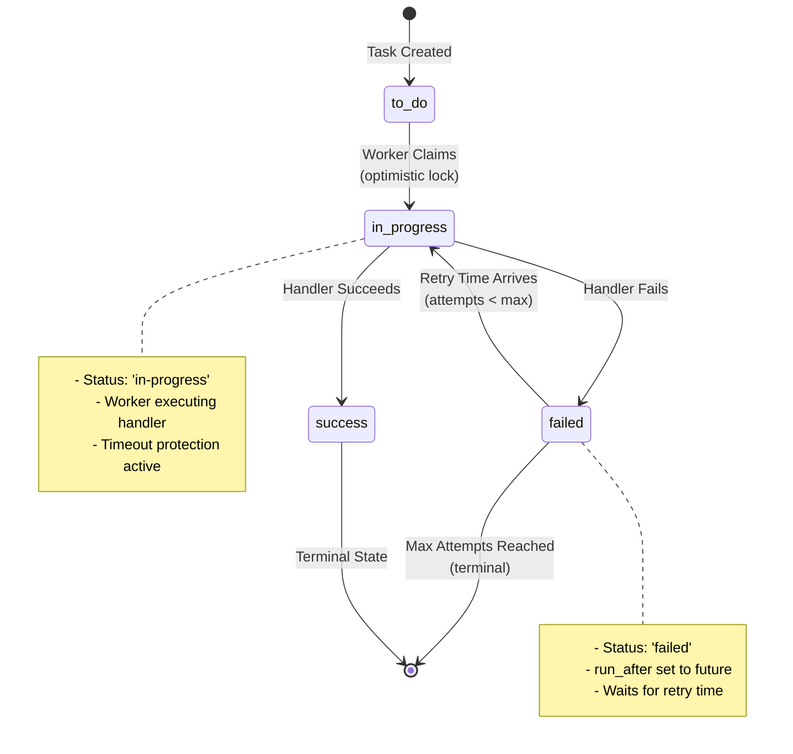

# Task Queue System Specification

**Version:** 1.0
**Type:** Language-agnostic, Database-agnostic
**Purpose:** Specification for implementing a production-ready task queue in any language/database

> **What is this?** This is a complete specification that any coding agent or developer can use to implement a task queue system in their preferred technology stack. It defines features, interfaces, data models, and API contracts without prescribing implementation details.

> **Code Examples:** All interface definitions and examples use JavaScript for consistency. Developers using other languages (Python, Go, Ruby, etc.) can adapt these patterns to their language's conventions.

## Architecture

### System Layers

```mermaid
graph TB
    Caller[Application Code]
    UI[Web UI]

    subgraph "Task Queue System"
        API[REST API Layer<br/>/api/task-queue/*]
        Core[Core Layer<br/>TaskQueue, Executor, Scheduler, Worker]
        DB[(Database<br/>tasks table)]
    end

    Caller -->|tq('type').add()| Core
    Caller -->|tq('type').setWorker()| Core
    UI -->|HTTP Requests| API
    API --> Core
    Core --> DB

    style Core fill:#e1f5ff
    style API fill:#fff4e1
    style UI fill:#f0e1ff
    style DB fill:#e1ffe1
```

### Task Lifecycle



## Table of Contents

1. [Features](#1-features)
2. [Interface Contracts](#2-interface-contracts)
3. [Data Models](#3-data-models)
4. [Core Modules](#4-core-modules)
5. [API Specification](#5-api-specification)
6. [UI Page](#6-ui-page)
7. [Reference Implementation](#7-reference-implementation)
8. [Integration Guide](#8-integration-guide)

---

## 1. Features

### 1.1 Core Features

- ✅ **Task Enqueue**: Add tasks to queue with arbitrary JSON input
- ✅ **Automatic Retry**: Failed tasks retry with exponential backoff
- ✅ **Exactly-Once Execution**: Tasks executed once via optimistic locking (see 4.3)
- ✅ **Timeout Protection**: Auto-recover stale tasks after timeout
- ✅ **Future Scheduling**: Schedule tasks to run at specific time
- ✅ **Manual Retry**: Force retry of failed tasks
- ✅ **Task Deletion**: Delete success/failed tasks
- ✅ **Cleanup**: Bulk delete old success tasks
- ✅ **Background Worker**: Automatic polling and processing
- ✅ **RPS Control**: Limit execution rate (tasks per second)
- ✅ **Parallelism Control**: Control concurrent task execution
- ✅ **Worker Pause/Resume**: Pause worker without stopping it
- ✅ **Observability**: Status tracking, error logging, output storage, statistics, query API

### 1.2 Non-Features (Out of Scope)

- ❌ **Priority scheduling**: Tasks processed in FIFO order
- ❌ **Task cancellation**: Adds complexity, can just wait or delete
- ❌ **Idempotency keys**: Perf-heavy, handle at application level
- ❌ **Task dependencies**: Run B after A completes
- ❌ **Progress tracking**: 0-100% completion
- ❌ **Distributed locking**: Multi-server coordination (single-DB only)
- ❌ **Dead letter queue**: Failed tasks stay in main table

### 1.3 Design Rationale

**Why Exactly-Once?**
- **Problem**: Concurrent workers may pick same task
- **Solution**: Optimistic locking with row versioning
- **Cost**: One extra column (`version`), minimal performance impact
- **Complexity**: Low - just check version in UPDATE WHERE clause

**Why Timeout Protection?**
- **Problem**: Worker crashes while processing → task stuck in 'in-progress' forever
- **Solution**: Auto-recover tasks in 'in-progress' state for > timeout duration
- **Default**: 5 minutes (configurable)
- **Mechanism**: Worker polls for stale tasks and marks as 'failed' with retry delay

**Why No Handler Timeout Enforcement?**
- **Rationale**:
  - Handlers are user code (can't reliably kill threads/processes)
  - Different handlers have different needs (30s vs 5min vs 1hr)
  - Handler should implement its own timeout logic
  - Worker timeout protects against crashes, not slow handlers
- **Recommendation**: Handlers should fail fast or implement internal timeout

**Why No Batch Processing?**
- **Problem**: Batch mode changes handler interface from `worker(input)` to `worker([input1, input2, ...])`
- **Conflict**: Breaks clean, unified interface - caller must handle two different patterns
- **Alternative**: For high-performance scenarios, use purpose-built systems (Redis queues like BullMQ, message queues like RabbitMQ/SQS)
- **Design Goal**: Our SQLite-based queue prioritizes simplicity and local processing, not extreme throughput
- **Workaround**: Users needing batch processing can:
  - Enqueue a single "batch job" task with array input
  - Handler processes the array internally
  - Or migrate to a dedicated high-performance queue system

**Why Polling Instead of DB Triggers?**
- **Polling**: Universal, works on all databases (SQLite, PostgreSQL, MySQL, etc.)
- **DB Triggers**: Can't directly call application code (JavaScript/Python handlers)
- **Poll Interval**: Configurable (default 1000ms, can reduce to 100ms for near-instant execution)
- **Simplicity**: Easier to debug, test, and reason about
- **Trade-off**: 100ms-1000ms latency is acceptable for most background job use cases

**Authentication & Authorization:**
- **Out of scope**: This spec does not include auth/admin features
- **User responsibility**: Protect REST API endpoints with your application's auth middleware
- **Recommendation**: Use existing auth system (JWT, session-based, API keys, etc.)

---

## 2. Interface Contracts

### 2.1 Queue Interface (Application-Level)

**Purpose:** Simple, ergonomic API for application code

**Primary Interface (Task-Type Scoped):**

```javascript
// Access task type context (chainable)
tq(type: String): TaskTypeContext

// TaskTypeContext methods (all chainable)
.add(input: JSON, options?: EnqueueOptions): TaskTypeContext
.setWorker(handler: Function): TaskTypeContext
.setWorkerCount(count: Number): TaskTypeContext        // Parallelism for this type
.setRateLimit(tasksPerSecond: Number): TaskTypeContext  // Rate limit for this type
.setTimeout(seconds: Number): TaskTypeContext           // Task timeout for this type
.setMaxAttempts(count: Number): TaskTypeContext         // Max retry attempts (default: 3)
```

**Example Usage:**

```javascript
// Setup worker
tq('crawl')
  .setWorker(async (input) => {
    console.log('Crawling', input.url);
    await fetch(input.url);
  })
  .setWorkerCount(3)
  .setRateLimit(10)      // 10 tasks/sec for crawl type
  .setTimeout(300)       // 5 min timeout for crawl tasks
  .setMaxAttempts(5);    // Retry up to 5 times

// Enqueue tasks
tq('crawl').add({ url: 'https://www.google.com/' });
tq('crawl').add({ url: 'https://www.baidu.com/' });

// Can also chain adds
tq('crawl')
  .add({ url: 'https://example.com/1' })
  .add({ url: 'https://example.com/2' })
  .add({ url: 'https://example.com/3' });

// Different task types, different configs
tq('email')
  .setWorker(async (input) => await sendEmail(input))
  .setWorkerCount(1)     // Sequential
  .setRateLimit(5);      // 5 emails/sec

tq('email').add({ to: 'user@example.com', subject: 'Hello' });
```

**Global Worker Control:**

```javascript
// Pause/resume ALL workers
tq.pause();
tq.resume();

// Get global stats
tq.stats();  // Returns QueueStats

// Graceful shutdown
await tq.stop();
```

**TypeScript Support:**

```typescript
// Type-safe payloads
interface CrawlPayload {
  url: string;
  depth?: number;
}

tq<CrawlPayload>('crawl')
  .setWorker(async (input) => {
    // input is typed as CrawlInput
    console.log(input.url.toUpperCase());  // ✅ Type-safe
  })
  .add({ url: 'https://example.com' });  // ✅ Type-checked

tq<CrawlPayload>('crawl')
  .add({ wrong: 'field' });  // ❌ Type error
```

### 2.2 Management API (REST/Admin Only)

**Purpose:** Administrative operations (monitoring, debugging)

**Note:** These are NOT exposed to application code - only via REST API or admin UI

```javascript
// Not part of tq() interface - only available via REST endpoints

GET  /api/tasks/:id           // Get task details
GET  /api/tasks               // List/filter tasks
POST /api/tasks/:id/retry     // Manual retry
DELETE /api/tasks/:id         // Delete task
DELETE /api/tasks             // Bulk cleanup
GET  /api/tasks/stats         // Queue statistics
POST /api/tasks/pause         // Pause all workers
POST /api/tasks/resume        // Resume all workers
POST /api/tasks/rate-limit    // Set global rate limit
```

**Rationale:**
- ✅ **Separation**: Application code doesn't need these
- ✅ **Security**: Can protect admin endpoints with auth
- ✅ **Simplicity**: Application API stays clean and focused

---

## 3. Data Models

### 3.1 Database Schema

**Table: `tasks`**

| Column | Type | Constraints | Description |
|--------|------|-------------|-------------|
| `id` | TEXT/VARCHAR(36) | PRIMARY KEY | UUID v7 (time-ordered) |
| `type` | TEXT/VARCHAR(255) | NOT NULL | Task type identifier |
| `input` | TEXT/JSON | NOT NULL | Task input data (JSON) |
| `status` | TEXT/VARCHAR(20) | NOT NULL, DEFAULT 'to-do' | `to-do`, `in-progress`, `success`, `failed` |
| `version` | INTEGER | NOT NULL, DEFAULT 0 | Optimistic lock version (incremented on claim) |
| `attempts` | INTEGER | DEFAULT 0 | Execution attempt count |
| `last_attempt_at` | INTEGER | NULL | Unix timestamp (seconds) of last execution |
| `output` | TEXT/JSON | NULL | Handler output (JSON). On failure, contains error message. |
| `error` | TEXT | NULL | Error message (failure only) |
| `run_after` | INTEGER | NULL | Don't run before this Unix timestamp (used for scheduling AND retry delays) |
| `created_at` | INTEGER | NOT NULL | Unix timestamp (seconds) |
| `updated_at` | INTEGER | NOT NULL | Unix timestamp (seconds) |
| `completed_at` | INTEGER | NULL | Unix timestamp (when reached terminal state) |

**Indexes:**

```sql
-- Critical for worker queries (FIFO + scheduling)
CREATE INDEX idx_tasks_todo
ON tasks(status, created_at ASC, run_after)
WHERE status IN ('to-do', 'failed');

-- Fast type-based queries
CREATE INDEX idx_tasks_type ON tasks(type, status);

-- Chronological listing
CREATE INDEX idx_tasks_created ON tasks(created_at DESC);
```

**Status Transitions:**

```
to-do → in-progress → success ✓
to-do → in-progress → failed → [wait for run_after] → in-progress → success ✓
to-do → in-progress → failed → [attempts >= max] → failed (terminal)
```

**Retry Logic:**
- Failed tasks stay in 'failed' status until `run_after` passes
- Worker queries: `WHERE status IN ('to-do', 'failed') AND run_after <= NOW()`
- When claimed: status changes to 'in-progress' (from either 'to-do' or 'failed')
- After execution: check `attempts >= maxAttempts` to decide terminal state
- Both to-do and eligible failed tasks compete for the same worker slots
- Max attempts is configured per task type (via `setMaxAttempts()`), default: 3

### 3.2 JSON Data Structures

**EnqueueOptions:**
```json
{
  "run_after": 1736942400   // Unix timestamp (optional) - schedule for future execution
}
```

**Task:**
```json
{
  "id": "01936d3f-1234-7abc-def0-123456789abc",
  "type": "send_email",
  "input": {
    "to": "user@example.com",
    "subject": "Welcome"
  },
  "status": "success",
  "attempts": 2,
  "last_attempt_at": 1736942730,
  "output": {
    "messageId": "abc123"
  },
  "error": null,
  "run_after": null,
  "created_at": 1736942400,
  "updated_at": 1736942730,
  "completed_at": 1736942730
}
```

**ListFilters:**
```json
{
  "type": "send_email",       // string (optional)
  "status": "failed",         // string or array (optional)
  "limit": 50,                // int (optional, default: 50)
  "offset": 0                 // int (optional, default: 0)
}
```

**QueueStats:**
```json
{
  "to-do": 42,
  "in-progress": 3,
  "success": 1205,
  "failed": 15,
  "byType": {
    "send_email": {
      "to-do": 10,
      "success": 500,
      "failed": 3
    },
    "process_image": {
      "to-do": 32,
      "success": 705,
      "failed": 12
    }
  }
}
```

---

## 4. Core Modules

### 4.1 Task Manager Module

**Responsibility:** CRUD operations on tasks table

**Functions:**
- `createTask(type, input, options)` → taskId
- `getTaskById(id)` → Task | null
- `listTasks(filters)` → Task[]
- `updateTaskStatus(id, status, updates)` → void
- `deleteTask(id)` → Boolean
- `incrementAttempts(id)` → void
- `setTaskOutput(id, output)` → void
- `setTaskError(id, error)` → void

**Implementation Notes:**
- Use transactions for atomic updates
- Generate UUID v7 for task IDs (time-ordered)
- Store all timestamps as Unix timestamps (integers, seconds)
- Parse/stringify JSON for input/output fields
- Validate status transitions

### 4.2 Scheduler Module

**Responsibility:** Calculate retry delays, schedule tasks, enforce rate limits

**Functions:**
- `calculateNextRetry(attempts)` → Timestamp
- `shouldRunNow(task)` → Boolean
- `getReadyTasks(batchSize)` → Task[]
- `canExecuteNow()` → Boolean (checks rate limit)
- `trackExecution()` → void (updates rate limit counter)

**Task Selection (FIFO Order):**

```sql
SELECT * FROM tasks
WHERE status IN ('to-do', 'failed')
  AND (run_after IS NULL OR run_after <= NOW())
ORDER BY created_at ASC  -- FIFO: oldest first
LIMIT batchSize;
```

**Note:** Failed tasks waiting for retry (`run_after > NOW()`) are NOT selected. Once `run_after` time arrives, they compete for worker slots just like to-do tasks. The `run_after` field serves dual purpose: initial scheduling AND retry delays.

**Retry Strategy (Exponential Backoff with Jitter):**

```
Base delay: 10 seconds
Formula: delay = min(10 * 2^attempts + jitter(), 21600)
Jitter: random(-20%, +20%)
Max delay: 6 hours (21600 seconds)

Examples:
Attempt 1: ~10s (range: 8-12s)
Attempt 2: ~40s (range: 32-48s)
Attempt 3: ~2.6min (range: 2.1-3.1min)
Attempt 4: ~10.6min (range: 8.5-12.7min)
Attempt 5: ~42.6min (range: 34.1-51.1min)
Attempt 6+: ~6hr (capped)
```

**Rate Limiting (Token Bucket Algorithm):**

```
Configuration: maxRPS (tasks per second)

Implementation:
- Track: lastExecutionTime, tokensAvailable
- Refill: tokens += (now - lastExecutionTime) * maxRPS
- Cap: tokens = min(tokens, maxRPS)
- Execute: if tokens >= 1, decrement and proceed
- Wait: if tokens < 1, skip this poll cycle

Example: maxRPS = 10
- Can execute 10 tasks/sec
- Burst up to 10 tasks instantly
- Then throttle to 1 task per 100ms
```

**Implementation Notes:**
- Add jitter to prevent thundering herd
- Respect `run_after` constraint
- FIFO order (created_at ASC)
- Rate limit applied per worker instance

### 4.3 Executor Module

**Responsibility:** Execute tasks using registered handlers with exactly-once guarantee

**Functions:**
- `registerHandler(type, handler)` → void
- `unregisterHandler(type)` → void
- `executeTask(task)` → Result | Error
- `recoverStaleTasks(timeout)` → Integer (recovered count)

**Exactly-Once Execution (Optimistic Locking):**

```sql
-- Claim task atomically (only one worker succeeds)
UPDATE tasks
SET status = 'in-progress',
    version = version + 1,           -- Increment version
    last_attempt_at = NOW(),
    attempts = attempts + 1,
    updated_at = NOW()
WHERE id = ?
  AND status IN ('pending', 'failed')
  AND version = ?;                   -- Check current version

-- If rowsAffected = 0, another worker claimed it (skip)
-- If rowsAffected = 1, we claimed it (proceed)
```

**Why This Works:**
- Version checked in WHERE clause
- If another worker updated first, version changed
- Our UPDATE fails (rowsAffected = 0)
- No duplicate execution
- Cost: 1 extra integer column, negligible overhead

**Stale Task Recovery (Timeout Protection):**

```sql
-- Find tasks stuck in 'in-progress' for > timeout
SELECT * FROM tasks
WHERE status = 'in-progress'
  AND last_attempt_at < NOW() - INTERVAL timeout
LIMIT 100;

-- Reset to failed for retry (will compete for worker slots when run_after arrives)
UPDATE tasks
SET status = 'failed',
    error = 'Task timeout - worker may have crashed',
    run_after = NOW() + retry_delay,
    updated_at = NOW()
WHERE id = ?
  AND status = 'in-progress'
  AND last_attempt_at < NOW() - INTERVAL timeout;
```

**Recovery Mechanism:**
- Worker polls for stale tasks every poll cycle
- Default timeout: 5 minutes (configurable)
- Stale tasks are marked as 'failed' and scheduled for retry
- They will consume a worker slot when retried (same as any failed task)
- Handles: crashes, network issues, OOM kills, hung processes
- Does NOT handle: slow handlers (that's handler's responsibility)

**Execution Flow:**

```
1. Claim task atomically (optimistic lock)
   - If failed (version mismatch): skip
   - If success: proceed

2. Check if handler registered for task.type
   - If no: log warning, skip task
   - If yes: proceed

3. Call handler(task.input)
   - If success:
     - UPDATE status = 'success', output, completed_at
     - WHERE id = ? AND version = currentVersion
   - If error:
     - Calculate run_after = NOW() + retry_delay
     - UPDATE status = 'failed', error, run_after
     - WHERE id = ? AND version = currentVersion
     - If attempts >= max_attempts (from task type config):
       - Keep status = 'failed' (terminal)
       - Set completed_at (marks as terminal)

4. If UPDATE rowsAffected = 0:
   - Another worker may have recovered this task (timeout)
   - Log warning, skip (avoid duplicate work)
```

**Implementation Notes:**
- Always check version in WHERE clause
- Catch all handler exceptions/errors
- Use database transactions for atomic updates
- Log execution events (claimed, success, failed, skipped)
- Run stale task recovery periodically (every poll cycle)

### 4.4 Worker Module

**Responsibility:** Background polling and batch processing with pause/resume

**Functions:**
- `start(pollInterval, batchSize)` → void
- `stop()` → void (graceful shutdown)
- `pause()` → void (stop executing, keep polling)
- `resume()` → void (resume execution)
- `isRunning()` → Boolean
- `isPaused()` → Boolean
- `processBatch()` → Integer (processedCount)

**Worker Loop:**

```
while (running) {
  // 1. Recover stale tasks (every poll cycle)
  recoveredCount = executor.recoverStaleTasks(timeout)
  if (recoveredCount > 0) {
    log("Recovered ${recoveredCount} stale tasks")
  }

  // 2. Check if paused
  if (paused) {
    // Paused: poll but don't execute
    sleep(pollInterval)
    continue
  }

  // 3. Fetch batch of ready tasks from Scheduler
  tasks = scheduler.getReadyTasks(batchSize)

  // 4. Process each task
  for (task in tasks) {
    // Check rate limit
    if (!scheduler.canExecuteNow()) {
      break  // Skip remaining tasks, wait for next poll
    }

    // Execute via Executor (with optimistic locking)
    executor.executeTask(task)
    scheduler.trackExecution()
  }

  // 5. Sleep for pollInterval
  sleep(pollInterval)
}
```

**Implementation Notes:**
- Use polling (not push-based)
- Poll interval: default 1000ms
- Batch size: default 10
- Graceful shutdown: finish current batch before stopping
- When paused: continue polling but don't execute tasks

---

## 5. API Specification

### REST API

The task queue provides a RESTful API for management and monitoring. See the complete OpenAPI specification:

**[openapi.yaml](./openapi.yaml)**

**Base Path:** `/api/task-queue/*`

**Key Endpoints:**
- `POST /tasks` - Create new task
- `GET /tasks/:id` - Get task details
- `GET /tasks` - List tasks with filters
- `POST /tasks/:id/retry` - Retry failed task
- `DELETE /tasks/:id` - Delete task
- `GET /tasks/stats` - Queue statistics
- `POST /tasks/pause` - Pause worker
- `POST /tasks/resume` - Resume worker

**Note:** Protect these endpoints with your application's authentication/authorization middleware.

### Programmatic API (Application Code)

**Simple, task-type scoped interface:**

```javascript
import { tq } from '@/lib/task-queue';

// Initialize once (app startup)
tq.init({ db, pollInterval: 1000, batchSize: 10 });

// Setup workers (per task type)
tq('send_email')
  .setWorker(async (input) => {
    await sendEmail(input.to, input.subject, input.body);
  })
  .setWorkerCount(2)
  .setRateLimit(10)
  .setTimeout(30);

tq('process_image')
  .setWorker(async (input) => {
    await processImage(input.imageUrl);
  })
  .setWorkerCount(4)
  .setRateLimit(20)
  .setTimeout(300);

// Enqueue tasks (anywhere in app)
tq('send_email').add({
  to: 'user@example.com',
  subject: 'Welcome',
  body: 'Hello!'
});

tq('process_image').add({ imageUrl: '/uploads/photo.jpg' });

// Advanced: Custom options
tq('send_email').add(
  { to: 'vip@example.com', subject: 'Important' },
  { run_after: new Date('2025-12-31') }
);

// Global controls
tq.pause();                    // Pause all workers
tq.resume();                   // Resume all workers
const stats = tq.stats();      // Get queue statistics
await tq.stop();               // Graceful shutdown
```

**Management operations (use REST API instead):**
```javascript
// These are NOT part of tq() interface
// Use REST endpoints: GET /api/tasks, POST /api/tasks/:id/retry, etc.
```

---

## 6. UI Page

### Minimal Admin UI (Repo)

- Location: Settings → Tasks tab (list-only view)
- Title: “Task Queues”
- Queues list: grouped by task type; each type is expandable
- Queue content: recent tasks (latest first) with status, attempts, created, error
- Task details: click a task to expand inline and show id, type, version, status, attempts, timestamps (created, updated, last_attempt_at, run_after, completed_at), input JSON, output JSON, and full error
- Actions: delete terminal tasks (success/failed)
- Refresh: open queues auto-refresh every 5 seconds
- Scope: no global stats cards or worker controls on this view

APIs used
- GET `/api/tasks/stats` for type counts and pending_by_type
- GET `/api/tasks?type={type}&limit=20` for recent tasks per queue
- DELETE `/api/tasks/{id}` for terminal task deletion

Notes
- This is a concise, local-first UI to inspect and debug queues without admin dashboards.
- Projects needing richer controls (filters, charts, worker toggles) can layer on additional pages or tabs as needed.

---

## 7. Reference Implementation

### 7.1 Technology Stack

**Language:** Node.js (TypeScript)
**Database:** SQLite (better-sqlite3)
**Framework:** Next.js 15 (App Router)
**UI Library:** shadcn/ui (React)

### 7.2 Module Structure

```
src/lib/task-queue/
├── index.ts                 # Main export
├── task-queue.ts            # TaskQueue class
├── task-manager.ts          # TaskManager class (CRUD)
├── scheduler.ts             # Scheduler class (retry logic)
├── executor.ts              # Executor class (run handlers)
├── worker.ts                # Worker class (background polling)
├── types.ts                 # TypeScript types
└── migrations/
    └── 001_create_tasks.sql # Database schema

src/app/api/tasks/
├── route.ts                 # POST /api/tasks, GET /api/tasks
├── [id]/
│   ├── route.ts            # GET /api/tasks/:id, DELETE /api/tasks/:id
│   ├── retry/
│   │   └── route.ts        # POST /api/tasks/:id/retry
│   └── cancel/
│       └── route.ts        # POST /api/tasks/:id/cancel
└── stats/
    └── route.ts             # GET /api/tasks/stats

src/app/tasks/
├── page.tsx                 # Task list page
├── [id]/
│   └── page.tsx            # Task detail page
└── stats/
    └── page.tsx            # Stats dashboard

src/components/tasks/
├── TaskList.tsx             # Table with filters
├── TaskDetail.tsx           # Detail view
├── TaskStats.tsx            # Stats dashboard
├── StatusBadge.tsx          # Status indicator
└── JsonViewer.tsx           # JSON display
```

### 7.3 Interface Design

#### Global tq() Function

```typescript
// Global singleton instance
interface TQ {
  // Initialize (call once at app startup)
  init(options: TaskQueueOptions): void;

  // Access task-type context
  <T = any>(type: string): TaskTypeContext<T>;

  // Global controls
  pause(): void;
  resume(): void;
  stop(): Promise<void>;
  stats(): QueueStats;
}

// Options for initialization
interface TaskQueueOptions {
  db: Database;                // better-sqlite3 instance
  pollInterval?: number;        // milliseconds (default: 1000)
  batchSize?: number;          // tasks per batch (default: 10)
  taskTimeout?: number;        // task timeout in seconds (default: 300)
}

// Task-type scoped context (chainable)
interface TaskTypeContext<T = any> {
  // Enqueue task
  add(input: T, options?: EnqueueOptions): TaskTypeContext<T>;

  // Configure worker
  setWorker(handler: TaskHandler<T>): TaskTypeContext<T>;
  setWorkerCount(count: number): TaskTypeContext<T>;
  setRateLimit(tasksPerSecond: number): TaskTypeContext<T>;
  setTimeout(seconds: number): TaskTypeContext<T>;
  setMaxAttempts(count: number): TaskTypeContext<T>;
}

// Task handler
type TaskHandler<T = any> = (input: T) => Promise<any>;

// Enqueue options
interface EnqueueOptions {
  run_after?: Date;  // Schedule for future execution
}
```

**Usage Example:**

```typescript
import { tq } from '@/lib/task-queue';

// Initialize
tq.init({ db, pollInterval: 1000 });

// Setup (chainable)
tq<CrawlPayload>('crawl')
  .setWorker(async (input) => await crawl(input.url))
  .setWorkerCount(3)
  .setRateLimit(10)
  .setTimeout(300);

// Use (chainable)
tq('crawl')
  .add({ url: 'https://example.com/1' })
  .add({ url: 'https://example.com/2' });

// Control
tq.pause();
tq.resume();
```

#### TaskManager

```typescript
class TaskManager {
  constructor(db: Database);

  createTask(type: string, input: any, options: EnqueueOptions): string;
  getTaskById(id: string): Task | null;
  listTasks(filters: ListFilters): Task[];
  updateTaskStatus(id: string, status: TaskStatus, updates: Partial<Task>): void;
  deleteTask(id: string): boolean;
  incrementAttempts(id: string): void;
  setTaskOutput(id: string, output: any): void;
  setTaskError(id: string, error: string): void;
}
```

#### Scheduler

```typescript
class Scheduler {
  constructor(db: Database);

  calculateNextRetry(attempts: number): Date;
  shouldRunNow(task: Task): boolean;
  getReadyTasks(batchSize: number): Task[];

  // Rate limiting
  canExecuteNow(): boolean;
  trackExecution(): void;
  setRateLimit(tasksPerSecond: number): void;
  getRateLimit(): number;
}
```

#### Executor

```typescript
type TaskHandler<T = any> = (input: T) => Promise<any>;

class Executor {
  constructor(taskManager: TaskManager, scheduler: Scheduler);

  registerHandler<T = any>(type: string, handler: TaskHandler<T>): void;
  unregisterHandler(type: string): void;
  executeTask(task: Task): Promise<void>;
}
```

#### Worker

```typescript
class Worker {
  constructor(executor: Executor, scheduler: Scheduler, options: WorkerOptions);

  start(): void;
  stop(): Promise<void>;
  isRunning(): boolean;
  processBatch(): Promise<number>;
}
```

---

## 8. Integration Guide

This guide helps you integrate the task queue into your existing project seamlessly.

### 8.1 Database Integration

**If your project has an existing database module:**

1. Use your existing database connection/instance
2. Run the migration to create the `tasks` table (see section 3.1 for schema)
3. Pass the database instance to task queue init

```javascript
// Example: Using existing DB module
import { db } from '@/lib/db';  // Your existing database module
import { tq } from '@/lib/task-queue';

tq.init({ db });
```

**If you don't have a database module:**

1. Decide on database location:
   - SQLite: Specify file path (e.g., `./data/tasks.db`)
   - PostgreSQL/MySQL: Provide connection URI
2. Create a simple database module in `src/lib/db/`
3. Initialize the database and create the tasks table

```javascript
// Example: New SQLite database
import Database from 'better-sqlite3';
import { tq } from '@/lib/task-queue';

const db = new Database('./data/tasks.db');

// Run migration (see section 3.1 for SQL)
db.exec(`CREATE TABLE IF NOT EXISTS tasks (...)`);

tq.init({ db });
```

### 8.2 API Integration

**If your project has an existing API framework:**

Mount the task queue API endpoints under `/api/task-queue/*`:

```javascript
// Example: Express.js
import { createTaskQueueRouter } from '@/lib/task-queue/api';
app.use('/api/task-queue', createTaskQueueRouter());

// Example: Fastify
import { taskQueueRoutes } from '@/lib/task-queue/api';
fastify.register(taskQueueRoutes, { prefix: '/api/task-queue' });

// Example: Next.js App Router
// Create files in src/app/api/task-queue/[...route]/route.ts
// See reference implementation section 7.2
```

**If you don't have an API framework:**

Ask the user for their preference:
- Which framework? (Express, Fastify, Koa, Next.js, etc.)
- Existing API structure? (RESTful, GraphQL, tRPC, etc.)
- Auth middleware? (JWT, session-based, API keys, etc.)

Then implement accordingly and mount endpoints.

### 8.3 UI Integration

**If your project has an existing UI:**

Mount the task queue UI at `/task-queue` (or follow your project's routing conventions):

```javascript
// Example: React Router
import { TaskQueuePage } from '@/components/task-queue';
<Route path="/task-queue" element={<TaskQueuePage />} />

// Example: Next.js App Router
// Create src/app/task-queue/page.tsx
// See section 6 for required components

// Example: Vue Router
import TaskQueuePage from '@/views/TaskQueuePage.vue';
{ path: '/task-queue', component: TaskQueuePage }
```

**If you don't have a UI framework:**

Ask the user for their preference:
- Which framework? (React, Vue, Svelte, Angular, etc.)
- UI library? (shadcn/ui, Material-UI, Ant Design, etc.)
- Routing? (React Router, Next.js, Vue Router, etc.)

Then implement the components (see section 6) using their chosen stack.

### 8.4 Worker Initialization

Start the worker when your application starts:

```javascript
// Example: Next.js (in server component or API route)
import { tq } from '@/lib/task-queue';
import { db } from '@/lib/db';

// Initialize on app startup
tq.init({
  db,
  pollInterval: 1000,  // 1 second
  batchSize: 10
});

// Register handlers
tq('send_email').setWorker(async (input) => {
  await sendEmail(input);
}).setMaxAttempts(3);

// Worker starts automatically
```

### 8.5 Integration Checklist

- ☐ Database: Created `tasks` table, passed DB instance to `tq.init()`
- ☐ API: Mounted REST endpoints at `/api/task-queue/*`
- ☐ UI: Created page at `/task-queue` with required components
- ☐ Worker: Registered handlers, worker running
- ☐ Auth: Protected API endpoints with existing auth middleware
- ☐ Testing: Verified enqueue, execution, retry, UI access
