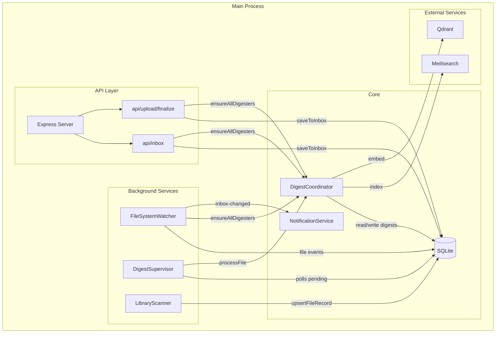
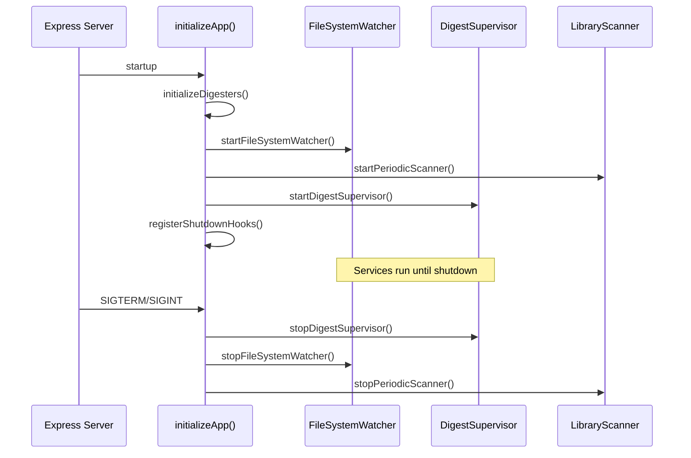
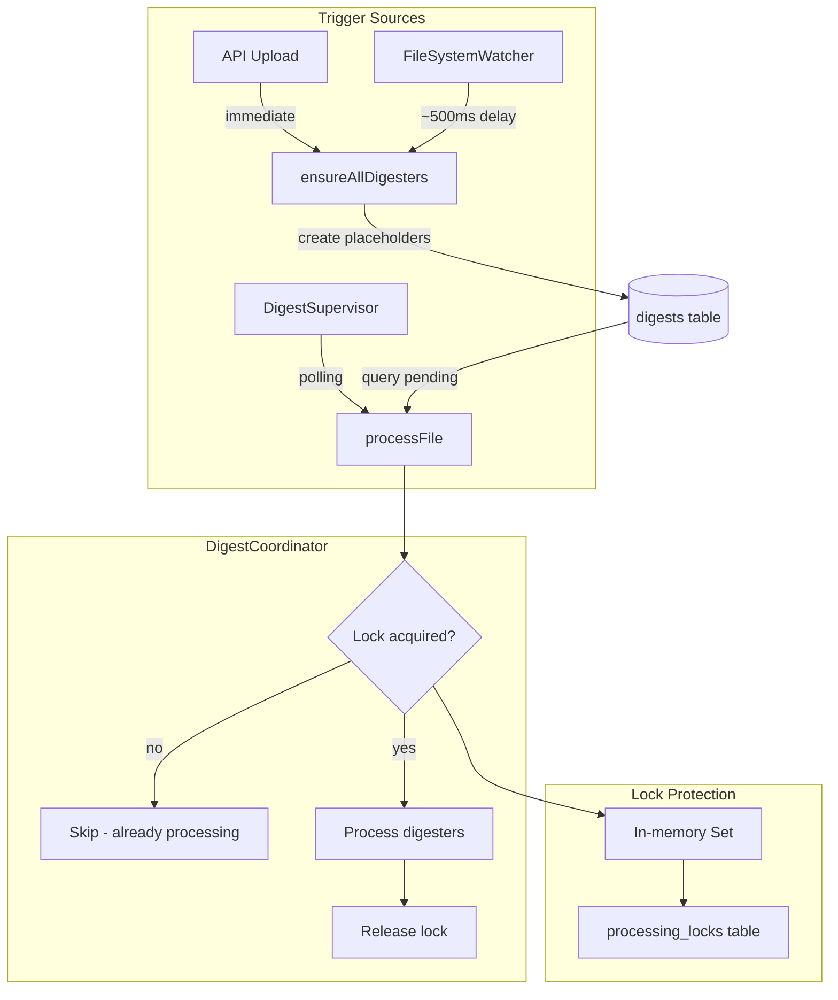
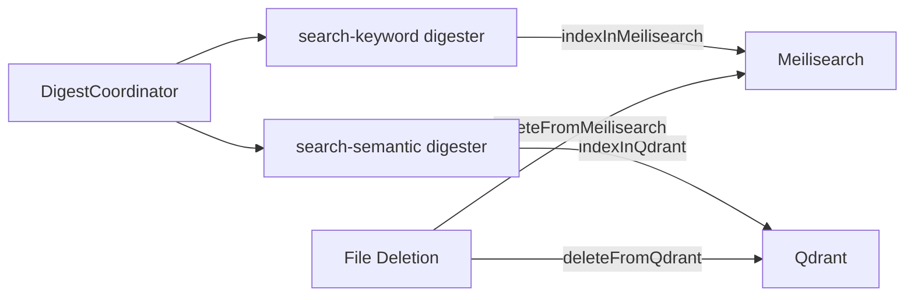

# Background Processing Architecture

## Overview

All background processing runs in the **main Node.js process** alongside the Express server. There is no separate worker thread or process - background services share the event loop with API request handling.

## Architecture

## Service Lifecycle

## Background Services

| Service | Trigger | Interval | Purpose |
|---------|---------|----------|---------|
| FileSystemWatcher | chokidar events | realtime (500ms stability) | Detect file changes, update DB, trigger digests |
| DigestSupervisor | setInterval | 10 seconds | Poll for pending digests, process sequentially |
| LibraryScanner | setInterval | 1 hour | Full filesystem scan for missed files |

## Digest Processing Flow

## Duplicate Processing Prevention

Multiple sources trigger digest processing for the same file:

1. **API endpoint** - Immediate `ensureAllDigesters()` after file save
2. **FileSystemWatcher** - Detects file after ~500ms stabilization
3. **DigestSupervisor** - Polls every 10s for pending digests

**Protection layers:**

| Layer | Scope | Speed | Purpose |
|-------|-------|-------|---------|
| `ensureAllDigesters()` | Placeholder creation | Fast | Only creates if missing (idempotent) |
| `activeProcessingFiles` Set | Same process | O(1) | Skip if already processing this file |
| `processing_locks` table | Cross-process | DB query | Prevent concurrent processing across instances |
| Digest status check | Per-digester | DB query | Skip `in-progress` or `completed` digests |

## Search Indexing

Search indexing runs as digesters within the coordinator:

Direct async function calls (no queue):
- `indexInMeilisearch(documentIds)`
- `indexInQdrant(documentIds)`
- `deleteFromMeilisearch(documentIds)`
- `deleteFromQdrant(documentIds)`

## Configuration

| Setting | Default | Location |
|---------|---------|----------|
| Supervisor interval | 10s | `supervisor.ts` |
| FS watcher stability | 500ms | `fs-watcher.ts` |
| Library scanner interval | 1 hour | `library-scanner.ts` |
| Max digest attempts | 3 | `constants.ts` |

## Future: Worker Thread Isolation

The current single-process design is simple but has tradeoffs:

**Current (single process):**
- ✅ Simple architecture, shared SQLite connection
- ✅ No IPC overhead
- ⚠️ Heavy digest processing can delay API responses
- ⚠️ All work shares the event loop

**Potential worker thread design:**
- Move DigestCoordinator + DigestSupervisor to worker thread
- Main thread only handles API requests
- Communication via `postMessage()` / `parentPort`
- Requires careful handling of SQLite (better-sqlite3 is sync)
