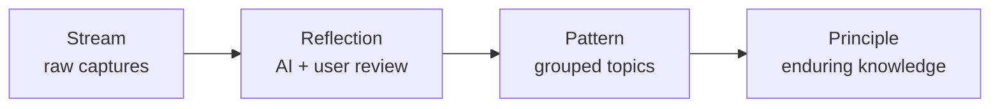
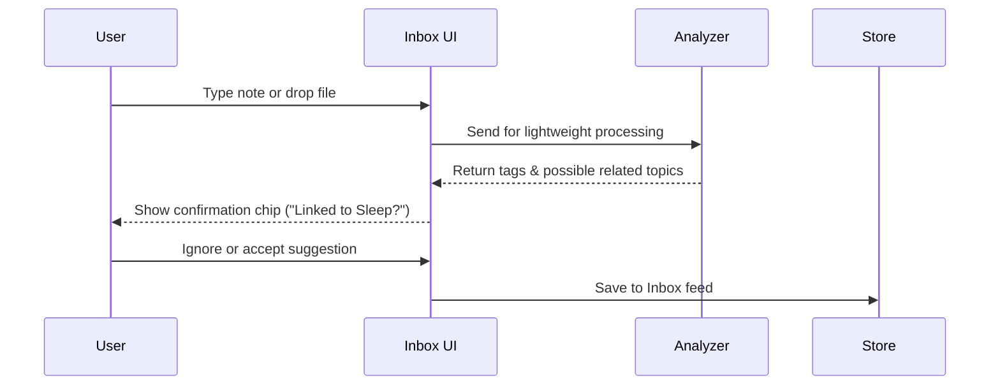
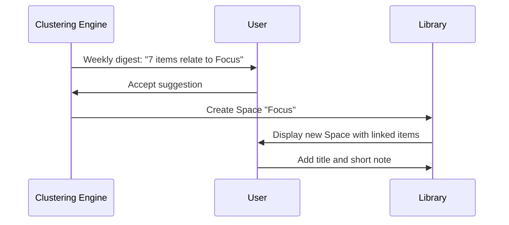

# MyLifeDB

## 1. Vision & Philosophy

MyLifeDB is a personal knowledge companion that helps people record, reflect, and evolve their thinking — while keeping full ownership of their data.

### Principles

1. **Frictionless capture**: users never think "where should this go?"
2. **AI-assisted structure**: the system surfaces relationships; the user confirms meaning.
3. **Human-centered design**: interface feels analog, calm, and trustworthy.
4. **Open formats** (future phase): all data remains readable, exportable, and independent.
5. **Long-term continuity**: the system matures with the user's thinking.

---

## 2. Core Model

| Concept | Description | User Perception |
|---------|-------------|-----------------|
| **Inbox** | Stream of everything you capture — text, media, voice, ideas, integrations. | "My daily flow." |
| **Library** | Organized and meaningful knowledge, built gradually from the Inbox. | "Where things I care about live." |

### Hidden conceptual lifecycle

```
Stream → Reflection → Pattern → Principle
```



---

## 3. User Journey Overview

| Stage | Goal | System Role |
|-------|------|-------------|
| **Capture** | Quickly record ideas, notes, or data | Minimal UI, automatic enrichment |
| **Reflect** | Notice connections or repetitions | AI clustering & suggestion digest |
| **Structure** | Approve groupings → create Spaces | One-click confirmation |
| **Revisit** | Browse or search by theme or time | Context-rich navigation |
| **Evolve** | Observe emerging principles | Summaries, trends, insights |

---

## 4. Primary UI Pages

### 4.1 Home / Inbox (Default Landing)

**Purpose**: frictionless capture and review.

#### Main elements

- **Quick-add bar** (always visible):
  - text input, image/file upload, voice capture
  - keyboard shortcuts (⌘N, Ctrl+Enter)
- **Stream view**: vertical chronological feed
  - card for each entry (title, snippet, date, source icon)
  - subtle tag chips auto-added by AI
- **Filter bar**: All · Notes · Media · Links · Voice · AI Clusters
- **AI summary panel** (right side / slide-up):
  - "You created 27 entries this week"
  - "3 possible clusters detected: Sleep, Focus, Journaling"

#### Actions

- Edit / pin / delete / merge
- "Add to Space" → choose existing Library space or create new
- "Reflect" → opens side panel with AI insights on that item's context

---

### 4.2 Reflection View

**Triggered by**: weekly notification or user clicking "Reflect Now."

**Purpose**: present AI-found patterns and ask for confirmation.

#### Layout

- **Left column**: Suggested Clusters
  - Example: Focus & Energy (5 items, 82% confidence)
- **Center**: Item list preview with snippets and sources
- **Right panel**: Quick actions
  - ✅ Confirm (creates/updates Library Space)
  - ✏️ Rename cluster
  - 🔗 Merge with existing Space
  - 🕓 Remind me later (snooze)

#### Additional section: "Emerging Topics"

Shows low-confidence groups (<60%) for user review.

---

### 4.3 Library (Structured Knowledge)

**Purpose**: organized, enduring spaces created from Inbox material.

#### Main components

- **Sidebar**: list of Spaces (e.g., Health, Projects, Books, People)
- **Main view**: open selected Space
  - Header: title, description, cover image
  - **Tabs**:
    - Notes (linked items)
    - Insights (AI-generated summaries, stats)
    - Principles (user-confirmed reflections)
- **Right panel**: cross-links to related Spaces ("Sleep ↔ Focus")

#### User actions

- Edit description, merge Spaces, tag manually
- Mark insights as "Principles" (persistent truths)
- Export Space as markdown folder

---

### 4.4 Search & Navigation

#### Unified Search Bar

- Typing shows hybrid results:
  - Inbox items (by time or content)
  - Library Spaces
  - AI-derived principles
- Natural-language support:
  - "show everything about focus last month"
  - "find notes that led to the 'Energy' space"

#### Filters

- Time (calendar picker)
- Source type (manual, integration)
- Confidence (AI grouping strength)

---

### 4.5 Insights / Journal Summary (Optional v1+)

**Purpose**: help users reflect on trends over time.

**Content**:

- Weekly summary: new clusters, updated Spaces
- Word cloud or topic heatmap
- Highlighted principles promoted this month
- Links to Library updates

---

## 5. Detailed User Flows

### Flow 1 — Capturing an Entry



---

### Flow 2 — Creating Structure



---

### Flow 3 — Surfacing Insights

```mermaid
sequenceDiagram
  participant U as User
  participant L as Library
  participant AI as Insight Engine

  U->>L: Open Space "Sleep"
  L->>AI: Request summary
  AI-->>L: "Average capture frequency: 3/wk; common themes: stress, recovery"
  L-->>U: Display insight panel + "Add to Principle"
  U->>L: Promote to principle
```

---

## 6. Inbox → Library Transformation Logic (Behavioral Rules)

| Trigger | Condition | Result |
|---------|-----------|--------|
| AI detects ≥3 similar items | within 2 weeks, ≥70% similarity | Propose new Space |
| User confirms suggestion | explicit accept | Create new Library Space |
| User edits title | renames Space | Update cluster label |
| User ignores suggestion | no action | remains in Inbox |
| User deletes Space | remove structure | items revert to Inbox |
| Library Space unused for 90 days | passive state | prompt to archive |

---

## 7. Key Features Summary

| Area | Feature | Purpose |
|------|---------|---------|
| **Capture** | Single unified input | Always-available quick capture |
| | Multi-modal inputs | text, file, voice, integration feed |
| **Organization** | AI-based clustering | Automatically identify topics |
| | User confirmation | Keep user agency; approve before structuring |
| **Reflection** | Weekly digest | Gentle review habit |
| | Contextual prompts | Suggest connections at right moment |
| **Library** | Spaces & principles | Structured, evolving knowledge base |
| | Linked items | Show origin of every insight |
| **Retrieval** | Global search | Unified across all content |
| **Ownership** | Local storage | Works offline; export anytime |

---

## 8. Interface Design Overview

| Page | Key Elements | Primary Actions | Emotional Goal |
|------|--------------|-----------------|----------------|
| **Inbox** | input bar, stream feed, AI side panel | capture, tag, reflect | speed, freedom |
| **Reflection** | suggested clusters list | confirm, merge, rename | clarity, lightness |
| **Library** | list of Spaces, note browser, insight panel | edit, link, promote | calm, permanence |
| **Search** | universal bar, filters | find, connect | discovery, serendipity |
| **Summary** (optional) | trend charts, highlights | read, reflect | satisfaction, growth |

---

## 9. Design Tone & Visual Cues

- **Aesthetic**: white background, soft gradients, minimal icons.
- **Typography**: clean sans-serif (SF Pro / Inter), generous spacing.
- **Colors**:
  - **Inbox**: light blue / gray — motion, openness.
  - **Library**: warm beige / off-white — stability, reflection.
- **Motion**: items "settle" from stream to shelf; micro-animation when clustering completes.
- **Voice**: polite, conversational — "Looks like you've been exploring sleep patterns."

---

## 10. Open Format (to be defined in tech spec)

- Plain-text files for notes and Spaces.
- Metadata will remain minimal, human-readable.
- No proprietary database; portable structure indexes.
- All AI decisions logged for transparency and reproducibility.

*(Detailed data schema deferred to Technical Design Doc.)*

---

## 11. Non-Goals (v1)

- No team collaboration (individual use only).
- No complex API integrations beyond capture collectors.
- No gamification or scoring.
- No lock-in dependencies (must work offline by design).

---

## 12. Success Criteria (Product Metrics)

| Objective | Metric | Target |
|-----------|--------|--------|
| **Adoption** | active users after onboarding | ≥70% completion |
| **Engagement** | average captures per user/week | ≥10 |
| **AI usefulness** | % accepted cluster suggestions | ≥75% |
| **Retention** | D30 retention | ≥35% |
| **User trust** | data export performed | ≥25% of users |

---

## 13. Summary

MyLifeDB is a two-zone knowledge companion —
**Inbox** for free capture, **Library** for meaningful structure.

AI quietly helps users transform their daily stream into a lifelong library of principles and reflections.
The design is simple enough for a daily habit, powerful enough to grow with a lifetime of data, and open enough to never hold knowledge hostage.
