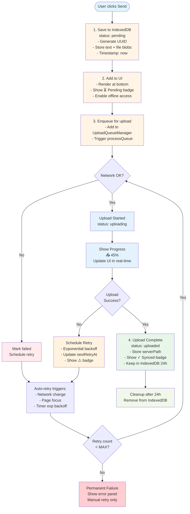

# Local-First Send Workflow

## Design Principles

1. **Personal use**: Single user, optimize for common cases
2. **Performance-first**: Avoid complex coordination unless critical
3. **Pragmatic**: Accept rare edge cases if cost is high
4. **Never lose data**: As soon as user hits "Send", content is saved and will eventually reach server

## Mental Model

1. **Send = Saved** - Hitting "Send" immediately saves content locally
2. **Visible Immediately** - Item appears in inbox feed with sync status
3. **Background Sync** - Upload happens in background with auto-retry
4. **Always Recoverable** - Network failures, app restarts, server downtime don't lose data

## Data Model

### IndexedDB Schema

Database: `mylife-inbox-queue`
Store: `pending-items`

```typescript
interface PendingInboxItem {
  // Identity
  id: string;                    // UUID (client-generated, also idempotency key)
  createdAt: string;            // ISO timestamp, used for ordering

  // Content
  text?: string;                // Optional text content
  files: Array<{
    name: string;
    type: string;
    size: number;
    blob: Blob;                 // Actual file data
  }>;

  // Sync state
  status: 'pending' | 'uploading' | 'uploaded' | 'failed';
  uploadProgress: number;       // 0-100
  errorMessage?: string;

  // Retry metadata
  retryCount: number;
  nextRetryAt?: string;         // ISO timestamp for next retry
  lastAttemptAt?: string;

  // Multi-tab lock
  uploadingBy?: string;         // Tab ID currently uploading
  uploadingAt?: string;         // Lock timestamp (for stale detection)

  // Server reference (once uploaded)
  serverPath?: string;          // e.g., 'inbox/photo.jpg'
  uploadedAt?: string;
  serverVerified?: boolean;     // Saw item in GET /api/inbox?
  verificationAttempts?: number;
}
```

### Upload Queue Manager

```typescript
class UploadQueueManager {
  private queue: PendingInboxItem[] = [];
  private activeUploads = new Map<string, AbortController>();

  async init(): Promise<void>;          // Load from IndexedDB, start processing
  async enqueue(item: PendingInboxItem): Promise<void>;
  async processQueue(): Promise<void>;
  private async uploadItem(item: PendingInboxItem): Promise<void>;
  private async scheduleRetry(item: PendingInboxItem): Promise<void>;
  async cancelUpload(id: string): Promise<void>;
  async retryFailed(): Promise<void>;
}
```

## State Flow



## Upload States & UI

| Status | Badge | Description | Actions |
|--------|-------|-------------|---------|
| `pending` | ⏳ Pending | Saved locally, not yet started | Cancel, View |
| `uploading` | 📤 45% | Upload in progress with percentage | Cancel, View |
| `uploaded` | ✓ Synced | Successfully uploaded to server | View, Delete |
| `failed` | ⚠️ Retry in 30s | Upload failed, auto-retry scheduled | Retry Now, Cancel, View |

## Send Button Behavior

**Before Click:**
- Enabled if text OR files present
- Text: "Send"

**After Click:**

1. **Immediate** (< 50ms):
   - Save to IndexedDB
   - Generate optimistic item
   - Add to inbox feed UI
   - Clear input fields
   - Show success feedback

2. **Background** (async):
   - Enqueue for upload
   - Start upload if network available

**User Experience:**
- Button never blocks on upload
- Input clears immediately
- Item appears in feed instantly
- No "Uploading..." blocking state

## Upload Queue Processing

**Priority Order:**
1. Failed items with `nextRetryAt` in the past (oldest first)
2. Pending items (oldest first)

**Concurrency:**
- Max 2 concurrent uploads
- Each upload independent (one failure doesn't block others)

**Retry Strategy:**
- Exponential backoff: 5s, 10s, 20s, 40s, 60s (max)
- Jitter: ±10% to prevent thundering herd
- Max retries: 15 (~15 minutes total)
- Optimized for personal homelab server

**Retry Triggers:**
1. Timer-based (persisted in IndexedDB)
2. Network change (`online` event)
3. Page focus (`visibilitychange`)
4. Manual retry (user clicks "Retry Now")

## Edge Cases

| Category | Scenario | Behavior | Priority |
|----------|----------|----------|----------|
| **Network** | Offline when sending | Save locally, auto-retry when online | Critical |
| | Server returns 500 | Retry with backoff (30s max) | Critical |
| | Upload timeout (3min) | Abort, retry | Critical |
| | Network switches | Resume from checkpoint (TUS) | High |
| **App Lifecycle** | Page refresh during upload | Resume from IndexedDB on reload | Critical |
| | App closed during upload | Resume when app reopens | Critical |
| | Browser crash | Item safe in IndexedDB, resumes on restart | Critical |
| | Reopened after days offline | All pending items resume automatically | Critical |
| **Upload Integrity** | Upload succeeds but client doesn't know | Idempotency key prevents duplicates | Critical |
| | Upload succeeds but finalize fails | Retry finalize only, reuse TUS upload IDs | High |
| | Server confirms but doesn't persist | 24h verification window before cleanup | High |
| | Upload stuck at 99% (5min) | Timeout, mark failed, allow retry | Medium |
| **Storage** | File too large (>50MB) | Stream directly, no offline queue | High |
| | Disk quota exceeded | Try cleanup, fallback to memory-only | High |
| | IndexedDB unavailable | Fallback to memory + immediate upload | Medium |
| **User Actions** | Double-click send | Debounce submit, prevent duplicates | High |
| | Delete item while uploading | Cancel upload, remove from IndexedDB | High |
| | Edit pending/uploading item | Cancel upload, update, re-enqueue | Medium |
| **Server Behavior** | Server rejects (400) | Permanent failure, allow edit/cancel | High |
| | Max retries exceeded | Mark failed, manual retry only | Medium |
| **Multi-Tab** | Multiple tabs open | Simple lock via IndexedDB | High |
| | Tab crashes mid-upload | Other tabs detect stale lock (2min), take over | High |
| **Security** | Sensitive data in IndexedDB | Accept risk (personal device, disk encryption) | Low |
| | User logs out | Clear queue, delete IndexedDB records | Medium |

## Idempotency Strategy

**Client-side:**
```
POST /api/inbox
Headers:
  X-Idempotency-Key: {item.id}  // Client-generated UUID
```

**Server-side:**
- Check `upload_idempotency` table for existing key
- If found: Return existing path (not an error)
- If not found: Process upload, store key → path mapping
- Cleanup keys after 7 days

## Multi-Tab Lock Mechanism

**Tab ID:** Generated on page load (`tab_{timestamp}_{random}`)
**Lock timeout:** 2 minutes

**Lock acquisition:**
1. Reload item from IndexedDB (get latest state)
2. Check if locked by another tab
3. If locked, check age (stale if >2min)
4. If stale or unlocked, acquire lock
5. Verify we got it (handle race conditions)

**Benefits:**
- Normal case: First tab wins, others skip
- Tab crash: Auto-recovery after 2min
- Race conditions: IndexedDB transactions prevent duplicates
- No complexity: No leader election, no messaging
- Fallback: Server idempotency catches edge cases

**Performance:** One extra IndexedDB read per upload (~1-5ms)

## Upload Verification

After successful upload:
1. Check if `serverPath` appears in GET `/api/inbox` response
2. Mark `serverVerified: true` if found
3. After 3 failed verification attempts: Keep indefinitely, show warning
4. Only delete from IndexedDB after 24h + `serverVerified: true`

## App Initialization

On every page load:
1. Load all pending items from IndexedDB
2. Filter items that need upload (pending + failed with retries left)
3. Sort by priority (ready retries first, then oldest)
4. Enqueue and start processing immediately

## Inbox Feed Integration

**Hybrid data source:**
```typescript
// Merge server items + local pending items
const allItems = [
  ...serverItems,
  ...pendingItems.map(toInboxItem)
].sort((a, b) => createdAt comparison);
```

**Visual differentiation:**
- Pending items: Subtle dimming + badge
- Click: Open preview from local blob (no server fetch)
- Context menu: "Cancel upload", "Retry now", "View locally"

**Scroll behavior:**
- New pending items auto-scroll to bottom
- Upload complete: Item stays in position, badge changes in-place

## IndexedDB Cleanup

**Strategy:**
1. Uploaded items: Delete after 24h (if `serverVerified`)
2. Failed items (max retries): Keep indefinitely, user dismisses
3. Pending items: Keep indefinitely until uploaded

**Frequency:** On app start + periodically

## Error Recovery UI

**Failed items panel:**
- Collapsible banner: "⚠️ 3 items failed to upload"
- Expand: Show list with errors and actions
- Bulk actions: "Retry all", "Dismiss all"

**Per-item actions:**
- Retry Now (reset count, immediate upload)
- Edit (modify before retry)
- Cancel (remove from queue)
- View Details (error log, retry history)

## Implementation Phases

**Phase 1: Basic Local-First**
- IndexedDB save on send
- Optimistic UI rendering
- Basic upload with retry

**Phase 2: Robust Retry**
- Exponential backoff
- Network/focus triggers
- Failed items UI

**Phase 3: Advanced Features**
- Edit before retry
- Bulk operations
- Upload analytics

## Monitoring

**Console logging:**
```
[UploadQueue] Enqueued: {id}
[UploadQueue] Uploading: {id}, {progress}%
[UploadQueue] Success: {id}
[UploadQueue] Failed: {id}, {error}
[UploadQueue] Retry scheduled: {id}, next at {time}
```

**Metrics (localStorage):**
- Total attempts, successes, failures
- Average retries
- Success rate
