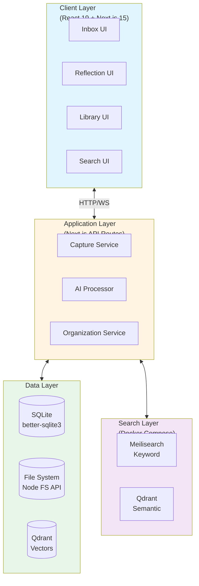
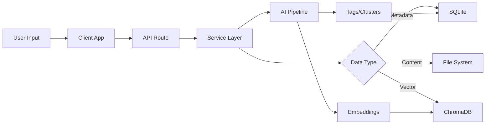
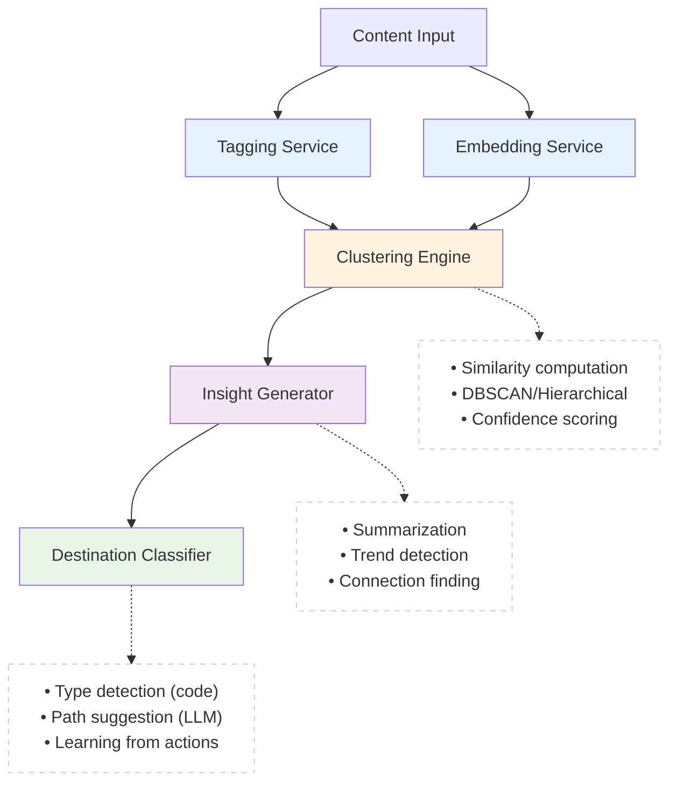

# Technical Design Document: MyLifeDB

**Version:** 1.1
**Last Updated:** 2025-10-28
**Status:** Updated - URL Crawl, File Indexing, Classification
**Owner:** Engineering Team

---

## Table of Contents

1. [Overview](#1-overview)
2. [System Architecture](#2-system-architecture)
3. [Technology Stack](#3-technology-stack)
4. [Data Models](#4-data-models)
5. [Database Design](#5-database-design)
6. [API Specifications](#6-api-specifications)
7. [Component Architecture](#7-component-architecture)
8. [AI/ML Pipeline](#8-aiml-pipeline)
9. [Search Implementation](#9-search-implementation)
10. [Security & Authentication](#10-security--authentication)
11. [Performance Optimization](#11-performance-optimization)
12. [Deployment Architecture](#12-deployment-architecture)
13. [Testing Strategy](#13-testing-strategy)
14. [Development Guidelines](#14-development-guidelines)

---

## 1. Overview

### 1.1 Purpose

This document provides technical specifications for implementing MyLifeDB, a personal knowledge management system. It covers architecture decisions, data models, APIs, and implementation details.

### 1.2 Scope

- **In Scope:** System architecture, database design, API contracts, component structure, AI pipeline
- **Out of Scope:** Product requirements, user stories, business logic (see [product-design.md](./product-design.md))

### 1.3 Audience

- Backend Engineers
- Frontend Engineers
- DevOps Engineers
- ML/AI Engineers

### 1.4 Related Documents

- [Product Requirements Document](./product-design.md)
- [API Documentation](./api-docs.md) *(to be created)*
- [Database Migration Guide](./db-migrations.md) *(to be created)*

---

## 2. System Architecture

### 2.1 High-Level Architecture



### 2.2 Architecture Principles

1. **Offline-First:** Core functionality works without internet
2. **Local-First:** Data stored locally, cloud optional
3. **Modular Design:** Loosely coupled services
4. **API-Driven:** Clear separation between frontend and backend
5. **Progressive Enhancement:** Basic features work, AI enhances

### 2.3 Data Flow



---

## 3. Technology Stack

### 3.1 Frontend

| Technology | Version | Purpose |
|------------|---------|---------|
| **Next.js** | 15.5+ | React framework with App Router |
| **React** | 19+ | UI library with concurrent features |
| **TypeScript** | 5.7+ | Type safety |
| **Tailwind CSS** | 4.0+ | Styling framework |
| **Zustand** | 5.0+ | Global state management |
| **React Query** | 5.0+ | Server state management |
| **Zod** | 3.23+ | Schema validation |
| **date-fns** | 3.0+ | Date utilities |

### 3.2 Backend

| Technology | Version | Purpose |
|------------|---------|---------|
| **Next.js API Routes** | 15.5+ | Backend API |
| **better-sqlite3** | 11.0+ | SQLite database driver |
| **Drizzle ORM** | 0.30+ | Type-safe database ORM |
| **NextAuth.js** | 5.0+ | Authentication |
| **sharp** | 0.33+ | Image processing |
| **ffmpeg** | - | Audio/video processing |

### 3.3 AI/ML & Search

| Technology | Version | Purpose |
|------------|---------|---------|
| **OpenAI SDK** | 4.0+ | AI API client (optional) |
| **Ollama** | Latest | Local LLM runtime (optional) |
| **Meilisearch** | 1.5+ | Instant keyword search engine |
| **Qdrant** | 1.7+ | Vector database for semantic search |
| **transformers.js** | 3.0+ | In-browser ML models |
| **natural** | 6.0+ | NLP utilities |

### 3.4 Development Tools

| Tool | Purpose |
|------|---------|
| **ESLint** | Linting |
| **Prettier** | Code formatting |
| **Vitest** | Unit testing |
| **Playwright** | E2E testing |
| **TSX** | TypeScript execution |

### 3.5 Technology Decision Log

| Decision | Rationale |
|----------|-----------|
| **Next.js over Remix/Astro** | Best React ecosystem, mature App Router, RSC support |
| **SQLite over PostgreSQL** | Offline-first, zero-config, portable, perfect for local-first apps |
| **Drizzle over Prisma** | Lighter, better TypeScript inference, SQL-like syntax |
| **Zustand over Redux** | Simpler API, less boilerplate, sufficient for our needs |
| **Meilisearch + Qdrant over single solution** | Best of both: instant keyword + semantic search |
| **Qdrant over ChromaDB** | More mature, better Docker support, richer features |
| **better-sqlite3 over node-sqlite3** | Synchronous API, better performance, simpler code |

**Search Stack Decision Log:**
- **Considered sqlite-vss:** Simpler (in-process), but less mature and fewer features
- **Considered FTS5 only:** Fast keyword search, but no semantic capabilities
- **Decision:** Accept Docker Compose complexity for superior search experience
- **Trade-off:** Operational complexity vs. feature completeness

---

## 4. Data Models

### 4.1 Core Entities (TypeScript Interfaces)

#### Entry (Inbox Item)

```typescript
interface Entry {
  id: string;                    // UUID v4
  userId: string;                // User identifier
  content: string;               // Main content (markdown)
  contentType: 'text' | 'voice' | 'file' | 'link';
  metadata: EntryMetadata;
  tags: string[];                // AI-generated tags
  suggestedSpaces: string[];     // Suggested Space IDs
  embedding: number[];           // 1536-dim vector (OpenAI) or 384-dim (local)
  createdAt: Date;
  updatedAt: Date;
  isArchived: boolean;
  spaceIds: string[];            // Linked Space IDs (many-to-many)
}

interface EntryMetadata {
  title?: string;                // Optional user-provided title
  source: 'manual' | 'integration' | 'voice';
  fileUrl?: string;              // Relative path to file
  fileName?: string;
  mimeType?: string;
  fileSize?: number;             // Bytes
  transcription?: string;        // For voice entries
  duration?: number;             // For audio/video (seconds)
  originalUrl?: string;          // For link captures
  linkPreview?: {
    title?: string;
    description?: string;
    image?: string;
  };
}
```

#### Space (Library Container)

```typescript
interface Space {
  id: string;                    // UUID v4
  userId: string;
  title: string;
  description: string;
  coverImage?: string;           // Relative path
  metadata: SpaceMetadata;
  entryIds: string[];            // Linked Entry IDs (computed from junction table)
  relatedSpaceIds: string[];     // Cross-references
  insights: Insight[];           // Embedded insights
  principles: Principle[];       // Embedded principles
  createdAt: Date;
  updatedAt: Date;
  lastAccessedAt: Date;
  isArchived: boolean;
  source: 'ai_suggested' | 'manual' | 'merged';
}

interface SpaceMetadata {
  color?: string;                // Hex color
  icon?: string;                 // Emoji or icon name
  category?: string;             // User-defined category
  tags?: string[];               // User-defined tags
}
```

#### Cluster (AI Suggestion)

```typescript
interface Cluster {
  id: string;                    // UUID v4
  userId: string;
  entryIds: string[];
  suggestedTitle: string;
  confidence: number;            // 0-100
  keywords: string[];
  reasoning?: string;            // AI explanation (optional)
  createdAt: Date;
  status: 'pending' | 'accepted' | 'dismissed' | 'snoozed';
  snoozeUntil?: Date;
  resultingSpaceId?: string;     // If accepted
  dismissReason?: string;        // User feedback
}
```

#### Insight

```typescript
interface Insight {
  id: string;                    // UUID v4
  spaceId: string;
  content: string;               // AI-generated summary
  type: 'summary' | 'trend' | 'connection' | 'pattern';
  confidence: number;            // 0-100
  isPromoted: boolean;           // Promoted to Principle
  metadata?: {
    frequency?: Record<string, number>;  // Word frequencies
    timeRange?: { start: Date; end: Date };
    relatedEntryIds?: string[];
  };
  createdAt: Date;
}
```

#### Principle

```typescript
interface Principle {
  id: string;                    // UUID v4
  spaceId: string;
  content: string;               // User-confirmed truth
  sourceInsightId?: string;      // Origin insight
  sourceEntryIds: string[];      // Traceability
  notes?: string;                // User annotations
  createdAt: Date;
  updatedAt: Date;
}
```

### 4.2 Supporting Types

```typescript
// User Settings
interface UserSettings {
  userId: string;
  preferences: {
    theme: 'light' | 'dark' | 'auto';
    aiProvider: 'openai' | 'ollama' | 'none';
    defaultView: 'inbox' | 'library';
    weeklyDigest: boolean;
    digestDay: 0 | 1 | 2 | 3 | 4 | 5 | 6;  // 0 = Sunday
  };
  aiConfig?: {
    openaiApiKey?: string;
    ollamaModel?: string;
    embeddingModel?: string;
  };
  storageConfig?: {
    dataPath: string;
    backupPath?: string;
    autoBackup: boolean;
    maxFileSize: number;         // MB
  };
}

// Search Query
interface SearchQuery {
  query: string;
  filters?: {
    dateRange?: { start: Date; end: Date };
    contentTypes?: ('text' | 'voice' | 'file' | 'link')[];
    spaceIds?: string[];
    tags?: string[];
    minConfidence?: number;
    maxConfidence?: number;
  };
  sort?: 'relevance' | 'date' | 'title';
  limit?: number;
  offset?: number;
}

// Search Result
interface SearchResult {
  type: 'entry' | 'space';
  id: string;
  title: string;
  snippet: string;
  highlights: string[];          // Matched text fragments
  score: number;                 // Relevance score
  metadata: {
    createdAt: Date;
    tags?: string[];
    contentType?: string;
  };
}
```

---

## 5. Database Design

### 5.1 Schema (SQLite)

```sql
-- Enable foreign keys
PRAGMA foreign_keys = ON;

-- Users
CREATE TABLE users (
  id TEXT PRIMARY KEY,
  email TEXT UNIQUE NOT NULL,
  password_hash TEXT,             -- NULL for OAuth users
  name TEXT,
  avatar_url TEXT,
  created_at INTEGER NOT NULL,
  updated_at INTEGER NOT NULL,
  settings JSON
);

CREATE INDEX idx_users_email ON users(email);

-- Entries (Inbox)
CREATE TABLE entries (
  id TEXT PRIMARY KEY,
  user_id TEXT NOT NULL,
  content TEXT NOT NULL,
  content_type TEXT NOT NULL CHECK(content_type IN ('text', 'voice', 'file', 'link')),
  metadata JSON NOT NULL,
  tags JSON,
  suggested_spaces JSON,
  embedding BLOB,                  -- Serialized float32 array
  created_at INTEGER NOT NULL,
  updated_at INTEGER NOT NULL,
  is_archived INTEGER DEFAULT 0,
  FOREIGN KEY (user_id) REFERENCES users(id) ON DELETE CASCADE
);

CREATE INDEX idx_entries_user_created ON entries(user_id, created_at DESC);
CREATE INDEX idx_entries_user_archived ON entries(user_id, is_archived);
CREATE INDEX idx_entries_content_type ON entries(user_id, content_type);

-- Full-text search index
CREATE VIRTUAL TABLE entries_fts USING fts5(
  content,
  tags,
  content='entries',
  content_rowid='rowid'
);

-- Triggers to keep FTS in sync
CREATE TRIGGER entries_ai AFTER INSERT ON entries BEGIN
  INSERT INTO entries_fts(rowid, content, tags)
  VALUES (new.rowid, new.content, json_extract(new.tags, '$'));
END;

CREATE TRIGGER entries_ad AFTER DELETE ON entries BEGIN
  DELETE FROM entries_fts WHERE rowid = old.rowid;
END;

CREATE TRIGGER entries_au AFTER UPDATE ON entries BEGIN
  UPDATE entries_fts
  SET content = new.content, tags = json_extract(new.tags, '$')
  WHERE rowid = new.rowid;
END;

-- Spaces (Library)
CREATE TABLE spaces (
  id TEXT PRIMARY KEY,
  user_id TEXT NOT NULL,
  title TEXT NOT NULL,
  description TEXT,
  cover_image TEXT,
  metadata JSON,
  created_at INTEGER NOT NULL,
  updated_at INTEGER NOT NULL,
  last_accessed_at INTEGER NOT NULL,
  is_archived INTEGER DEFAULT 0,
  source TEXT NOT NULL CHECK(source IN ('ai_suggested', 'manual', 'merged')),
  FOREIGN KEY (user_id) REFERENCES users(id) ON DELETE CASCADE
);

CREATE INDEX idx_spaces_user_created ON spaces(user_id, created_at DESC);
CREATE INDEX idx_spaces_user_accessed ON spaces(user_id, last_accessed_at DESC);
CREATE INDEX idx_spaces_user_archived ON spaces(user_id, is_archived);

-- Entry-Space relationships (many-to-many)
CREATE TABLE entry_spaces (
  entry_id TEXT NOT NULL,
  space_id TEXT NOT NULL,
  added_at INTEGER NOT NULL,
  added_by TEXT CHECK(added_by IN ('user', 'ai')),
  PRIMARY KEY (entry_id, space_id),
  FOREIGN KEY (entry_id) REFERENCES entries(id) ON DELETE CASCADE,
  FOREIGN KEY (space_id) REFERENCES spaces(id) ON DELETE CASCADE
);

CREATE INDEX idx_entry_spaces_space ON entry_spaces(space_id);

-- Space-Space relationships (cross-references)
CREATE TABLE space_relations (
  space_id_1 TEXT NOT NULL,
  space_id_2 TEXT NOT NULL,
  relation_type TEXT DEFAULT 'related',
  strength REAL DEFAULT 0.5,      -- 0-1
  created_at INTEGER NOT NULL,
  PRIMARY KEY (space_id_1, space_id_2),
  FOREIGN KEY (space_id_1) REFERENCES spaces(id) ON DELETE CASCADE,
  FOREIGN KEY (space_id_2) REFERENCES spaces(id) ON DELETE CASCADE,
  CHECK (space_id_1 < space_id_2) -- Prevent duplicates
);

-- Clusters (AI suggestions)
CREATE TABLE clusters (
  id TEXT PRIMARY KEY,
  user_id TEXT NOT NULL,
  entry_ids JSON NOT NULL,
  suggested_title TEXT NOT NULL,
  confidence REAL NOT NULL CHECK(confidence >= 0 AND confidence <= 100),
  keywords JSON,
  reasoning TEXT,
  created_at INTEGER NOT NULL,
  status TEXT NOT NULL CHECK(status IN ('pending', 'accepted', 'dismissed', 'snoozed')),
  snooze_until INTEGER,
  resulting_space_id TEXT,
  dismiss_reason TEXT,
  FOREIGN KEY (user_id) REFERENCES users(id) ON DELETE CASCADE,
  FOREIGN KEY (resulting_space_id) REFERENCES spaces(id) ON DELETE SET NULL
);

CREATE INDEX idx_clusters_user_status ON clusters(user_id, status);
CREATE INDEX idx_clusters_user_created ON clusters(user_id, created_at DESC);

-- Insights
CREATE TABLE insights (
  id TEXT PRIMARY KEY,
  space_id TEXT NOT NULL,
  content TEXT NOT NULL,
  type TEXT NOT NULL CHECK(type IN ('summary', 'trend', 'connection', 'pattern')),
  confidence REAL NOT NULL CHECK(confidence >= 0 AND confidence <= 100),
  is_promoted INTEGER DEFAULT 0,
  metadata JSON,
  created_at INTEGER NOT NULL,
  FOREIGN KEY (space_id) REFERENCES spaces(id) ON DELETE CASCADE
);

CREATE INDEX idx_insights_space ON insights(space_id, created_at DESC);
CREATE INDEX idx_insights_promoted ON insights(space_id, is_promoted);

-- Principles
CREATE TABLE principles (
  id TEXT PRIMARY KEY,
  space_id TEXT NOT NULL,
  content TEXT NOT NULL,
  source_insight_id TEXT,
  source_entry_ids JSON,
  notes TEXT,
  created_at INTEGER NOT NULL,
  updated_at INTEGER NOT NULL,
  FOREIGN KEY (space_id) REFERENCES spaces(id) ON DELETE CASCADE,
  FOREIGN KEY (source_insight_id) REFERENCES insights(id) ON DELETE SET NULL
);

CREATE INDEX idx_principles_space ON principles(space_id, created_at DESC);

-- Activity Log (for analytics/debugging)
CREATE TABLE activity_log (
  id INTEGER PRIMARY KEY AUTOINCREMENT,
  user_id TEXT NOT NULL,
  action TEXT NOT NULL,
  entity_type TEXT NOT NULL,
  entity_id TEXT,
  metadata JSON,
  created_at INTEGER NOT NULL,
  FOREIGN KEY (user_id) REFERENCES users(id) ON DELETE CASCADE
);

CREATE INDEX idx_activity_user_created ON activity_log(user_id, created_at DESC);
```

### 5.2 Drizzle ORM Schema

```typescript
// lib/db/schema.ts
import { sqliteTable, text, integer, real, blob, index } from 'drizzle-orm/sqlite-core';
import { relations } from 'drizzle-orm';

export const users = sqliteTable('users', {
  id: text('id').primaryKey(),
  email: text('email').notNull().unique(),
  passwordHash: text('password_hash'),
  name: text('name'),
  avatarUrl: text('avatar_url'),
  createdAt: integer('created_at', { mode: 'timestamp' }).notNull(),
  updatedAt: integer('updated_at', { mode: 'timestamp' }).notNull(),
  settings: text('settings', { mode: 'json' }).$type<UserSettings>(),
});

export const entries = sqliteTable('entries', {
  id: text('id').primaryKey(),
  userId: text('user_id').notNull().references(() => users.id, { onDelete: 'cascade' }),
  content: text('content').notNull(),
  contentType: text('content_type').notNull().$type<'text' | 'voice' | 'file' | 'link'>(),
  metadata: text('metadata', { mode: 'json' }).notNull().$type<EntryMetadata>(),
  tags: text('tags', { mode: 'json' }).$type<string[]>(),
  suggestedSpaces: text('suggested_spaces', { mode: 'json' }).$type<string[]>(),
  embedding: blob('embedding'),
  createdAt: integer('created_at', { mode: 'timestamp' }).notNull(),
  updatedAt: integer('updated_at', { mode: 'timestamp' }).notNull(),
  isArchived: integer('is_archived', { mode: 'boolean' }).default(false),
}, (table) => ({
  userCreatedIdx: index('idx_entries_user_created').on(table.userId, table.createdAt),
  userArchivedIdx: index('idx_entries_user_archived').on(table.userId, table.isArchived),
}));

export const spaces = sqliteTable('spaces', {
  id: text('id').primaryKey(),
  userId: text('user_id').notNull().references(() => users.id, { onDelete: 'cascade' }),
  title: text('title').notNull(),
  description: text('description'),
  coverImage: text('cover_image'),
  metadata: text('metadata', { mode: 'json' }).$type<SpaceMetadata>(),
  createdAt: integer('created_at', { mode: 'timestamp' }).notNull(),
  updatedAt: integer('updated_at', { mode: 'timestamp' }).notNull(),
  lastAccessedAt: integer('last_accessed_at', { mode: 'timestamp' }).notNull(),
  isArchived: integer('is_archived', { mode: 'boolean' }).default(false),
  source: text('source').notNull().$type<'ai_suggested' | 'manual' | 'merged'>(),
}, (table) => ({
  userCreatedIdx: index('idx_spaces_user_created').on(table.userId, table.createdAt),
  userAccessedIdx: index('idx_spaces_user_accessed').on(table.userId, table.lastAccessedAt),
}));

export const entrySpaces = sqliteTable('entry_spaces', {
  entryId: text('entry_id').notNull().references(() => entries.id, { onDelete: 'cascade' }),
  spaceId: text('space_id').notNull().references(() => spaces.id, { onDelete: 'cascade' }),
  addedAt: integer('added_at', { mode: 'timestamp' }).notNull(),
  addedBy: text('added_by').$type<'user' | 'ai'>(),
}, (table) => ({
  pk: { columns: [table.entryId, table.spaceId] },
  spaceIdx: index('idx_entry_spaces_space').on(table.spaceId),
}));

// Relations
export const usersRelations = relations(users, ({ many }) => ({
  entries: many(entries),
  spaces: many(spaces),
}));

export const entriesRelations = relations(entries, ({ one, many }) => ({
  user: one(users, {
    fields: [entries.userId],
    references: [users.id],
  }),
  spaces: many(entrySpaces),
}));

export const spacesRelations = relations(spaces, ({ one, many }) => ({
  user: one(users, {
    fields: [spaces.userId],
    references: [users.id],
  }),
  entries: many(entrySpaces),
  insights: many(insights),
  principles: many(principles),
}));
```

### 5.3 File Storage Structure (Updated)

**Decision:** Multi-app compatible structure with clear separation

```
MY_DATA_DIR/
├── .app/
│   └── mylifedb/
│       ├── database.sqlite          # All app state + metadata
│       ├── inbox/                   # Temporary staging (app-managed)
│       │   └── {ai-slug}/
│       │       ├── content.md       # Main content
│       │       ├── content.html     # Original (preserved)
│       │       ├── screenshot.png   # Visual capture
│       │       └── main-content.md  # Cleaned extraction
│       ├── cache/
│       │   ├── thumbnails/
│       │   └── temp/
│       └── archive/                 # Archived content
│           └── {original-path}/
│
└── {user-library}/                  # User-owned, free-form
    ├── bookmarks/                   # User decides structure
    ├── dev/
    │   └── react/
    ├── notes/
    └── ...
```

**Key Design Decisions:**

1. **Inbox Location:** `.app/mylifedb/inbox/` (not root)
   - **Why:** Keeps app concepts separate from user content
   - **Alt:** Root directory - rejected (clutters user's namespace)

2. **Library Structure:** Root directory, completely free-form
   - **Why:** User owns structure, multi-app compatible
   - **Alt:** `library/` subfolder - rejected (unnecessary nesting)

3. **Metadata Storage:** Database only (no `.meta.json` files)
   - **Why:** Keeps user directories clean
   - **Alt:** Sidecar files - rejected (pollutes user structure)

### 5.4 File System Indexing

**Full directory/file index for semantic search across all content**

```sql
-- Index all files (mylifedb-managed AND user-added)
CREATE TABLE indexed_files (
  path TEXT PRIMARY KEY,               -- Relative from MY_DATA_DIR
  file_name TEXT NOT NULL,
  is_folder BOOLEAN NOT NULL,
  file_size INTEGER,                   -- NULL for folders
  modified_at DATETIME NOT NULL,
  content_hash TEXT,                   -- Only for text files
  indexed_at DATETIME DEFAULT CURRENT_TIMESTAMP,

  -- Extracted for search
  content_type TEXT,                   -- url, text, image, etc.
  searchable_text TEXT                 -- Extracted content
);

CREATE INDEX idx_path_prefix ON indexed_files(path);
CREATE INDEX idx_modified ON indexed_files(modified_at);

-- Archive in separate table (performance)
CREATE TABLE archived_files (
  -- Same schema
);
```

**Sync Strategy: Hybrid Approach**

```typescript
// 1. Real-time: fs.watch() for file system changes
const watcher = fs.watch(MY_DATA_DIR, { recursive: true });
watcher.on('change', async (eventType, filename) => {
  await indexFile(filename);  // Update index
});

// 2. Startup: Light reconciliation scan
async function reconcileIndex() {
  // Only check: which indexed files no longer exist?
  const indexed = await db.all('SELECT path, modified_at FROM indexed_files');

  for (const file of indexed) {
    const stats = await fs.stat(join(MY_DATA_DIR, file.path)).catch(() => null);
    if (!stats) {
      await db.run('DELETE FROM indexed_files WHERE path = ?', file.path);
    }
  }
}

// 3. Full scan: On-demand only (user triggers)
async function fullScan() {
  for await (const file of walkDirectory(MY_DATA_DIR)) {
    const existing = await db.get('SELECT modified_at FROM indexed_files WHERE path = ?', file.path);

    if (!existing || existing.modified_at < file.modifiedAt) {
      await indexFile(file);  // Changed or new
    }
  }
}
```

**Change Detection Strategy:**

| File Type | Detection Method | Reason |
|-----------|------------------|--------|
| **Text files** | `mtime + size + hash` | Content often changes without size change (edit word) |
| **Binary files** | `mtime + size` only | Hashing large files too expensive; size change = content changed |
| **Folders** | `mtime` only | Track folder itself, files handled separately |

**Performance Characteristics:**

| Operation | Speed | Notes |
|-----------|-------|-------|
| File system watch event | ~1ms | Real-time, incremental |
| Startup reconciliation (10k files) | ~200-500ms | Just checks existence |
| Full scan (10k files) | ~500ms-1s | Only checks timestamps |
| Text file hash | ~1-5ms | Fast, small files |
| Binary file hash | Skip | Too expensive (images: MB-GB) |

**Why Full Index (Not Minimal):**

- **Semantic search requirement:** Must search all content, not just app-managed
- **Multi-app scenario:** Discovers files added by other apps
- **Performance acceptable:** Modern SSDs handle 10k files in <1s
- **User expectation:** "Search everything" = everything in MY_DATA_DIR

**Alternatives Considered:**

| Approach | Pros | Cons | Decision |
|----------|------|------|----------|
| **Minimal index (mylifedb-only)** | Simple, fast | Semantic search misses user content | ❌ Rejected |
| **On-demand scan (no index)** | Always in sync | Slow queries | ❌ Rejected |
| **Hash all files** | Perfect change detection | Too slow for binaries | ⚠️ Partial (text only) |
| **Cached folder sizes** | Fast folder stats | Complex invalidation | ❌ Rejected (on-demand fine) |
| **Hybrid (chosen)** | Best balance | Some complexity | ✅ Chosen |

### 5.5 URL Crawl Implementation

**End-to-End Flow:**

```typescript
// 1. User adds URL
async function addUrl(url: string, userId: string) {
  const entryId = uuid();
  const inboxPath = `.app/mylifedb/inbox/${entryId}`;

  // Create staging directory
  await fs.mkdir(join(MY_DATA_DIR, inboxPath), { recursive: true });
  await fs.writeFile(join(MY_DATA_DIR, inboxPath, 'url.txt'), url);

  // Save to database
  await db.run(`
    INSERT INTO entries (id, source_type, status, inbox_path)
    VALUES (?, 'url', 'pending', ?)
  `, [entryId, inboxPath]);

  // Queue for background processing
  await jobQueue.add('crawl-url', { entryId });

  return { entryId, inboxPath };
}

// 2. Background: Crawl & Process
async function crawlUrl(entryId: string) {
  const entry = await getEntry(entryId);
  const url = await fs.readFile(join(MY_DATA_DIR, entry.inbox_path, 'url.txt'), 'utf-8');

  try {
    // Crawl using Playwright/Puppeteer
    const { html, markdown, text, screenshot } = await crawlWebPage(url);

    // Extract metadata
    const metadata = extractMetadata(html);  // Title, author, date, etc.

    // Generate AI summary for folder name
    const aiSlug = await generateSlug(metadata.title || text.substring(0, 100));

    // Save to inbox
    const inboxPath = entry.inbox_path;
    await fs.writeFile(join(MY_DATA_DIR, inboxPath, 'content.html'), html);
    await fs.writeFile(join(MY_DATA_DIR, inboxPath, 'content.md'), markdown);
    await fs.writeFile(join(MY_DATA_DIR, inboxPath, 'main-content.md'), text);
    await fs.writeFile(join(MY_DATA_DIR, inboxPath, 'screenshot.png'), screenshot);

    // Rename folder to human-readable slug
    const newInboxPath = `.app/mylifedb/inbox/${aiSlug}`;
    await fs.rename(
      join(MY_DATA_DIR, inboxPath),
      join(MY_DATA_DIR, newInboxPath)
    );

    // Update database
    await db.run(`
      UPDATE entries
      SET status = 'ready', inbox_path = ?, metadata = ?
      WHERE id = ?
    `, [newInboxPath, JSON.stringify(metadata), entryId]);

  } catch (error) {
    await db.run(`UPDATE entries SET status = 'error', error = ? WHERE id = ?`, [error.message, entryId]);
  }
}

// 3. User Settlement: Manual Export
// User action: Copy .app/mylifedb/inbox/understanding-react-hooks/ to library root
// No code needed - pure file operation

// 4. Learning: Detect user's organization
async function learnFromUserMove(oldPath: string, newPath: string) {
  // Detect: user moved inbox/understanding-react-hooks → dev/react/understanding-react-hooks

  const entry = await db.get(`SELECT * FROM entries WHERE inbox_path LIKE ?`, `%${basename(oldPath)}%`);
  if (!entry) return;  // Not our entry

  const destination = dirname(newPath);  // "dev/react"

  // Extract signals
  const metadata = JSON.parse(entry.metadata || '{}');
  const url = metadata.url || '';
  const domain = url ? new URL(url).hostname : null;
  const keywords = extractKeywords(metadata.title || '');

  // Update learned patterns
  if (domain) {
    await db.run(`
      INSERT INTO learned_patterns (pattern_type, pattern_value, target_path, confidence, sample_count)
      VALUES ('domain', ?, ?, 0.5, 1)
      ON CONFLICT (pattern_type, pattern_value, target_path)
      DO UPDATE SET
        confidence = MIN(confidence + 0.2, 1.0),
        sample_count = sample_count + 1
    `, [domain, destination]);
  }

  for (const keyword of keywords.slice(0, 5)) {
    await db.run(`
      INSERT INTO learned_patterns (pattern_type, pattern_value, target_path, confidence, sample_count)
      VALUES ('keyword', ?, ?, 0.3, 1)
      ON CONFLICT (pattern_type, pattern_value, target_path)
      DO UPDATE SET confidence = MIN(confidence + 0.1, 1.0), sample_count = sample_count + 1
    `, [keyword, destination]);
  }

  // Mark entry as settled
  await db.run(`UPDATE entries SET status = 'settled', library_path = ? WHERE id = ?`, [newPath, entry.id]);
}
```

**Crawling Libraries:**

| Library | Purpose | Notes |
|---------|---------|-------|
| **Playwright** | Full browser automation | Best for JS-heavy sites, screenshots |
| **Cheerio** | HTML parsing | Fast for static sites |
| **Readability** | Article extraction | Mozilla's algorithm |
| **Turndown** | HTML → Markdown | Clean conversion |

---

## 6. API Specifications

### 6.1 REST API Endpoints

**Base URL:** `/api/v1`

#### Entries

```typescript
// Create entry
POST /api/v1/entries
Headers: { Authorization: Bearer {token} }
Body: {
  content: string;
  contentType: 'text' | 'voice' | 'file' | 'link';
  metadata?: Partial<EntryMetadata>;
}
Response: Entry

// Get entries (Inbox)
GET /api/v1/entries?limit=50&offset=0&filter=all&contentType=text&archived=false
Response: {
  entries: Entry[];
  total: number;
  hasMore: boolean;
}

// Get entry by ID
GET /api/v1/entries/:id
Response: Entry

// Update entry
PATCH /api/v1/entries/:id
Body: {
  content?: string;
  metadata?: Partial<EntryMetadata>;
  tags?: string[];
}
Response: Entry

// Delete entry
DELETE /api/v1/entries/:id
Response: { success: boolean }

// Link entry to space
POST /api/v1/entries/:id/spaces
Body: { spaceId: string }
Response: Entry

// Unlink entry from space
DELETE /api/v1/entries/:id/spaces/:spaceId
Response: { success: boolean }

// Trigger AI processing
POST /api/v1/entries/:id/process
Response: {
  tags: string[];
  suggestedSpaces: string[];
  embedding: number[];
}
```

#### Spaces

```typescript
// Create Space
POST /api/v1/spaces
Body: {
  title: string;
  description?: string;
  source: 'manual' | 'ai_suggested';
  entryIds?: string[];
  metadata?: Partial<SpaceMetadata>;
}
Response: Space

// Get all Spaces
GET /api/v1/spaces?archived=false
Response: Space[]

// Get Space by ID
GET /api/v1/spaces/:id?includeEntries=true
Response: Space & { entries?: Entry[] }

// Update Space
PATCH /api/v1/spaces/:id
Body: Partial<Space>
Response: Space

// Delete Space
DELETE /api/v1/spaces/:id?deleteEntries=false
Response: { success: boolean }

// Archive Space
POST /api/v1/spaces/:id/archive
Response: Space

// Export Space
GET /api/v1/spaces/:id/export?format=markdown
Response: File (application/zip)
```

#### Clusters

```typescript
// Get pending clusters
GET /api/v1/clusters?status=pending
Response: Cluster[]

// Accept cluster
POST /api/v1/clusters/:id/accept
Body: { title?: string; mergeWithSpaceId?: string }
Response: {
  cluster: Cluster;
  space: Space;
}

// Dismiss cluster
POST /api/v1/clusters/:id/dismiss
Body: { reason?: string }
Response: { success: boolean }

// Snooze cluster
POST /api/v1/clusters/:id/snooze
Body: { until: string } // ISO date
Response: Cluster

// Trigger clustering
POST /api/v1/clusters/generate
Body: { entryIds?: string[]; minConfidence?: number }
Response: Cluster[]
```

#### Search

```typescript
// Universal search
POST /api/v1/search
Body: SearchQuery
Response: {
  results: SearchResult[];
  total: number;
  queryTime: number; // ms
  facets?: {
    contentTypes: Record<string, number>;
    tags: Record<string, number>;
    spaces: Record<string, number>;
  };
}

// Semantic search (vector)
POST /api/v1/search/semantic
Body: {
  query: string;
  limit?: number;
  threshold?: number; // similarity threshold
}
Response: SearchResult[]
```

#### AI Processing

```typescript
// Generate tags
POST /api/v1/ai/tag
Body: { content: string; context?: string }
Response: { tags: string[] }

// Generate embedding
POST /api/v1/ai/embed
Body: { text: string }
Response: { embedding: number[] }

// Generate insights for Space
POST /api/v1/ai/insights/:spaceId
Response: Insight[]

// Classify destination (content organization)
POST /api/v1/ai/classify
Body: {
  content: string;
  contentType: 'url' | 'text' | 'image' | 'pdf';
  metadata?: { url?: string; title?: string };
}
Response: {
  path: string;              // Suggested destination
  confidence: number;        // 0-1
  reasoning: string;         // Why this location
  isNewFolder: boolean;      // Creating new vs. using existing
}

// Chat with content (future)
POST /api/v1/ai/chat
Body: {
  query: string;
  context?: { entryIds?: string[]; spaceIds?: string[] };
}
Response: {
  response: string;
  sources: Array<{ id: string; type: 'entry' | 'space' }>;
}
```

### 6.2 WebSocket Events

**Connection:** `ws://localhost:3000/api/ws`

```typescript
// Client → Server
{
  type: 'entry:subscribe',
  data: { userId: string }
}

{
  type: 'entry:create',
  data: { content: string, contentType: string }
}

// Server → Client
{
  type: 'entry:created',
  data: Entry
}

{
  type: 'entry:updated',
  data: Entry
}

{
  type: 'cluster:suggested',
  data: Cluster
}

{
  type: 'space:updated',
  data: Space
}

{
  type: 'ai:processing',
  data: { entryId: string, status: 'started' | 'completed' | 'failed' }
}
```

### 6.3 Error Responses

```typescript
interface APIError {
  error: {
    code: string;
    message: string;
    details?: Record<string, unknown>;
  };
}

// Common error codes
{
  'UNAUTHORIZED': 'Authentication required',
  'FORBIDDEN': 'Insufficient permissions',
  'NOT_FOUND': 'Resource not found',
  'VALIDATION_ERROR': 'Invalid input',
  'RATE_LIMIT': 'Too many requests',
  'INTERNAL_ERROR': 'Server error'
}
```

---

## 7. Component Architecture

### 7.1 Directory Structure

```
src/
├── app/                          # Next.js App Router
│   ├── (auth)/
│   │   ├── login/
│   │   │   └── page.tsx
│   │   └── signup/
│   │       └── page.tsx
│   ├── (dashboard)/
│   │   ├── inbox/
│   │   │   ├── page.tsx
│   │   │   └── components/
│   │   │       ├── EntryCard.tsx
│   │   │       ├── QuickAdd.tsx
│   │   │       └── SummaryPanel.tsx
│   │   ├── library/
│   │   │   ├── page.tsx
│   │   │   ├── [spaceId]/
│   │   │   │   └── page.tsx
│   │   │   └── components/
│   │   │       ├── SpaceCard.tsx
│   │   │       ├── SpaceDetail.tsx
│   │   │       └── SpaceSidebar.tsx
│   │   ├── reflection/
│   │   │   ├── page.tsx
│   │   │   └── components/
│   │   │       ├── ClusterList.tsx
│   │   │       ├── ClusterPreview.tsx
│   │   │       └── ClusterActions.tsx
│   │   └── search/
│   │       ├── page.tsx
│   │       └── components/
│   │           ├── SearchBar.tsx
│   │           ├── SearchResults.tsx
│   │           └── SearchFilters.tsx
│   ├── api/
│   │   └── v1/
│   │       ├── entries/
│   │       │   ├── route.ts
│   │       │   └── [id]/
│   │       │       └── route.ts
│   │       ├── spaces/
│   │       ├── clusters/
│   │       ├── search/
│   │       └── ai/
│   ├── layout.tsx
│   └── globals.css
├── components/                   # Shared components
│   ├── ui/                       # Base UI components
│   │   ├── Button.tsx
│   │   ├── Input.tsx
│   │   ├── Card.tsx
│   │   ├── Modal.tsx
│   │   └── ...
│   ├── layout/
│   │   ├── Header.tsx
│   │   ├── Sidebar.tsx
│   │   └── Container.tsx
│   └── shared/
│       ├── TagCloud.tsx
│       ├── DatePicker.tsx
│       └── FileUpload.tsx
├── lib/                          # Core business logic
│   ├── ai/
│   │   ├── tagger.ts
│   │   ├── clusterer.ts
│   │   ├── embeddings.ts
│   │   └── providers/
│   │       ├── openai.ts
│   │       └── ollama.ts
│   ├── db/
│   │   ├── client.ts
│   │   ├── schema.ts
│   │   ├── queries/
│   │   │   ├── entries.ts
│   │   │   ├── spaces.ts
│   │   │   └── clusters.ts
│   │   └── migrations/
│   │       ├── 001_initial.sql
│   │       └── ...
│   ├── storage/
│   │   ├── files.ts
│   │   └── backups.ts
│   ├── search/
│   │   ├── fulltext.ts
│   │   └── vector.ts
│   └── utils/
│       ├── validation.ts
│       ├── dates.ts
│       └── formatting.ts
├── hooks/                        # React hooks
│   ├── useEntries.ts
│   ├── useSpaces.ts
│   ├── useSearch.ts
│   └── useWebSocket.ts
├── stores/                       # Zustand stores
│   ├── authStore.ts
│   ├── uiStore.ts
│   └── syncStore.ts
├── types/                        # TypeScript types
│   ├── api.ts
│   ├── models.ts
│   └── index.ts
└── config/
    ├── constants.ts
    └── env.ts
```

### 7.2 Key Component Patterns

#### React Server Components (RSC)

```typescript
// app/(dashboard)/inbox/page.tsx
import { getEntries } from '@/lib/db/queries/entries';

export default async function InboxPage() {
  const entries = await getEntries({ limit: 50 });

  return (
    <div>
      <QuickAdd />
      <EntryList initialEntries={entries} />
    </div>
  );
}
```

#### Client Components with Server Actions

```typescript
// components/QuickAdd.tsx
'use client';

import { createEntry } from '@/app/actions/entries';

export function QuickAdd() {
  async function handleSubmit(formData: FormData) {
    const content = formData.get('content') as string;
    await createEntry({ content, contentType: 'text' });
  }

  return (
    <form action={handleSubmit}>
      <input name="content" />
      <button type="submit">Add</button>
    </form>
  );
}
```

---

## 8. AI/ML Pipeline

### 8.1 AI Architecture



### 8.2 Content Type Detection vs Destination Classification

**Two-Stage Approach:**

#### Stage 1: Type Detection (Fast, Code-Based)

```typescript
// lib/ai/typeDetector.ts
export function detectContentType(item: InboxItem): ContentType {
  // Client-side capable, no AI needed
  if (item.url) {
    const ext = getFileExtension(item.url);
    if (['.jpg', '.png', '.gif', '.webp'].includes(ext)) return 'image';
    if (['.pdf'].includes(ext)) return 'pdf';
    if (['.mp4', '.mov', '.webm'].includes(ext)) return 'video';
    if (['.mp3', '.wav', '.m4a'].includes(ext)) return 'audio';
    return 'url';  // Default for web pages
  }

  if (item.file) {
    const mime = item.file.mimeType;
    if (mime.startsWith('image/')) return 'image';
    if (mime === 'application/pdf') return 'pdf';
    if (mime.startsWith('video/')) return 'video';
    if (mime.startsWith('audio/')) return 'audio';
  }

  return 'text';  // Default fallback
}
```

**Performance:** <1ms, 100% accurate for type

#### Stage 2: Destination Classification (LLM-Based, Evolving)

**Decision: Single Evolving Prompt Architecture**

```typescript
// lib/ai/destinationClassifier.ts
export class DestinationClassifier {
  async classify(item: ProcessedItem): Promise<ClassificationResult> {
    const guide = await this.buildGuide();

    const prompt = `${guide}

NEW ITEM TO CATEGORIZE:
Type: ${item.contentType}
${item.url ? `URL: ${item.url}\nDomain: ${new URL(item.url).hostname}` : ''}
Title: ${item.title}
Content preview: ${item.content?.substring(0, 1000)}

Suggest where to save this. Return JSON:
{
  "path": "exact/folder/path/",
  "confidence": 0.0-1.0,
  "reasoning": "one sentence explanation",
  "isNewFolder": boolean
}`;

    const result = await this.llm.complete(prompt, {
      temperature: 0.3,  // More deterministic
      responseFormat: 'json'
    });

    return JSON.parse(result);
  }

  private async buildGuide(): Promise<string> {
    // Scan user's library structure
    const folders = await this.scanLibraryFolders();

    // Get learned patterns
    const patterns = await db.all(`
      SELECT pattern_type, pattern_value, target_path, confidence, sample_count
      FROM learned_patterns
      WHERE confidence > 0.5
      ORDER BY confidence DESC, sample_count DESC
      LIMIT 50
    `);

    return `You are organizing content into a personal knowledge library.

CURRENT LIBRARY STRUCTURE:
${folders.map(f => `- ${f.path}/ (${f.count} items, last: ${f.lastModified})`).join('\n')}

LEARNED PATTERNS (from user's past choices):
${patterns.map(p =>
  `- ${p.pattern_type}:"${p.pattern_value}" → ${p.target_path} (conf: ${p.confidence.toFixed(2)}, seen ${p.sample_count}x)`
).join('\n')}

RULES:
- Prefer existing folders over creating new ones
- Consider content meaning, not just source type (a URL can be notes/todo/etc.)
- Use learned patterns as strong hints
- Be specific with paths (e.g., "dev/react/" not just "dev/")
- If truly doesn't fit, suggest new folder with clear reasoning`;
  }

  async learnFromUserAction(item: ProcessedItem, chosenPath: string) {
    const features = this.extractFeatures(item);

    // Update pattern confidences
    for (const [type, value] of Object.entries(features)) {
      await db.run(`
        INSERT INTO learned_patterns (pattern_type, pattern_value, target_path, confidence, sample_count)
        VALUES (?, ?, ?, 0.3, 1)
        ON CONFLICT (pattern_type, pattern_value, target_path)
        DO UPDATE SET
          confidence = MIN(confidence + 0.1, 1.0),
          sample_count = sample_count + 1,
          last_seen = CURRENT_TIMESTAMP
      `, [type, value, chosenPath]);
    }
  }

  private extractFeatures(item: ProcessedItem) {
    const features: Record<string, string> = {};

    if (item.url) {
      features.domain = new URL(item.url).hostname;
      features.urlPath = new URL(item.url).pathname.split('/')[1];
    }

    // Extract top keywords
    const keywords = extractKeywords(item.title + ' ' + item.content, { topN: 5 });
    keywords.forEach((kw, i) => {
      features[`keyword_${i}`] = kw;
    });

    return features;
  }
}
```

**Database Schema for Learning:**

```sql
CREATE TABLE learned_patterns (
  id INTEGER PRIMARY KEY AUTOINCREMENT,
  pattern_type TEXT NOT NULL,         -- 'domain', 'keyword', 'url_path'
  pattern_value TEXT NOT NULL,        -- 'github.com', 'react', '/blog/'
  target_path TEXT NOT NULL,          -- 'dev/', 'recipes/', 'notes/'

  confidence REAL DEFAULT 0.5,        -- 0-1, increases with correct usage
  sample_count INTEGER DEFAULT 1,     -- How many times seen
  last_seen DATETIME,                 -- Last time pattern matched

  created_at DATETIME DEFAULT CURRENT_TIMESTAMP,
  UNIQUE(pattern_type, pattern_value, target_path)
);

CREATE INDEX idx_patterns_lookup ON learned_patterns(pattern_type, pattern_value, confidence DESC);
```

**Why This Approach:**

| Aspect | Decision | Rationale |
|--------|----------|-----------|
| **Architecture** | Single LLM prompt (not pipeline) | Simplest, most flexible, fully transparent |
| **Type detection** | Separate, code-based | Fast, deterministic, no AI cost |
| **Learning** | Update prompt context | Transparent, user can see/edit rules |
| **Cache** | Cache identical URLs | Reduce LLM cost for duplicates |
| **Performance** | Accept ~1-2s LLM latency | Background job, user not blocked |

**Alternatives Considered:**

| Approach | Pros | Cons | Decision |
|----------|------|------|----------|
| **Sequential pipeline (rules → LLM)** | Fast path for common cases | Complex code, harder to maintain | ❌ Rejected |
| **Decision tree** | Transparent logic | Rigid, hard to evolve | ❌ Rejected |
| **Ensemble (all vote)** | Uses all signals | Always pays LLM cost, complex | ❌ Rejected |
| **Pure rules (no LLM)** | Fast, cheap | Limited power for edge cases | ❌ Rejected |
| **Single prompt (chosen)** | Simple, flexible, transparent | Every call needs LLM | ✅ Chosen |

**Mitigation for LLM Cost:**

```typescript
// Cache classification results
const cacheKey = hash({
  url: item.url,
  title: item.title,
  contentPreview: item.content?.substring(0, 200)
});

const cached = await cache.get(`classify:${cacheKey}`);
if (cached) return cached;

const result = await classifier.classify(item);
await cache.set(`classify:${cacheKey}`, result, { ttl: '7d' });
```

### 8.3 Tagging Service

```typescript
// lib/ai/tagger.ts
import { OpenAI } from 'openai';
import { z } from 'zod';

const TagResponseSchema = z.object({
  tags: z.array(z.string()).min(2).max(5),
  reasoning: z.string().optional(),
});

export async function generateTags(
  content: string,
  context?: string
): Promise<string[]> {
  const provider = getAIProvider(); // OpenAI or Ollama

  const prompt = `
    Analyze the following content and generate 2-5 relevant tags.
    Tags should be concise, lowercase, and descriptive.

    Content: ${content}
    ${context ? `Context: ${context}` : ''}

    Return JSON: { "tags": ["tag1", "tag2", ...] }
  `;

  const response = await provider.complete(prompt);
  const parsed = TagResponseSchema.parse(JSON.parse(response));

  return parsed.tags;
}
```

### 8.3 Embedding Service

```typescript
// lib/ai/embeddings.ts
import { ChromaClient } from 'chromadb';

const chroma = new ChromaClient({ path: './data/vectors/chroma' });

export async function generateEmbedding(text: string): Promise<number[]> {
  const provider = getEmbeddingProvider();

  // OpenAI: text-embedding-3-small (1536-dim)
  // Local: all-MiniLM-L6-v2 (384-dim)
  const embedding = await provider.embed(text);

  return embedding;
}

export async function storeEmbedding(
  entryId: string,
  text: string,
  metadata: Record<string, unknown>
): Promise<void> {
  const embedding = await generateEmbedding(text);
  const collection = await chroma.getOrCreateCollection({ name: 'entries' });

  await collection.add({
    ids: [entryId],
    embeddings: [embedding],
    metadatas: [metadata],
  });
}

export async function searchSimilar(
  query: string,
  limit: number = 10,
  threshold: number = 0.7
): Promise<Array<{ id: string; score: number }>> {
  const queryEmbedding = await generateEmbedding(query);
  const collection = await chroma.getCollection({ name: 'entries' });

  const results = await collection.query({
    queryEmbeddings: [queryEmbedding],
    nResults: limit,
  });

  return results.ids[0].map((id, i) => ({
    id: id as string,
    score: results.distances[0][i],
  })).filter(r => r.score >= threshold);
}
```

### 8.4 Clustering Algorithm

```typescript
// lib/ai/clusterer.ts
import { cosineSimilarity, dbscan } from '@/lib/utils/ml';

export async function clusterEntries(
  entries: Entry[],
  minClusterSize: number = 3,
  minConfidence: number = 0.7
): Promise<Cluster[]> {
  // 1. Get embeddings for all entries
  const embeddings = entries.map(e => e.embedding);

  // 2. Compute pairwise similarities
  const similarities = computeSimilarityMatrix(embeddings);

  // 3. Run DBSCAN clustering
  const clusters = dbscan(similarities, {
    epsilon: 1 - minConfidence, // distance threshold
    minPoints: minClusterSize,
  });

  // 4. Generate cluster metadata
  const results: Cluster[] = [];
  for (const clusterIndices of clusters) {
    const clusterEntries = clusterIndices.map(i => entries[i]);

    // Extract common keywords
    const keywords = extractKeywords(clusterEntries);

    // Generate title suggestion
    const title = await generateClusterTitle(clusterEntries, keywords);

    // Compute confidence
    const confidence = computeClusterConfidence(clusterIndices, similarities);

    results.push({
      id: generateId(),
      userId: entries[0].userId,
      entryIds: clusterEntries.map(e => e.id),
      suggestedTitle: title,
      confidence: Math.round(confidence * 100),
      keywords,
      createdAt: new Date(),
      status: 'pending',
    });
  }

  return results.filter(c => c.confidence >= minConfidence * 100);
}

function computeSimilarityMatrix(embeddings: number[][]): number[][] {
  const n = embeddings.length;
  const matrix: number[][] = Array(n).fill(null).map(() => Array(n).fill(0));

  for (let i = 0; i < n; i++) {
    for (let j = i + 1; j < n; j++) {
      const sim = cosineSimilarity(embeddings[i], embeddings[j]);
      matrix[i][j] = sim;
      matrix[j][i] = sim;
    }
  }

  return matrix;
}
```

### 8.5 Insight Generation

```typescript
// lib/ai/insights.ts
export async function generateInsights(space: Space): Promise<Insight[]> {
  const entries = await getEntriesForSpace(space.id);
  const insights: Insight[] = [];

  // 1. Summary insight
  const summary = await generateSummary(entries);
  insights.push({
    id: generateId(),
    spaceId: space.id,
    content: summary,
    type: 'summary',
    confidence: 85,
    isPromoted: false,
    createdAt: new Date(),
  });

  // 2. Trend analysis
  const trend = analyzeTrend(entries);
  if (trend) {
    insights.push({
      id: generateId(),
      spaceId: space.id,
      content: trend.description,
      type: 'trend',
      confidence: trend.confidence,
      isPromoted: false,
      metadata: { frequency: trend.frequency },
      createdAt: new Date(),
    });
  }

  // 3. Connection detection
  const connections = await findConnections(space.id);
  for (const conn of connections) {
    insights.push({
      id: generateId(),
      spaceId: space.id,
      content: `Related to ${conn.relatedSpace.title}`,
      type: 'connection',
      confidence: conn.strength * 100,
      isPromoted: false,
      createdAt: new Date(),
    });
  }

  return insights;
}
```

---

## 9. Search Implementation

### 9.1 Hybrid Search Strategy

```typescript
// lib/search/index.ts
export async function hybridSearch(
  query: SearchQuery
): Promise<SearchResult[]> {
  // 1. Full-text search (SQLite FTS5)
  const textResults = await fullTextSearch(query);

  // 2. Vector search (ChromaDB)
  const vectorResults = await vectorSearch(query);

  // 3. Merge and re-rank
  const merged = mergeResults(textResults, vectorResults);

  // 4. Apply filters
  const filtered = applyFilters(merged, query.filters);

  // 5. Sort
  const sorted = sortResults(filtered, query.sort || 'relevance');

  // 6. Paginate
  const paginated = sorted.slice(
    query.offset || 0,
    (query.offset || 0) + (query.limit || 20)
  );

  return paginated;
}

function mergeResults(
  textResults: SearchResult[],
  vectorResults: SearchResult[]
): SearchResult[] {
  const scoreMap = new Map<string, number>();

  // Combine scores with weights
  const TEXT_WEIGHT = 0.4;
  const VECTOR_WEIGHT = 0.6;

  for (const result of textResults) {
    scoreMap.set(result.id, result.score * TEXT_WEIGHT);
  }

  for (const result of vectorResults) {
    const current = scoreMap.get(result.id) || 0;
    scoreMap.set(result.id, current + result.score * VECTOR_WEIGHT);
  }

  // Get all unique results
  const allResults = [
    ...new Map([...textResults, ...vectorResults].map(r => [r.id, r])).values()
  ];

  // Update scores
  return allResults.map(r => ({
    ...r,
    score: scoreMap.get(r.id) || 0,
  }));
}
```

### 9.2 Full-Text Search

```typescript
// lib/search/fulltext.ts
import { db } from '@/lib/db/client';

export async function fullTextSearch(
  query: SearchQuery
): Promise<SearchResult[]> {
  const sql = `
    SELECT
      e.id,
      e.content,
      e.metadata,
      e.created_at,
      e.tags,
      bm25(entries_fts) as score,
      highlight(entries_fts, 0, '<mark>', '</mark>') as highlighted
    FROM entries_fts
    JOIN entries e ON entries_fts.rowid = e.rowid
    WHERE entries_fts MATCH ?
    ORDER BY score
    LIMIT ?
  `;

  const results = await db.prepare(sql).all(query.query, query.limit || 20);

  return results.map(row => ({
    type: 'entry',
    id: row.id,
    title: extractTitle(row.content),
    snippet: extractSnippet(row.content, 200),
    highlights: extractHighlights(row.highlighted),
    score: row.score,
    metadata: {
      createdAt: new Date(row.created_at * 1000),
      tags: JSON.parse(row.tags || '[]'),
    },
  }));
}
```

---

## 10. Security & Authentication

### 10.1 Authentication Flow

```typescript
// lib/auth/config.ts
import NextAuth from 'next-auth';
import Credentials from 'next-auth/providers/credentials';
import Google from 'next-auth/providers/google';
import { compare } from 'bcryptjs';

export const { handlers, auth, signIn, signOut } = NextAuth({
  providers: [
    Credentials({
      credentials: {
        email: { label: 'Email', type: 'email' },
        password: { label: 'Password', type: 'password' },
      },
      authorize: async (credentials) => {
        const user = await getUserByEmail(credentials.email);
        if (!user) return null;

        const isValid = await compare(credentials.password, user.passwordHash);
        if (!isValid) return null;

        return { id: user.id, email: user.email, name: user.name };
      },
    }),
    Google({
      clientId: process.env.GOOGLE_CLIENT_ID,
      clientSecret: process.env.GOOGLE_CLIENT_SECRET,
    }),
  ],
  callbacks: {
    async jwt({ token, user }) {
      if (user) {
        token.id = user.id;
      }
      return token;
    },
    async session({ session, token }) {
      session.user.id = token.id as string;
      return session;
    },
  },
  pages: {
    signIn: '/login',
    signOut: '/logout',
  },
});
```

### 10.2 Authorization Middleware

```typescript
// middleware.ts
import { NextResponse } from 'next/server';
import { auth } from '@/lib/auth/config';

export async function middleware(request: Request) {
  const session = await auth();

  // Protect API routes
  if (request.url.startsWith('/api/v1')) {
    if (!session) {
      return NextResponse.json(
        { error: { code: 'UNAUTHORIZED', message: 'Authentication required' } },
        { status: 401 }
      );
    }
  }

  // Protect dashboard routes
  if (request.url.match(/^\/(inbox|library|reflection)/)) {
    if (!session) {
      return NextResponse.redirect(new URL('/login', request.url));
    }
  }

  return NextResponse.next();
}

export const config = {
  matcher: ['/api/v1/:path*', '/(inbox|library|reflection)/:path*'],
};
```

### 10.3 Data Encryption

```typescript
// lib/storage/encryption.ts
import Database from 'better-sqlite3';
import { randomBytes, createCipheriv, createDecipheriv } from 'crypto';

const ALGORITHM = 'aes-256-gcm';

export function initEncryptedDB(path: string, key: string): Database.Database {
  const db = new Database(path);

  // Enable SQLCipher encryption (requires special build)
  db.pragma(`key = '${key}'`);
  db.pragma('cipher_page_size = 4096');

  return db;
}

export function encryptField(data: string, key: Buffer): string {
  const iv = randomBytes(16);
  const cipher = createCipheriv(ALGORITHM, key, iv);

  let encrypted = cipher.update(data, 'utf8', 'hex');
  encrypted += cipher.final('hex');

  const authTag = cipher.getAuthTag();

  return JSON.stringify({
    iv: iv.toString('hex'),
    data: encrypted,
    tag: authTag.toString('hex'),
  });
}

export function decryptField(encrypted: string, key: Buffer): string {
  const { iv, data, tag } = JSON.parse(encrypted);

  const decipher = createDecipheriv(
    ALGORITHM,
    key,
    Buffer.from(iv, 'hex')
  );
  decipher.setAuthTag(Buffer.from(tag, 'hex'));

  let decrypted = decipher.update(data, 'hex', 'utf8');
  decrypted += decipher.final('utf8');

  return decrypted;
}
```

---

## 11. Performance Optimization

### 11.1 Caching Strategy

```typescript
// lib/cache/index.ts
import { LRUCache } from 'lru-cache';

// In-memory cache for frequently accessed data
const cache = new LRUCache<string, unknown>({
  max: 500,
  ttl: 1000 * 60 * 5, // 5 minutes
});

export async function getCached<T>(
  key: string,
  fetcher: () => Promise<T>
): Promise<T> {
  const cached = cache.get(key);
  if (cached) return cached as T;

  const data = await fetcher();
  cache.set(key, data);

  return data;
}

// React Query configuration
export const queryClient = new QueryClient({
  defaultOptions: {
    queries: {
      staleTime: 1000 * 60 * 5, // 5 minutes
      cacheTime: 1000 * 60 * 30, // 30 minutes
      refetchOnWindowFocus: false,
    },
  },
});
```

### 11.2 Database Optimization

```sql
-- Vacuum regularly to optimize database
VACUUM;

-- Analyze query plans
ANALYZE;

-- Use prepared statements
PRAGMA query_only = OFF;

-- Enable WAL mode for better concurrency
PRAGMA journal_mode = WAL;

-- Optimize page cache
PRAGMA cache_size = -64000; -- 64MB

-- Auto-vacuum
PRAGMA auto_vacuum = INCREMENTAL;
```

### 11.3 Lazy Loading & Code Splitting

```typescript
// Dynamic imports for heavy components
const ReflectionView = dynamic(() => import('@/components/ReflectionView'), {
  loading: () => <Skeleton />,
  ssr: false,
});

// Route-based code splitting (automatic with Next.js App Router)
// Each route in app/ is automatically code-split
```

---

## 12. Deployment Architecture

### 12.1 Self-Hosted Deployment

```dockerfile
# Dockerfile
FROM node:20-alpine AS base

# Install dependencies
FROM base AS deps
WORKDIR /app
COPY package.json package-lock.json ./
RUN npm ci

# Build application
FROM base AS builder
WORKDIR /app
COPY --from=deps /app/node_modules ./node_modules
COPY . .
RUN npm run build

# Production image
FROM base AS runner
WORKDIR /app

ENV NODE_ENV production

RUN addgroup --system --gid 1001 nodejs
RUN adduser --system --uid 1001 nextjs

COPY --from=builder /app/public ./public
COPY --from=builder --chown=nextjs:nodejs /app/.next/standalone ./
COPY --from=builder --chown=nextjs:nodejs /app/.next/static ./.next/static

USER nextjs

EXPOSE 3000

ENV PORT 3000
ENV HOSTNAME "0.0.0.0"

CMD ["node", "server.js"]
```

```yaml
# docker-compose.yml
version: '3.8'

services:
  app:
    build: .
    ports:
      - "3000:3000"
    volumes:
      - ./data:/app/data
    environment:
      - NODE_ENV=production
      - DATABASE_URL=file:/app/data/db/mylifedb.sqlite
      - NEXTAUTH_SECRET=${NEXTAUTH_SECRET}
      - NEXTAUTH_URL=${NEXTAUTH_URL}
    restart: unless-stopped
```

### 12.2 Environment Configuration

```bash
# .env.example
# App
NODE_ENV=production
PORT=3000

# Database
DATABASE_URL=file:./data/db/mylifedb.sqlite

# Authentication
NEXTAUTH_URL=http://localhost:3000
NEXTAUTH_SECRET=your-secret-key-here
GOOGLE_CLIENT_ID=
GOOGLE_CLIENT_SECRET=

# AI Providers (optional)
OPENAI_API_KEY=
OLLAMA_HOST=http://localhost:11434

# Storage
DATA_PATH=./data
MAX_FILE_SIZE_MB=50
```

---

## 13. Testing Strategy

### 13.1 Test Structure

```
tests/
├── unit/
│   ├── lib/
│   │   ├── ai/
│   │   │   ├── tagger.test.ts
│   │   │   └── clusterer.test.ts
│   │   └── db/
│   │       └── queries.test.ts
│   └── components/
│       ├── EntryCard.test.tsx
│       └── QuickAdd.test.tsx
├── integration/
│   ├── api/
│   │   ├── entries.test.ts
│   │   └── search.test.ts
│   └── db/
│       └── migrations.test.ts
└── e2e/
    ├── inbox.spec.ts
    ├── reflection.spec.ts
    └── library.spec.ts
```

### 13.2 Unit Test Example

```typescript
// tests/unit/lib/ai/tagger.test.ts
import { describe, it, expect, vi } from 'vitest';
import { generateTags } from '@/lib/ai/tagger';

describe('generateTags', () => {
  it('should generate relevant tags for text content', async () => {
    const content = 'I practiced deep work today and achieved great focus.';
    const tags = await generateTags(content);

    expect(tags).toContain('focus');
    expect(tags).toContain('productivity');
    expect(tags.length).toBeGreaterThanOrEqual(2);
    expect(tags.length).toBeLessThanOrEqual(5);
  });

  it('should handle empty content', async () => {
    const tags = await generateTags('');
    expect(tags).toHaveLength(0);
  });
});
```

### 13.3 E2E Test Example

```typescript
// tests/e2e/inbox.spec.ts
import { test, expect } from '@playwright/test';

test.describe('Inbox', () => {
  test('should create a new entry', async ({ page }) => {
    await page.goto('/inbox');

    const quickAdd = page.getByPlaceholder('Quick add...');
    await quickAdd.fill('Test entry content');
    await quickAdd.press('Enter');

    await expect(page.getByText('Test entry content')).toBeVisible();
  });

  test('should filter entries by content type', async ({ page }) => {
    await page.goto('/inbox');

    await page.getByRole('button', { name: 'Media' }).click();

    const entries = page.getByTestId('entry-card');
    await expect(entries.first()).toContainText('Photo');
  });
});
```

---

## 14. Development Guidelines

### 14.1 Code Style

```typescript
// Use TypeScript strict mode
{
  "compilerOptions": {
    "strict": true,
    "noUncheckedIndexedAccess": true,
    "noImplicitOverride": true
  }
}

// Naming conventions
interface UserData {}        // PascalCase for types/interfaces
function getUserById() {}    // camelCase for functions
const MAX_SIZE = 100;        // UPPER_SNAKE_CASE for constants

// File naming
// Components: PascalCase (EntryCard.tsx)
// Utilities: camelCase (formatDate.ts)
// API routes: kebab-case (user-profile.ts)
```

### 14.2 Git Workflow

```bash
# Branch naming
feature/inbox-quick-add
fix/search-performance
refactor/db-queries

# Commit messages (Conventional Commits)
feat(inbox): add voice recording support
fix(search): improve query performance
docs(api): update endpoint documentation
test(e2e): add reflection flow tests
```

### 14.3 Performance Budgets

```javascript
// next.config.js
module.exports = {
  experimental: {
    bundleSizeLimit: 250000, // 250KB per page
  },
  images: {
    formats: ['image/avif', 'image/webp'],
    deviceSizes: [640, 750, 828, 1080, 1200],
  },
};
```

---

**End of Technical Design Document**

---

## Appendix A: Migration Scripts

```typescript
// lib/db/migrations/001_initial.ts
export async function up(db: Database) {
  db.exec(`
    CREATE TABLE users (
      id TEXT PRIMARY KEY,
      email TEXT UNIQUE NOT NULL,
      created_at INTEGER NOT NULL
    );
  `);
}

export async function down(db: Database) {
  db.exec(`DROP TABLE users;`);
}
```

## Appendix B: API Client SDK

```typescript
// sdk/client.ts
export class MyLifeDBClient {
  constructor(private baseURL: string, private apiKey: string) {}

  async createEntry(data: CreateEntryInput): Promise<Entry> {
    return this.request('POST', '/api/v1/entries', data);
  }

  async searchEntries(query: SearchQuery): Promise<SearchResult[]> {
    return this.request('POST', '/api/v1/search', query);
  }

  private async request(method: string, path: string, data?: unknown) {
    const response = await fetch(`${this.baseURL}${path}`, {
      method,
      headers: {
        'Content-Type': 'application/json',
        'Authorization': `Bearer ${this.apiKey}`,
      },
      body: data ? JSON.stringify(data) : undefined,
    });

    if (!response.ok) {
      throw new Error(`API error: ${response.statusText}`);
    }

    return response.json();
  }
}
```

---

**Revision History**

| Version | Date | Author | Changes |
|---------|------|--------|---------|
| 1.1 | 2025-10-28 | Engineering Team | Added URL crawl implementation, file system indexing strategy, dual search (Meilisearch + Qdrant), destination classification, alternatives analysis |
| 1.0 | 2025-10-15 | Engineering Team | Initial technical design |
