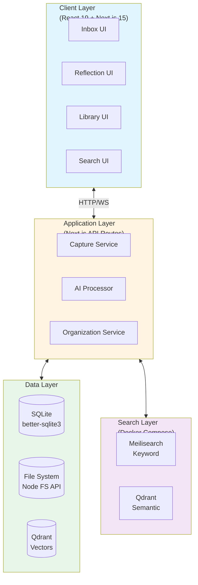
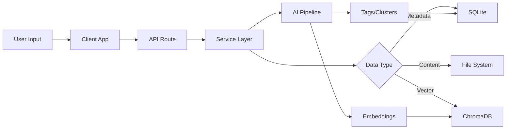
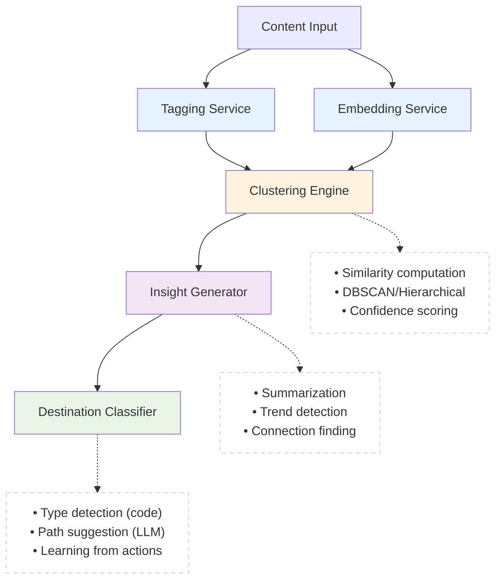

# Technical Design Document: MyLifeDB

**Version:** 2.0
**Last Updated:** 2025-01-11
**Status:** Current - Flat Data Structure with Items Architecture
**Owner:** Engineering Team

---

## Table of Contents

1. [Overview](#1-overview)
2. [Design Principles](#2-design-principles)
3. [System Architecture](#3-system-architecture)
4. [Technology Stack](#4-technology-stack)
5. [Data Models](#5-data-models)
6. [Database Design](#6-database-design)
7. [API Specifications](#7-api-specifications)
8. [Component Architecture](#8-component-architecture)
9. [AI/ML Pipeline](#9-aiml-pipeline)
10. [Search Implementation](#10-search-implementation)
11. [Security & Authentication](#11-security--authentication)
12. [Performance Optimization](#12-performance-optimization)
13. [Deployment Architecture](#13-deployment-architecture)
14. [Testing Strategy](#14-testing-strategy)
15. [Development Guidelines](#15-development-guidelines)

---

## 1. Overview

### 1.1 Purpose

This document provides technical specifications for implementing MyLifeDB, a personal knowledge management system. It covers architecture decisions, data models, APIs, and implementation details.

### 1.2 Scope

- **In Scope:** System architecture, database design, API contracts, component structure, AI pipeline
- **Out of Scope:** Product requirements, user stories, business logic (see [product-design.md](./product-design.md))

### 1.3 Audience

- Backend Engineers
- Frontend Engineers
- DevOps Engineers
- ML/AI Engineers

### 1.4 Related Documents

- [Product Requirements Document](./product-design.md)
- [API Documentation](./api-docs.md) *(to be created)*
- [Database Migration Guide](./db-migrations.md) *(to be created)*

---

## 2. Design Principles

### 2.1 Core Principles

1. **Library and inbox are the source of truth**
   - Plain folders and files on disk are authoritative
   - Database contains indexes and derived data only
   - Files can be accessed by any application

2. **Durability through simplicity**
   - No proprietary file formats
   - Direct file system access
   - Standard file organization

3. **Multi-app compatibility**
   - Other applications can read/write user folders
   - No vendor lock-in
   - Standard conventions (Markdown, JSON, etc.)

4. **Rebuildable application data**
   - `app/` folder can be deleted and rebuilt
   - Search indexes, crawl results, digests are all regenerated
   - Only source files (inbox + library) are irreplaceable

5. **Performance through smart caching**
   - File metadata cached in database for fast queries
   - Binary digests compressed in SQLAR
   - Hash-based change detection

### 2.2 Data Structure Philosophy

```
MY_DATA_DIR/
├── inbox/              # Source of truth: unprocessed items
├── notes/              # Source of truth: user library
├── journal/            # Source of truth: user library
├── work/               # Source of truth: user library
└── app/                # Rebuildable: application metadata
    └── mylifedb/
        └── database.sqlite
```

**Reserved folders**: `inbox`, `app`
**Everything else**: User library content (auto-indexed)

---

## 3. System Architecture

### 3.1 High-Level Architecture



### 3.2 Architecture Layers

1. **Offline-First:** Core functionality works without internet
2. **Local-First:** Data stored locally, cloud optional
3. **Modular Design:** Loosely coupled services
4. **API-Driven:** Clear separation between frontend and backend
5. **Progressive Enhancement:** Basic features work, AI enhances

### 3.3 Data Flow



---

## 3. Technology Stack

### 3.1 Frontend

| Technology | Version | Purpose |
|------------|---------|---------|
| **Next.js** | 15.5+ | React framework with App Router |
| **React** | 19+ | UI library with concurrent features |
| **TypeScript** | 5.7+ | Type safety |
| **Tailwind CSS** | 4.0+ | Styling framework |
| **Zustand** | 5.0+ | Global state management |
| **React Query** | 5.0+ | Server state management |
| **Zod** | 3.23+ | Schema validation |
| **date-fns** | 3.0+ | Date utilities |

### 3.2 Backend

| Technology | Version | Purpose |
|------------|---------|---------|
| **Next.js API Routes** | 15.5+ | Backend API |
| **better-sqlite3** | 11.0+ | SQLite database driver |
| **Drizzle ORM** | 0.30+ | Type-safe database ORM |
| **NextAuth.js** | 5.0+ | Authentication |
| **sharp** | 0.33+ | Image processing |
| **ffmpeg** | - | Audio/video processing |

### 3.3 AI/ML & Search

| Technology | Version | Purpose |
|------------|---------|---------|
| **OpenAI SDK** | 4.0+ | AI API client (optional) |
| **Ollama** | Latest | Local LLM runtime (optional) |
| **Meilisearch** | 1.5+ | Instant keyword search engine |
| **Qdrant** | 1.7+ | Vector database for semantic search |
| **transformers.js** | 3.0+ | In-browser ML models |
| **natural** | 6.0+ | NLP utilities |

### 3.4 Development Tools

| Tool | Purpose |
|------|---------|
| **ESLint** | Linting |
| **Prettier** | Code formatting |
| **Vitest** | Unit testing |
| **Playwright** | E2E testing |
| **TSX** | TypeScript execution |

### 3.5 Technology Decision Log

| Decision | Rationale |
|----------|-----------|
| **Next.js over Remix/Astro** | Best React ecosystem, mature App Router, RSC support |
| **SQLite over PostgreSQL** | Offline-first, zero-config, portable, perfect for local-first apps |
| **Drizzle over Prisma** | Lighter, better TypeScript inference, SQL-like syntax |
| **Zustand over Redux** | Simpler API, less boilerplate, sufficient for our needs |
| **Meilisearch + Qdrant over single solution** | Best of both: instant keyword + semantic search |
| **Qdrant over ChromaDB** | More mature, better Docker support, richer features |
| **better-sqlite3 over node-sqlite3** | Synchronous API, better performance, simpler code |

**Search Stack Decision Log:**
- **Considered sqlite-vss:** Simpler (in-process), but less mature and fewer features
- **Considered FTS5 only:** Fast keyword search, but no semantic capabilities
- **Decision:** Accept Docker Compose complexity for superior search experience
- **Trade-off:** Operational complexity vs. feature completeness

---

## 4. Data Models

### 4.1 Core Entities (TypeScript Interfaces)

#### Entry (Inbox Item)

```typescript
interface Entry {
  id: string;                    // UUID v4
  userId: string;                // User identifier
  content: string;               // Main content (markdown)
  contentType: 'text' | 'voice' | 'file' | 'link';
  metadata: EntryMetadata;
  tags: string[];                // AI-generated tags
  suggestedSpaces: string[];     // Suggested Space IDs
  embedding: number[];           // 1536-dim vector (OpenAI) or 384-dim (local)
  createdAt: Date;
  updatedAt: Date;
  isArchived: boolean;
  spaceIds: string[];            // Linked Space IDs (many-to-many)
}

interface EntryMetadata {
  title?: string;                // Optional user-provided title
  source: 'manual' | 'integration' | 'voice';
  fileUrl?: string;              // Relative path to file
  fileName?: string;
  mimeType?: string;
  fileSize?: number;             // Bytes
  transcription?: string;        // For voice entries
  duration?: number;             // For audio/video (seconds)
  originalUrl?: string;          // For link captures
  linkPreview?: {
    title?: string;
    description?: string;
    image?: string;
  };
}
```

#### Space (Library Container)

```typescript
interface Space {
  id: string;                    // UUID v4
  userId: string;
  title: string;
  description: string;
  coverImage?: string;           // Relative path
  metadata: SpaceMetadata;
  entryIds: string[];            // Linked Entry IDs (computed from junction table)
  relatedSpaceIds: string[];     // Cross-references
  insights: Insight[];           // Embedded insights
  principles: Principle[];       // Embedded principles
  createdAt: Date;
  updatedAt: Date;
  lastAccessedAt: Date;
  isArchived: boolean;
  source: 'ai_suggested' | 'manual' | 'merged';
}

interface SpaceMetadata {
  color?: string;                // Hex color
  icon?: string;                 // Emoji or icon name
  category?: string;             // User-defined category
  tags?: string[];               // User-defined tags
}
```

#### Cluster (AI Suggestion)

```typescript
interface Cluster {
  id: string;                    // UUID v4
  userId: string;
  entryIds: string[];
  suggestedTitle: string;
  confidence: number;            // 0-100
  keywords: string[];
  reasoning?: string;            // AI explanation (optional)
  createdAt: Date;
  status: 'pending' | 'accepted' | 'dismissed' | 'snoozed';
  snoozeUntil?: Date;
  resultingSpaceId?: string;     // If accepted
  dismissReason?: string;        // User feedback
}
```

#### Insight

```typescript
interface Insight {
  id: string;                    // UUID v4
  spaceId: string;
  content: string;               // AI-generated summary
  type: 'summary' | 'trend' | 'connection' | 'pattern';
  confidence: number;            // 0-100
  isPromoted: boolean;           // Promoted to Principle
  metadata?: {
    frequency?: Record<string, number>;  // Word frequencies
    timeRange?: { start: Date; end: Date };
    relatedEntryIds?: string[];
  };
  createdAt: Date;
}
```

#### Principle

```typescript
interface Principle {
  id: string;                    // UUID v4
  spaceId: string;
  content: string;               // User-confirmed truth
  sourceInsightId?: string;      // Origin insight
  sourceEntryIds: string[];      // Traceability
  notes?: string;                // User annotations
  createdAt: Date;
  updatedAt: Date;
}
```

### 4.2 Supporting Types

```typescript
// User Settings
interface UserSettings {
  userId: string;
  preferences: {
    theme: 'light' | 'dark' | 'auto';
    aiProvider: 'openai' | 'ollama' | 'none';
    defaultView: 'inbox' | 'library';
    weeklyDigest: boolean;
    digestDay: 0 | 1 | 2 | 3 | 4 | 5 | 6;  // 0 = Sunday
  };
  aiConfig?: {
    openaiApiKey?: string;
    ollamaModel?: string;
    embeddingModel?: string;
  };
  storageConfig?: {
    dataPath: string;
    backupPath?: string;
    autoBackup: boolean;
    maxFileSize: number;         // MB
  };
}

// Search Query
interface SearchQuery {
  query: string;
  filters?: {
    dateRange?: { start: Date; end: Date };
    contentTypes?: ('text' | 'voice' | 'file' | 'link')[];
    spaceIds?: string[];
    tags?: string[];
    minConfidence?: number;
    maxConfidence?: number;
  };
  sort?: 'relevance' | 'date' | 'title';
  limit?: number;
  offset?: number;
}

// Search Result
interface SearchResult {
  type: 'entry' | 'space';
  id: string;
  title: string;
  snippet: string;
  highlights: string[];          // Matched text fragments
  score: number;                 // Relevance score
  metadata: {
    createdAt: Date;
    tags?: string[];
    contentType?: string;
  };
}
```

---

## 5. Database Design

### 5.1 Core Schema (SQLite)

**Philosophy**: Database contains indexes and derived data. Source of truth is on disk.

```sql
-- Enable foreign keys
PRAGMA foreign_keys = ON;

-- Schema versioning (for migration tracking)
CREATE TABLE schema_version (
  version INTEGER PRIMARY KEY,
  applied_at DATETIME DEFAULT CURRENT_TIMESTAMP,
  description TEXT
);

-- Items: Unified model for inbox and library content
-- Replaces old 'inbox' and 'library' tables
CREATE TABLE items (
  -- Core identity
  id TEXT PRIMARY KEY,                    -- UUID
  name TEXT NOT NULL,                     -- Original filename or slug

  -- Type classification
  raw_type TEXT NOT NULL,                 -- What user submitted: 'text'|'image'|'audio'|'video'|'pdf'|'mixed'
  detected_type TEXT,                     -- What AI detected: 'url'|'note'|'todo'|'email'|etc.

  -- File system location
  is_folder INTEGER NOT NULL DEFAULT 0,   -- 0=single file, 1=folder
  path TEXT NOT NULL UNIQUE,              -- Relative path from MY_DATA_DIR
                                          -- Examples: 'inbox/photo.jpg' (uploaded file)
                                          --           'inbox/9a7f3e2c.md' (text-only, UUID initially)
                                          --           'inbox/uuid-123' (multi-file folder)
                                          --           'notes/meeting.md' (library item)

  -- File metadata (JSON array for performance)
  -- Schema: [{ name, size, type, hash?, modifiedAt? }]
  -- Small files (< 10MB): include SHA256 hash
  -- Large files: size only
  files TEXT,                             -- NULL for pending items

  -- Processing state
  status TEXT NOT NULL DEFAULT 'pending' CHECK(status IN ('pending', 'enriching', 'enriched', 'failed')),

  -- Metadata
  created_at TEXT NOT NULL,               -- ISO 8601
  updated_at TEXT NOT NULL,               -- ISO 8601
  schema_version INTEGER DEFAULT 1
);

CREATE INDEX idx_items_path_prefix ON items(path);
CREATE INDEX idx_items_detected_type ON items(detected_type);
CREATE INDEX idx_items_status ON items(status);
CREATE INDEX idx_items_raw_type ON items(raw_type);
CREATE INDEX idx_items_created_at ON items(created_at DESC);

-- Digests: AI-generated content (rebuildable)
-- Foreign table to items
CREATE TABLE digests (
  id TEXT PRIMARY KEY,                    -- UUID
  item_id TEXT NOT NULL,                  -- FK to items(id)
  digest_type TEXT NOT NULL,              -- 'summary'|'tags'|'slug'|'content-md'|'content-html'|'screenshot'
  status TEXT NOT NULL DEFAULT 'pending' CHECK(status IN ('pending', 'in_progress', 'completed', 'failed')),

  -- Text digests (stored directly)
  content TEXT,                           -- Summary text, tags JSON, slug JSON

  -- Binary digests (stored in SQLAR)
  sqlar_name TEXT,                        -- Filename in SQLAR table: '{item_id}/{digest_type}/filename'

  created_at TEXT NOT NULL,               -- ISO 8601
  updated_at TEXT NOT NULL,               -- ISO 8601

  FOREIGN KEY (item_id) REFERENCES items(id) ON DELETE CASCADE
);

CREATE INDEX idx_digests_item_id ON digests(item_id);
CREATE INDEX idx_digests_type ON digests(digest_type);
CREATE INDEX idx_digests_status ON digests(status);

-- SQLAR: SQLite Archive format for binary digests
-- Standard format: https://www.sqlite.org/sqlar.html
CREATE TABLE IF NOT EXISTS sqlar(
  name TEXT PRIMARY KEY,  -- File path: '{item_id}/{digest_type}/filename.ext'
  mode INT,               -- File permissions
  mtime INT,              -- Modification time (Unix timestamp)
  sz INT,                 -- Original size (before compression)
  data BLOB               -- Compressed content (zlib)
);

-- NOTE: Full-text search moved to Meilisearch (external service)
-- NOTE: Vector search moved to Qdrant (external service)
-- SQLite FTS5 removed per architecture decision (see section 4.5)

-- Spaces (Library)
CREATE TABLE spaces (
  id TEXT PRIMARY KEY,
  user_id TEXT NOT NULL,
  title TEXT NOT NULL,
  description TEXT,
  cover_image TEXT,
  metadata JSON,
  created_at INTEGER NOT NULL,
  updated_at INTEGER NOT NULL,
  last_accessed_at INTEGER NOT NULL,
  is_archived INTEGER DEFAULT 0,
  source TEXT NOT NULL CHECK(source IN ('ai_suggested', 'manual', 'merged')),
  FOREIGN KEY (user_id) REFERENCES users(id) ON DELETE CASCADE
);

CREATE INDEX idx_spaces_user_created ON spaces(user_id, created_at DESC);
CREATE INDEX idx_spaces_user_accessed ON spaces(user_id, last_accessed_at DESC);
CREATE INDEX idx_spaces_user_archived ON spaces(user_id, is_archived);

-- Entry-Space relationships (many-to-many)
CREATE TABLE entry_spaces (
  entry_id TEXT NOT NULL,
  space_id TEXT NOT NULL,
  added_at INTEGER NOT NULL,
  added_by TEXT CHECK(added_by IN ('user', 'ai')),
  PRIMARY KEY (entry_id, space_id),
  FOREIGN KEY (entry_id) REFERENCES inbox(id) ON DELETE CASCADE,
  FOREIGN KEY (space_id) REFERENCES spaces(id) ON DELETE CASCADE
);

CREATE INDEX idx_entry_spaces_space ON entry_spaces(space_id);

-- Space-Space relationships (cross-references)
CREATE TABLE space_relations (
  space_id_1 TEXT NOT NULL,
  space_id_2 TEXT NOT NULL,
  relation_type TEXT DEFAULT 'related',
  strength REAL DEFAULT 0.5,      -- 0-1
  created_at INTEGER NOT NULL,
  PRIMARY KEY (space_id_1, space_id_2),
  FOREIGN KEY (space_id_1) REFERENCES spaces(id) ON DELETE CASCADE,
  FOREIGN KEY (space_id_2) REFERENCES spaces(id) ON DELETE CASCADE,
  CHECK (space_id_1 < space_id_2) -- Prevent duplicates
);

-- Clusters (AI suggestions)
CREATE TABLE clusters (
  id TEXT PRIMARY KEY,
  user_id TEXT NOT NULL,
  entry_ids JSON NOT NULL,
  suggested_title TEXT NOT NULL,
  confidence REAL NOT NULL CHECK(confidence >= 0 AND confidence <= 100),
  keywords JSON,
  reasoning TEXT,
  created_at INTEGER NOT NULL,
  status TEXT NOT NULL CHECK(status IN ('pending', 'accepted', 'dismissed', 'snoozed')),
  snooze_until INTEGER,
  resulting_space_id TEXT,
  dismiss_reason TEXT,
  FOREIGN KEY (user_id) REFERENCES users(id) ON DELETE CASCADE,
  FOREIGN KEY (resulting_space_id) REFERENCES spaces(id) ON DELETE SET NULL
);

CREATE INDEX idx_clusters_user_status ON clusters(user_id, status);
CREATE INDEX idx_clusters_user_created ON clusters(user_id, created_at DESC);

-- Insights
CREATE TABLE insights (
  id TEXT PRIMARY KEY,
  space_id TEXT NOT NULL,
  content TEXT NOT NULL,
  type TEXT NOT NULL CHECK(type IN ('summary', 'trend', 'connection', 'pattern')),
  confidence REAL NOT NULL CHECK(confidence >= 0 AND confidence <= 100),
  is_promoted INTEGER DEFAULT 0,
  metadata JSON,
  created_at INTEGER NOT NULL,
  FOREIGN KEY (space_id) REFERENCES spaces(id) ON DELETE CASCADE
);

CREATE INDEX idx_insights_space ON insights(space_id, created_at DESC);
CREATE INDEX idx_insights_promoted ON insights(space_id, is_promoted);

-- Principles
CREATE TABLE principles (
  id TEXT PRIMARY KEY,
  space_id TEXT NOT NULL,
  content TEXT NOT NULL,
  source_insight_id TEXT,
  source_entry_ids JSON,
  notes TEXT,
  created_at INTEGER NOT NULL,
  updated_at INTEGER NOT NULL,
  FOREIGN KEY (space_id) REFERENCES spaces(id) ON DELETE CASCADE,
  FOREIGN KEY (source_insight_id) REFERENCES insights(id) ON DELETE SET NULL
);

CREATE INDEX idx_principles_space ON principles(space_id, created_at DESC);

-- Activity Log (for analytics/debugging)
CREATE TABLE activity_log (
  id INTEGER PRIMARY KEY AUTOINCREMENT,
  user_id TEXT NOT NULL,
  action TEXT NOT NULL,
  entity_type TEXT NOT NULL,
  entity_id TEXT,
  metadata JSON,
  created_at INTEGER NOT NULL,
  FOREIGN KEY (user_id) REFERENCES users(id) ON DELETE CASCADE
);

CREATE INDEX idx_activity_user_created ON activity_log(user_id, created_at DESC);
```

### 5.2 Drizzle ORM Schema

```typescript
// lib/db/schema.ts
import { sqliteTable, text, integer, real, blob, index } from 'drizzle-orm/sqlite-core';
import { relations } from 'drizzle-orm';

export const users = sqliteTable('users', {
  id: text('id').primaryKey(),
  email: text('email').notNull().unique(),
  passwordHash: text('password_hash'),
  name: text('name'),
  avatarUrl: text('avatar_url'),
  createdAt: integer('created_at', { mode: 'timestamp' }).notNull(),
  updatedAt: integer('updated_at', { mode: 'timestamp' }).notNull(),
  settings: text('settings', { mode: 'json' }).$type<UserSettings>(),
});

export const entries = sqliteTable('entries', {
  id: text('id').primaryKey(),
  userId: text('user_id').notNull().references(() => users.id, { onDelete: 'cascade' }),
  content: text('content').notNull(),
  contentType: text('content_type').notNull().$type<'text' | 'voice' | 'file' | 'link'>(),
  metadata: text('metadata', { mode: 'json' }).notNull().$type<EntryMetadata>(),
  tags: text('tags', { mode: 'json' }).$type<string[]>(),
  suggestedSpaces: text('suggested_spaces', { mode: 'json' }).$type<string[]>(),
  embedding: blob('embedding'),
  createdAt: integer('created_at', { mode: 'timestamp' }).notNull(),
  updatedAt: integer('updated_at', { mode: 'timestamp' }).notNull(),
  isArchived: integer('is_archived', { mode: 'boolean' }).default(false),
}, (table) => ({
  userCreatedIdx: index('idx_entries_user_created').on(table.userId, table.createdAt),
  userArchivedIdx: index('idx_entries_user_archived').on(table.userId, table.isArchived),
}));

export const spaces = sqliteTable('spaces', {
  id: text('id').primaryKey(),
  userId: text('user_id').notNull().references(() => users.id, { onDelete: 'cascade' }),
  title: text('title').notNull(),
  description: text('description'),
  coverImage: text('cover_image'),
  metadata: text('metadata', { mode: 'json' }).$type<SpaceMetadata>(),
  createdAt: integer('created_at', { mode: 'timestamp' }).notNull(),
  updatedAt: integer('updated_at', { mode: 'timestamp' }).notNull(),
  lastAccessedAt: integer('last_accessed_at', { mode: 'timestamp' }).notNull(),
  isArchived: integer('is_archived', { mode: 'boolean' }).default(false),
  source: text('source').notNull().$type<'ai_suggested' | 'manual' | 'merged'>(),
}, (table) => ({
  userCreatedIdx: index('idx_spaces_user_created').on(table.userId, table.createdAt),
  userAccessedIdx: index('idx_spaces_user_accessed').on(table.userId, table.lastAccessedAt),
}));

export const entrySpaces = sqliteTable('entry_spaces', {
  entryId: text('entry_id').notNull().references(() => entries.id, { onDelete: 'cascade' }),
  spaceId: text('space_id').notNull().references(() => spaces.id, { onDelete: 'cascade' }),
  addedAt: integer('added_at', { mode: 'timestamp' }).notNull(),
  addedBy: text('added_by').$type<'user' | 'ai'>(),
}, (table) => ({
  pk: { columns: [table.entryId, table.spaceId] },
  spaceIdx: index('idx_entry_spaces_space').on(table.spaceId),
}));

// Relations
export const usersRelations = relations(users, ({ many }) => ({
  entries: many(entries),
  spaces: many(spaces),
}));

export const entriesRelations = relations(entries, ({ one, many }) => ({
  user: one(users, {
    fields: [entries.userId],
    references: [users.id],
  }),
  spaces: many(entrySpaces),
}));

export const spacesRelations = relations(spaces, ({ one, many }) => ({
  user: one(users, {
    fields: [spaces.userId],
    references: [users.id],
  }),
  entries: many(entrySpaces),
  insights: many(insights),
  principles: many(principles),
}));
```

### 5.3 File Storage Structure

**Philosophy:** Flat, user-friendly structure with clear separation of source files and app data.

```
MY_DATA_DIR/
├── inbox/              # Unprocessed items (source of truth)
│   ├── photo.jpg       # Single file item - uploaded file keeps original name
│   ├── document.pdf    # Single file item - uploaded file keeps original name
│   ├── 9a7f3e2c.md     # Single text-only item - uses UUID, optionally renamed to slug
│   └── article-uuid/   # Multi-file item - folder uses UUID, optionally renamed to slug
│       ├── text.md     # User's text input
│       ├── audio.mp3   # User's uploaded file
│       └── photo.jpg   # Another user file
├── notes/              # User library folder (source of truth)
│   ├── meeting-notes.md
│   └── project-ideas.md
├── journal/            # User library folder (source of truth)
│   └── 2025-01-11.md
├── work/               # User library folder (source of truth)
│   └── quarterly-review.pdf
└── app/                # Application data (rebuildable)
    └── mylifedb/
        └── database.sqlite  # Contains items index, digests (inc. SQLAR), tasks
```

**Reserved folders**: `inbox`, `app`
**Everything else**: User library content (auto-indexed by scanner)

### 5.4 Technical Decisions & Rationale

#### Decision 1: `app/` vs `.app/`

**Chosen:** `app/` (visible folder)

**Rationale:**
- **Visibility:** Users can easily see and understand what it is
- **Generality:** Standard convention, no special meaning
- **Multi-app:** Other apps can use `app/appname/` pattern
- **Transparency:** Users know where app data lives

**Alternative considered:** `.app/` (hidden folder)
- **Pros:** Protected from accidental deletion, cleaner root
- **Cons:** Hidden = mysterious, against transparency principle
- **Decision:** Rejected - we prioritize transparency and user understanding

#### Decision 2: Inbox Location - Root vs Nested

**Chosen:** `data/inbox/` (flat, at root)

**Rationale:**
- **User-friendly:** Clear, obvious location
- **Direct access:** No nested navigation required
- **Multi-app compatible:** Other apps can read/write inbox
- **Principle alignment:** Source of truth should be easily accessible

**Alternative considered:** `data/app/mylifedb/inbox/`
- **Pros:** Keeps app concepts contained
- **Cons:** Nested structure, harder to access, clutters principle
- **Decision:** Rejected - inbox is user content, not app infrastructure

#### Decision 3: Single File Items - Folder vs Direct

**Chosen:** Direct file (e.g., `inbox/photo.jpg`)

**Rationale:**
- **Simplicity:** No unnecessary folder wrapper
- **Performance:** Fewer file system operations
- **User-friendly:** Natural organization, matches file manager behavior
- **Storage efficiency:** No empty folder overhead

**File naming patterns:**
- **Single file with natural name** (uploaded file): Keep original name (e.g., `inbox/photo.jpg`)
- **Single text-only item**: Use UUID initially (`inbox/{uuid}.md`), optionally rename to slug after digest (`inbox/{slug}.md`)
- **Multi-file items**: Use folder (`inbox/{uuid}/` → `inbox/{slug}/`)
  - UUID initially for stable ID
  - Optionally renamed to slug after AI generation for human readability

#### Decision 4: Digests Storage - Files vs Database

**Chosen:** Database with SQLAR for binary content

**Rationale:**
- **Rebuildable principle:** Digests can be regenerated from source files
- **Clean file system:** No `digest/` folders cluttering user content
- **Performance:** Database queries faster than file system scans
- **Compression:** SQLAR provides automatic zlib compression
- **Atomic operations:** Database transactions ensure consistency

**Alternative considered:** `digest/` subfolder in each item
- **Pros:** Files directly accessible, simple model
- **Cons:** Clutters user content, violates rebuildable principle
- **Decision:** Rejected - digests are app data, not source files

#### Decision 5: SQLAR vs Direct BLOB

**Chosen:** SQLAR (SQLite Archive format)

**Rationale:**
- **Standard format:** Well-documented, tooling available
- **Compression:** Built-in zlib compression saves space
- **Extraction:** Standard SQLite tools can extract files
- **Versioning:** Clear naming scheme `{item_id}/{digest_type}/filename`
- **Migration-friendly:** Easy to export/import

**Alternative considered:** Direct BLOB in `digests.content`
- **Pros:** Simpler queries, no extra table
- **Cons:** No compression, larger database, no standard tooling
- **Decision:** Rejected - SQLAR benefits outweigh complexity

#### Decision 6: Files Field - Store vs Derive

**Chosen:** Store file metadata in `items.files` JSON field

**Rationale:**
- **Performance:** No file system access for listing
- **Self-contained:** Database has complete picture
- **Change detection:** Hash comparison without reading files
- **Query capability:** Can filter items by file count, size, type

**Alternative considered:** Always derive from file system
- **Pros:** Single source of truth on disk
- **Cons:** Slow, requires file system access for every query
- **Decision:** Rejected - performance is critical

**Implementation:**
- Small files (< 10MB): Store SHA256 hash
- Large files: Store only size
- Purpose: Change detection and deduplication

### 5.4 Inbox Implementation Details

**Design Decisions:**

1. **Separate User Input vs Processed Output**
   - **Decision:** Track user files and enriched files separately in database
   - **Why:** Clear separation of concerns (original vs generated), easy to identify which files to preserve vs regenerate
   - **User files:**
     - Text input: `text.md`
     - Attachments: original filenames (`photo.jpg`, `document.pdf`)
     - **NEVER renamed or modified** - user files are sacred
     - Stored in `user_files` JSON array
   - **Processed files:**
     - Simple, descriptive names stored under `/digest`: `digest/content.md`, `digest/content.html`, `digest/screenshot.png`
     - Stored in `processed_files` JSON array with explicit filenames
     - **NOT** determined by convention - always check DB for actual filenames
     - **Conflict resolution:** If enriched filename conflicts with user file, apply macOS-style deduplication (e.g., `summary.md` → `summary 2.md`)
   - **Alt:** Underscore prefix for processed files - rejected (unnecessary complexity, harder to read)
   - **Alt:** Single files array - rejected (can't distinguish user vs generated content)

2. **UUID → Slug Workflow**
   - **Decision:** Folders initially named with UUID; slug rename happens as a separate manual step (not automatic on crawl)
   - **Why:** Stable ID (UUID never changes), human-readable names (slug), clean separation once confirmed
   - **Alt:** Slug-only - rejected (slug collisions, can't identify before processing)

3. **File Deduplication Strategy (macOS-style)**
   - **Decision:** Space + number suffix pattern (`photo.jpg` → `photo 2.jpg`)
   - **Why:** Familiar to users, simple logic, preserves extensions
   - **Applied to:**
     - User files when multiple uploads have same name
     - Processed files when they conflict with user files (user files have priority)
   - **Example:** User has `summary.md` attachment → generated summary becomes `summary 2.md`
   - **Alt:** Hash suffixes - rejected (cryptic names), Timestamps - rejected (too long)

4. **Schema Versioning**
   - **Decision:** Track `schema_version` in both inbox and library tables
   - **Why:** Graceful evolution, detect outdated metadata, enable re-processing
   - **Implementation:** Version in DB column, schemas in metadata_schemas registry
   - **User Experience:** Badge shows outdated items, "Re-process" button upgrades

**Enrichment Features:**

| Feature | Status | User Input | Processed Output |
|---------|--------|------------|------------------|
| **URL Crawling** | In Progress | `text.md` (URL text) | `digest/content.md`, `digest/content.html`, `digest/screenshot.png` |
| **Image Captioning** | Planned | `photo.jpg` (original) | `caption.md` |
| **OCR Extraction** | Planned | `document.jpg` (scan) | `ocr.md` |
| **Audio Transcription** | Planned | `recording.mp3` (original) | `transcript.md` |
| **PDF Parsing** | Planned | `document.pdf` (original) | `extracted.md` |

**Key Principles:**
- **User input files:** Always preserve originals with original filenames, NEVER rename or modify
- **Processed files:** Simple, descriptive names stored explicitly in DB
- **Conflict resolution:** User files have priority; processed files get deduplicated if needed
- **No prefix convention:** Database tracking makes prefixes unnecessary

**Archive Design:**

1. **Column vs Separate Table**
   - **Decision:** Use `is_archived` column in inbox table (NOT separate archive table)
   - **Why:**
     - Simpler: single table, single query
     - Consistent with library/spaces tables
     - Easier to unarchive (just flip boolean)
     - Good enough for expected scale (inbox is temporary)
   - **Alt:** Separate archive table - rejected (complexity, data migration overhead)

2. **Filesystem Handling**
   - **Decision:** Move files to `archive/` directory, update `folder_name` in DB
   - **Why:** Clear visual separation, clean inbox directory
   - **Implementation:** `folder_name` becomes `archive/{uuid}` or `archive/{slug}`
   - **Alt:** Keep files in inbox/ - rejected (confusing folder structure)

3. **Manual Cleanup**
   - **Decision:** Let user clean up archives manually
   - **Why:** User controls data retention, no surprise deletions
   - **Future:** Optional auto-cleanup job with user-configurable retention period

4. **De-indexing**
   - **Decision:** Queue async de-index task (don't block archive operation)
   - **Why:** External services can fail, shouldn't block user action
   - **Implementation:** Task queue handles retry with exponential backoff
   - **See:** Section 5.5 for task queue details

### 5.5 Task Queue Architecture

**Problem Statement:**

Traditional single `status` field is insufficient because:
- Multiple independent processes run on same item (search index, face detection, AI enrichment, etc.)
- Each external service can fail independently
- Need to retry failures without affecting other processes
- External services (Meilisearch, Qdrant, AI APIs) are unreliable

**Design Decision: Task-Based Enrichment**

Instead of boolean flags (`is_search_indexed`, `has_faces_detected`, etc.), use a general-purpose task queue to track all async/external operations.

**Architecture:**

```
┌─────────────────────┐
│  Application Logic  │
│  - Enqueue tasks    │
│  - Define handlers  │
└──────────┬──────────┘
           │
           ▼
┌─────────────────────┐
│  Task Queue (lib)   │
│  - Scheduling       │
│  - Retry logic      │
│  - Persistence      │
└──────────┬──────────┘
           │
           ▼
┌─────────────────────┐
│  SQLite (tasks)     │
│  - Pending          │
│  - Processing       │
│  - Completed/Failed │
└─────────────────────┘
```

**Task Queue Schema:**

```sql
CREATE TABLE tasks (
  -- Identity
  id TEXT PRIMARY KEY,
  type TEXT NOT NULL,                     -- e.g., 'search_index', 'face_detection'

  -- Payload (application-defined JSON)
  payload TEXT NOT NULL,

  -- Status
  status TEXT NOT NULL DEFAULT 'pending'
    CHECK(status IN ('pending', 'enriching', 'enriched', 'failed', 'cancelled')),

  -- Execution tracking
  attempts INTEGER DEFAULT 0,
  max_attempts INTEGER DEFAULT 3,
  last_attempt_at TEXT,
  next_retry_at TEXT,                     -- Exponential backoff

  -- Results
  result TEXT,                            -- Success result (JSON)
  error TEXT,                             -- Failure error message

  -- Scheduling
  priority INTEGER DEFAULT 5              -- 1=highest, 10=lowest
    CHECK(priority >= 1 AND priority <= 10),
  run_after TEXT,                         -- Schedule for future

  -- Timestamps
  created_at TEXT NOT NULL,
  updated_at TEXT NOT NULL,
  completed_at TEXT
);

CREATE INDEX idx_tasks_pending ON tasks(status, priority, next_retry_at)
  WHERE status IN ('pending', 'failed');
CREATE INDEX idx_tasks_type ON tasks(type, status);
```

**Hybrid Approach: Cached Flags + Task Queue**

Combine fast queries (cached flags) with detailed tracking (task queue):

```sql
-- Inbox table: Cached flags for UI performance (see schema in section 5.3)
-- - is_search_indexed: Fast query for "ready to search" items
-- - is_archived: Fast query for active vs archived filtering

-- Task queue: Detailed execution state (see schema above)
-- - Tracks attempts, errors, retry timing
-- - Enables monitoring and manual retry
```

**Task Types:**

| Task Type | Priority | External Service | Retry Strategy |
|-----------|----------|------------------|----------------|
| `search_index` | High (3) | Meilisearch/Qdrant | 5 attempts, exp. backoff |
| `search_deindex` | High (1) | Meilisearch/Qdrant | 5 attempts, exp. backoff |
| `ai_slug_generation` | High (3) | LLM API | 3 attempts |
| `url_crawl` | High (3) | Playwright | 3 attempts |
| `image_caption` | Medium (5) | Vision API | 3 attempts |
| `face_detection` | Medium (5) | Face API | 3 attempts |
| `place_detection` | Medium (6) | Location API | 3 attempts |
| `audio_transcription` | Medium (5) | Whisper API | 3 attempts |
| `ai_summary` | Low (7) | LLM API | 3 attempts |

**Example Flow: Archive Item**

```typescript
async function archiveInboxItem(id: string) {
  const db = getDatabase();
  const queue = getTaskQueue();

  db.transaction(() => {
    // 1. Update database
    db.run(`UPDATE inbox SET is_archived = 1, archived_at = datetime('now') WHERE id = ?`, [id]);

    // 2. Move files
    const item = getInboxItemById(id);
    fs.renameSync(
      path.join(INBOX_DIR, item.folderName),
      path.join(ARCHIVE_DIR, item.folderName)
    );
    db.run(`UPDATE inbox SET folder_name = ? WHERE id = ?`, [`archive/${item.folderName}`, id]);

    // 3. Queue de-index task (async, can fail, will retry)
    if (item.isSearchIndexed) {
      queue.enqueue('search_deindex', { itemId: id }, {
        priority: 1,  // High priority
        maxAttempts: 5
      });
    }
  })();

  // Task worker processes de-index task asynchronously
}
```

**Retry Strategy:**

Exponential backoff with jitter:
```
Attempt 1: Fail → Retry in ~10s
Attempt 2: Fail → Retry in ~1min
Attempt 3: Fail → Retry in ~10min
Attempt 4: Fail → Retry in ~1hr
Attempt 5+: Fail → Retry in ~6hr (capped)
```

**Benefits:**

1. ✅ **Decoupled**: Archive succeeds even if de-index fails
2. ✅ **Resilient**: Auto-retry with backoff
3. ✅ **Observable**: Can query task status
4. ✅ **Maintainable**: Add new task types without schema changes
5. ✅ **Testable**: Disable worker for synchronous tests

**Trade-offs:**

| Aspect | Boolean Flags | Task Queue | Decision |
|--------|---------------|------------|----------|
| Query speed | ✅ Fast (indexed column) | ⚠️ Requires JOIN | Hybrid (cache + queue) |
| Retry logic | ❌ Manual | ✅ Built-in | Task queue |
| Error tracking | ❌ Lost | ✅ Preserved | Task queue |
| Complexity | ✅ Simple | ⚠️ More moving parts | Worth it |

**Implementation:**

See `src/lib/task-queue/` for application-agnostic task queue library.

### 5.6 File System Indexing

**Full directory/file index for semantic search across all content**

```sql
-- Library: Index all files (mylifedb-managed AND user-added)
-- Renamed from 'indexed_files' for clarity
CREATE TABLE library (
  -- Core identity
  id TEXT PRIMARY KEY,                    -- UUID (permanent, stable identifier)
  path TEXT NOT NULL UNIQUE,              -- Relative from MY_DATA_DIR (can change if user moves)

  -- File attributes
  file_name TEXT NOT NULL,
  is_folder BOOLEAN NOT NULL,
  file_size INTEGER,                      -- NULL for folders
  modified_at DATETIME NOT NULL,
  content_hash TEXT,                      -- Only for text files (performance)

  -- Content classification
  content_type TEXT,                      -- 'url' | 'text' | 'image' | 'pdf' | 'audio' | 'video'
  searchable_text TEXT,                   -- Extracted content for search engines

  -- Enrichment (JSON, extensible for schema evolution)
  -- Schema: { caption, ocr, summary, tags, faces, entities, etc. }
  enrichment JSON,

  -- Metadata versioning (for schema evolution detection)
  schema_version INTEGER DEFAULT 1,

  -- Timestamps
  indexed_at DATETIME DEFAULT CURRENT_TIMESTAMP,
  enriched_at DATETIME
);

CREATE INDEX idx_library_path_prefix ON library(path);
CREATE INDEX idx_library_modified ON library(modified_at);
CREATE INDEX idx_library_content_type ON library(content_type);
CREATE INDEX idx_library_schema_version ON library(schema_version);

-- Metadata schema registry (track expected schemas for validation)
CREATE TABLE metadata_schemas (
  version INTEGER PRIMARY KEY,
  table_name TEXT NOT NULL,               -- 'inbox' | 'library'
  field_name TEXT NOT NULL,               -- 'user_files' | 'processed_files' | 'enrichment'
  schema_json TEXT NOT NULL,              -- JSON Schema definition
  created_at DATETIME DEFAULT CURRENT_TIMESTAMP,
  UNIQUE(table_name, field_name, version)
);

-- Example: Register initial schemas
INSERT INTO metadata_schemas (version, table_name, field_name, schema_json) VALUES
(1, 'inbox', 'user_files', '{
  "type": "array",
  "items": {
    "type": "object",
    "required": ["filename", "size", "mimeType", "type"],
    "properties": {
      "filename": {"type": "string"},
      "size": {"type": "integer"},
      "mimeType": {"type": "string"},
      "type": {"type": "string", "enum": ["text", "image", "audio", "video", "pdf", "other"]},
      "hash": {"type": "string"}
    }
  }
}'),
(1, 'inbox', 'processed_files', '{
  "type": "array",
  "items": {
    "type": "object",
    "required": ["filename", "size", "mimeType", "type", "purpose"],
    "properties": {
      "filename": {"type": "string"},
      "size": {"type": "integer"},
      "mimeType": {"type": "string"},
      "type": {"type": "string", "enum": ["html", "image", "markdown", "text", "other"]},
      "purpose": {"type": "string", "description": "What this enriched file represents"}
    }
  }
}'),
(1, 'library', 'enrichment', '{
  "type": "object",
  "properties": {
    "caption": {"type": "string"},
    "ocr": {"type": "string"},
    "summary": {"type": "string"},
    "tags": {"type": "array", "items": {"type": "string"}},
    "faces": {"type": "array"}
  }
}');
```

### 5.7 Schema Evolution Strategy

**Design Principle:** App should gracefully handle old data schemas and provide smooth upgrades

**Core Requirements:**
1. ✅ **Backward compatible:** App doesn't break when reading old schema data
2. ✅ **Detectable:** App highlights when metadata schema doesn't match current version
3. ✅ **Re-processable:** User can trigger re-processing to upgrade to latest schema
4. ✅ **Auto-migration:** Database table changes migrate automatically on app startup

**Implementation:**

```typescript
// 1. Schema Version Detection
export async function detectSchemaVersion(
  table: 'inbox' | 'library',
  record: any
): Promise<{
  currentVersion: number;
  expectedVersion: number;
  isOutdated: boolean;
  changes: string[];
}> {
  const currentVersion = record.schema_version || 1;
  const expectedVersion = await getLatestSchemaVersion(table);

  if (currentVersion === expectedVersion) {
    return { currentVersion, expectedVersion, isOutdated: false, changes: [] };
  }

  // Validate against expected schema
  const expectedSchema = await db.get(
    'SELECT schema_json FROM metadata_schemas WHERE table_name = ? AND version = ?',
    [table, expectedVersion]
  );

  const ajv = new Ajv();
  const validate = ajv.compile(JSON.parse(expectedSchema.schema_json));

  const fieldData = table === 'inbox' ? record.files : record.enrichment;
  const isValid = validate(fieldData);
  const changes = isValid ? [] : (validate.errors || []).map(e => e.message);

  return {
    currentVersion,
    expectedVersion,
    isOutdated: true,
    changes
  };
}

// 2. Re-process to Latest Schema
export async function migrateRecord(
  table: 'inbox' | 'library',
  id: string
): Promise<void> {
  const record = await db.get(`SELECT * FROM ${table} WHERE id = ?`, [id]);

  // Get raw files (always preserved)
  const rawFiles = JSON.parse(record.files || '[]');

  // Re-process with latest enrichment pipeline
  const enrichedFiles = await enrichFiles(rawFiles);

  // Update to latest schema
  const latestVersion = await getLatestSchemaVersion(table);
  await db.run(
    `UPDATE ${table}
     SET files = ?, schema_version = ?, updated_at = CURRENT_TIMESTAMP
     WHERE id = ?`,
    [JSON.stringify(enrichedFiles), latestVersion, id]
  );
}

// 3. Automatic Database Migrations
export async function runMigrations() {
  const currentVersion = await db.get(
    'SELECT MAX(version) as version FROM schema_version'
  );

  const pendingMigrations = migrations.filter(
    m => m.version > (currentVersion?.version || 0)
  );

  for (const migration of pendingMigrations) {
    console.log(`Running migration ${migration.version}: ${migration.description}`);
    await migration.up(db);
    await db.run(
      'INSERT INTO schema_version (version, description) VALUES (?, ?)',
      [migration.version, migration.description]
    );
  }
}

// Example migration
export const migrations = [
  {
    version: 2,
    description: 'Add face recognition metadata to library enrichment',
    async up(db) {
      // Update metadata schema
      await db.run(`
        INSERT INTO metadata_schemas (version, table_name, field_name, schema_json)
        VALUES (2, 'library', 'enrichment', '{ ... new schema with faces ... }')
      `);

      // No need to update existing data - backward compatible
      // Users can re-process manually to get new enrichment
    }
  }
];
```

**UI Components:**

```typescript
// components/SchemaVersionBadge.tsx
export function SchemaVersionBadge({ record }: { record: InboxItem | LibraryFile }) {
  const { isOutdated, changes, currentVersion, expectedVersion } =
    await detectSchemaVersion(record.table, record);

  if (!isOutdated) return null;

  return (
    <div className="flex items-center gap-2">
      <Badge variant="warning">
        Schema v{currentVersion} (latest: v{expectedVersion})
      </Badge>
      <Button
        size="sm"
        onClick={() => migrateRecord(record.table, record.id)}
      >
        Re-process
      </Button>
      {changes.length > 0 && (
        <Tooltip content={`Missing: ${changes.join(', ')}`}>
          <InfoIcon />
        </Tooltip>
      )}
    </div>
  );
}
```

**Sync Strategy: Hybrid Approach**

```typescript
// 1. Real-time: fs.watch() for file system changes
const watcher = fs.watch(MY_DATA_DIR, { recursive: true });
watcher.on('change', async (eventType, filename) => {
  await indexFile(filename);  // Update index
});

// 2. Startup: Light reconciliation scan
async function reconcileIndex() {
  // Only check: which indexed files no longer exist?
  const indexed = await db.all('SELECT path, modified_at FROM library');

  for (const file of indexed) {
    const stats = await fs.stat(join(MY_DATA_DIR, file.path)).catch(() => null);
    if (!stats) {
      await db.run('DELETE FROM library WHERE path = ?', [file.path]);
    }
  }
}

// 3. Full scan: On-demand only (user triggers)
async function fullScan() {
  for await (const file of walkDirectory(MY_DATA_DIR)) {
    const existing = await db.get('SELECT modified_at FROM library WHERE path = ?', [file.path]);

    if (!existing || existing.modified_at < file.modifiedAt) {
      await indexFile(file);  // Changed or new
    }
  }
}
```

**Change Detection Strategy:**

| File Type | Detection Method | Reason |
|-----------|------------------|--------|
| **Text files** | `mtime + size + hash` | Content often changes without size change (edit word) |
| **Binary files** | `mtime + size` only | Hashing large files too expensive; size change = content changed |
| **Folders** | `mtime` only | Track folder itself, files handled separately |

**Performance Characteristics:**

| Operation | Speed | Notes |
|-----------|-------|-------|
| File system watch event | ~1ms | Real-time, incremental |
| Startup reconciliation (10k files) | ~200-500ms | Just checks existence |
| Full scan (10k files) | ~500ms-1s | Only checks timestamps |
| Text file hash | ~1-5ms | Fast, small files |
| Binary file hash | Skip | Too expensive (images: MB-GB) |

**Why Full Index (Not Minimal):**

- **Semantic search requirement:** Must search all content, not just app-managed
- **Multi-app scenario:** Discovers files added by other apps
- **Performance acceptable:** Modern SSDs handle 10k files in <1s
- **User expectation:** "Search everything" = everything in MY_DATA_DIR

**Alternatives Considered:**

| Approach | Pros | Cons | Decision |
|----------|------|------|----------|
| **Minimal index (mylifedb-only)** | Simple, fast | Semantic search misses user content | ❌ Rejected |
| **On-demand scan (no index)** | Always in sync | Slow queries | ❌ Rejected |
| **Hash all files** | Perfect change detection | Too slow for binaries | ⚠️ Partial (text only) |
| **Cached folder sizes** | Fast folder stats | Complex invalidation | ❌ Rejected (on-demand fine) |
| **Hybrid (chosen)** | Best balance | Some complexity | ✅ Chosen |

### 5.8 URL Crawl Implementation

**End-to-End Flow:**

```typescript
// 1. User adds URL
async function addUrl(url: string, userId: string) {
  const entryId = uuid();
  const folderName = entryId;
  const inboxPath = `app/mylifedb/inbox/${folderName}`;

  // Create staging directory
  await fs.mkdir(join(MY_DATA_DIR, inboxPath), { recursive: true });

  // Save user input as text.md with the URL
  await fs.writeFile(join(MY_DATA_DIR, inboxPath, 'text.md'), url);

  // Save to database
  await db.run(`
    INSERT INTO inbox (id, folder_name, type, user_files, status, created_at, updated_at)
    VALUES (?, ?, 'url', ?, 'pending', datetime('now'), datetime('now'))
  `, [entryId, folderName, JSON.stringify([{
    filename: 'text.md',
    size: Buffer.byteLength(url),
    mimeType: 'text/markdown',
    type: 'text',
    hash: hashContent(url)
  }])]);

  // Queue for background processing
  await jobQueue.add('crawl-url', { entryId });

  return { entryId, inboxPath };
}

// 2. Background: Crawl & Process
async function crawlUrl(entryId: string) {
  const entry = await db.get('SELECT * FROM inbox WHERE id = ?', [entryId]);
  const inboxPath = `app/mylifedb/inbox/${entry.folder_name}`;

  // Read URL from user's text.md
  const url = await fs.readFile(join(MY_DATA_DIR, inboxPath, 'text.md'), 'utf-8');

  try {
    const { html, markdown, screenshotBase64 } = await haidClient.webCrawl({
      url,
      screenshot: true,
    });

    if (!html && !markdown) {
      throw new Error('HAID returned empty content');
    }

    const digestPath = join(MY_DATA_DIR, inboxPath, 'digest');
    await fs.rm(digestPath, { recursive: true, force: true });
    await fs.mkdir(digestPath, { recursive: true });

    if (html) {
      await fs.writeFile(join(MY_DATA_DIR, inboxPath, 'digest/content.html'), html);
    }
    if (markdown) {
      await fs.writeFile(join(MY_DATA_DIR, inboxPath, 'digest/content.md'), markdown);
    }
    if (screenshotBase64) {
      const screenshotBuffer = Buffer.from(screenshotBase64, 'base64');
      await fs.writeFile(join(MY_DATA_DIR, inboxPath, 'digest/screenshot.png'), screenshotBuffer);
    }

    await db.run(`
      UPDATE inbox
      SET status = 'enriched',
          error = NULL,
          updated_at = datetime('now')
      WHERE id = ?
    `, [entryId]);
  } catch (error) {
    await db.run(`
      UPDATE inbox
      SET status = 'failed',
          error = ?,
          updated_at = datetime('now')
      WHERE id = ?
    `, [String(error), entryId]);
    throw error;
  }
}

// 3. User Settlement: Manual Export
// User action: Copy app/mylifedb/inbox/understanding-react-hooks/ to library root
// No code needed - pure file operation

// 4. Learning: Detect user's organization
async function learnFromUserMove(oldPath: string, newPath: string) {
  // Detect: user moved inbox/understanding-react-hooks → dev/react/understanding-react-hooks

  const entry = await db.get(`SELECT * FROM entries WHERE inbox_path LIKE ?`, `%${basename(oldPath)}%`);
  if (!entry) return;  // Not our entry

  const destination = dirname(newPath);  // "dev/react"

  // Extract signals
  const metadata = JSON.parse(entry.metadata || '{}');
  const url = metadata.url || '';
  const domain = url ? new URL(url).hostname : null;
  const keywords = extractKeywords(metadata.title || '');

  // Update learned patterns
  if (domain) {
    await db.run(`
      INSERT INTO learned_patterns (pattern_type, pattern_value, target_path, confidence, sample_count)
      VALUES ('domain', ?, ?, 0.5, 1)
      ON CONFLICT (pattern_type, pattern_value, target_path)
      DO UPDATE SET
        confidence = MIN(confidence + 0.2, 1.0),
        sample_count = sample_count + 1
    `, [domain, destination]);
  }

  for (const keyword of keywords.slice(0, 5)) {
    await db.run(`
      INSERT INTO learned_patterns (pattern_type, pattern_value, target_path, confidence, sample_count)
      VALUES ('keyword', ?, ?, 0.3, 1)
      ON CONFLICT (pattern_type, pattern_value, target_path)
      DO UPDATE SET confidence = MIN(confidence + 0.1, 1.0), sample_count = sample_count + 1
    `, [keyword, destination]);
  }

  // Mark entry as settled
  await db.run(`UPDATE entries SET status = 'settled', library_path = ? WHERE id = ?`, [newPath, entry.id]);
}
```

**Crawling Libraries:**

| Library | Purpose | Notes |
|---------|---------|-------|
| **Playwright** | Full browser automation | Best for JS-heavy sites, screenshots |
| **Cheerio** | HTML parsing | Fast for static sites |
| **Readability** | Article extraction | Mozilla's algorithm |
| **Turndown** | HTML → Markdown | Clean conversion |

### 5.9 Search Index Tracking (Meilisearch)

Local SQLite remains the source of truth for what was crawled, while Meilisearch acts as a read-optimized replica. We therefore keep explicit metadata describing every document that should exist in Meilisearch so we can reconcile, retry, or re-ingest deterministically.

#### 5.9.1 SQLite tables

1. `search_documents` — one row per Meilisearch document (post-chunking). Tracks provenance, hashes, and the latest indexing status.

```sql
CREATE TABLE search_documents (
  document_id TEXT PRIMARY KEY,                 -- entryId:variant:chunkIndex
  entry_id TEXT NOT NULL,                       -- inbox/library entry that produced this chunk
  library_id TEXT,                              -- nullable until the item settles in the library
  source_url TEXT NOT NULL,
  source_path TEXT NOT NULL,                    -- relative path to digest/content.md etc.
  variant TEXT NOT NULL CHECK(
    variant IN ('url-content-md', 'url-content-html', 'url-summary')
  ),
  chunk_index INTEGER NOT NULL DEFAULT 0,
  chunk_count INTEGER NOT NULL DEFAULT 1,
  content_hash TEXT NOT NULL,                   -- sha256(text + metadata snapshot)
  word_count INTEGER NOT NULL,
  token_count INTEGER NOT NULL,
  meili_status TEXT NOT NULL CHECK(
    meili_status IN ('pending', 'indexing', 'indexed', 'deleting', 'deleted', 'error')
  ),
  last_indexed_at DATETIME,
  last_deindexed_at DATETIME,
  last_error TEXT,
  created_at DATETIME NOT NULL DEFAULT CURRENT_TIMESTAMP,
  updated_at DATETIME NOT NULL DEFAULT CURRENT_TIMESTAMP,
  FOREIGN KEY (entry_id) REFERENCES entries(id) ON DELETE CASCADE,
  FOREIGN KEY (library_id) REFERENCES library(id) ON DELETE SET NULL
);

CREATE INDEX idx_search_documents_entry_variant
  ON search_documents(entry_id, variant);
CREATE INDEX idx_search_documents_status
  ON search_documents(meili_status)
  WHERE meili_status != 'indexed';
```

2. We continue to reuse the existing `task_queue` table for background work. Meilisearch-specific jobs set `task_type` to `search_index` / `search_delete` and carry `document_id` references so handlers can join back to `search_documents`.

#### 5.9.2 Meilisearch document shape

```typescript
interface MeiliDocument {
  docId: string;                 // entryId:variant:chunkIndex
  entryId: string;
  libraryId?: string | null;
  url: string;
  hostname: string;
  path: string;
  sourcePath: string;            // digest/content.md etc.
  variant: 'url-content-md' | 'url-content-html' | 'url-summary';
  chunkIndex: number;
  chunkCount: number;
  checksum: string;              // mirrors content_hash
  capturedAt: string;
  text: string;                  // chunk body (<= 2k tokens)
  metadata: {
    title: string;
    tags: string[];
    digestPath: string;          // relative path for fs lookup
    screenshotPath?: string;
    summary?: string;
    sourceType: 'url';
  };
  createdAt: string;
  updatedAt: string;
}
```

**Invariants**
- `docId` is stable and derived from SQLite IDs, so Meilisearch never generates identifiers independently.
- `entryId` + `sourcePath` are sufficient to jump back to the inbox/library row and on-disk file.
- `checksum` tracks both text and metadata; when it changes we can diff and reindex without relying on Meilisearch state.
- Text chunks cap at ~1,200 tokens with 200-token overlap to balance ranking quality and index size.

---

## 6. API Specifications

### 6.1 REST API Endpoints

**Base URL:** `/api/v1`

#### Inbox

```typescript
// Create inbox item (multipart/form-data)
POST /api/inbox
Body: FormData {
  text?: string;           // Optional text content
  files?: File[];          // Optional file attachments
}
Response: InboxItem
Notes:
  - Must provide either text or files (or both)
  - Text saved as text.md file
  - Files saved with original names (auto-deduplicated if needed)
  - Returns full InboxItem with all metadata

// List inbox items
GET /api/inbox?status=pending&limit=50&offset=0
Response: {
  items: InboxItem[];
  total: number;
}

// Get inbox item by ID
GET /api/inbox/:id
Response: InboxItem

// Update inbox item
PUT /api/inbox/:id
Body: FormData {
  text?: string;           // Replace text content
  files?: File[];          // Add new files
  removeFiles?: string[];  // Filenames to remove
}
Response: InboxItem

// Delete inbox item (removes files too)
DELETE /api/inbox/:id
Response: { success: boolean }
```

#### Entries

```typescript
// Create entry
POST /api/v1/entries
Headers: { Authorization: Bearer {token} }
Body: {
  content: string;
  contentType: 'text' | 'voice' | 'file' | 'link';
  metadata?: Partial<EntryMetadata>;
}
Response: Entry

// Get entries (Inbox)
GET /api/v1/entries?limit=50&offset=0&filter=all&contentType=text&archived=false
Response: {
  entries: Entry[];
  total: number;
  hasMore: boolean;
}

// Get entry by ID
GET /api/v1/entries/:id
Response: Entry

// Update entry
PATCH /api/v1/entries/:id
Body: {
  content?: string;
  metadata?: Partial<EntryMetadata>;
  tags?: string[];
}
Response: Entry

// Delete entry
DELETE /api/v1/entries/:id
Response: { success: boolean }

// Link entry to space
POST /api/v1/entries/:id/spaces
Body: { spaceId: string }
Response: Entry

// Unlink entry from space
DELETE /api/v1/entries/:id/spaces/:spaceId
Response: { success: boolean }

// Trigger AI enrichment
POST /api/v1/entries/:id/process
Response: {
  tags: string[];
  suggestedSpaces: string[];
  embedding: number[];
}
```

#### Spaces

```typescript
// Create Space
POST /api/v1/spaces
Body: {
  title: string;
  description?: string;
  source: 'manual' | 'ai_suggested';
  entryIds?: string[];
  metadata?: Partial<SpaceMetadata>;
}
Response: Space

// Get all Spaces
GET /api/v1/spaces?archived=false
Response: Space[]

// Get Space by ID
GET /api/v1/spaces/:id?includeEntries=true
Response: Space & { entries?: Entry[] }

// Update Space
PATCH /api/v1/spaces/:id
Body: Partial<Space>
Response: Space

// Delete Space
DELETE /api/v1/spaces/:id?deleteEntries=false
Response: { success: boolean }

// Archive Space
POST /api/v1/spaces/:id/archive
Response: Space

// Export Space
GET /api/v1/spaces/:id/export?format=markdown
Response: File (application/zip)
```

#### Clusters

```typescript
// Get pending clusters
GET /api/v1/clusters?status=pending
Response: Cluster[]

// Accept cluster
POST /api/v1/clusters/:id/accept
Body: { title?: string; mergeWithSpaceId?: string }
Response: {
  cluster: Cluster;
  space: Space;
}

// Dismiss cluster
POST /api/v1/clusters/:id/dismiss
Body: { reason?: string }
Response: { success: boolean }

// Snooze cluster
POST /api/v1/clusters/:id/snooze
Body: { until: string } // ISO date
Response: Cluster

// Trigger clustering
POST /api/v1/clusters/generate
Body: { entryIds?: string[]; minConfidence?: number }
Response: Cluster[]
```

#### Search

```typescript
// Universal search
POST /api/v1/search
Body: SearchQuery
Response: {
  results: SearchResult[];
  total: number;
  queryTime: number; // ms
  facets?: {
    contentTypes: Record<string, number>;
    tags: Record<string, number>;
    spaces: Record<string, number>;
  };
}

// Semantic search (vector)
POST /api/v1/search/semantic
Body: {
  query: string;
  limit?: number;
  threshold?: number; // similarity threshold
}
Response: SearchResult[]
```

#### AI Enrichment

```typescript
// Generate tags
POST /api/v1/ai/tag
Body: { content: string; context?: string }
Response: { tags: string[] }

// Generate embedding
POST /api/v1/ai/embed
Body: { text: string }
Response: { embedding: number[] }

// Generate insights for Space
POST /api/v1/ai/insights/:spaceId
Response: Insight[]

// Classify destination (content organization)
POST /api/v1/ai/classify
Body: {
  content: string;
  contentType: 'url' | 'text' | 'image' | 'pdf';
  metadata?: { url?: string; title?: string };
}
Response: {
  path: string;              // Suggested destination
  confidence: number;        // 0-1
  reasoning: string;         // Why this location
  isNewFolder: boolean;      // Creating new vs. using existing
}

// Chat with content (future)
POST /api/v1/ai/chat
Body: {
  query: string;
  context?: { entryIds?: string[]; spaceIds?: string[] };
}
Response: {
  response: string;
  sources: Array<{ id: string; type: 'entry' | 'space' }>;
}
```

### 6.2 WebSocket Events

**Connection:** `ws://localhost:3000/api/ws`

```typescript
// Client → Server
{
  type: 'entry:subscribe',
  data: { userId: string }
}

{
  type: 'entry:create',
  data: { content: string, contentType: string }
}

// Server → Client
{
  type: 'entry:created',
  data: Entry
}

{
  type: 'entry:updated',
  data: Entry
}

{
  type: 'cluster:suggested',
  data: Cluster
}

{
  type: 'space:updated',
  data: Space
}

{
  type: 'ai:enrichment',
  data: { entryId: string, status: 'started' | 'completed' | 'failed' }
}
```

### 6.3 Error Responses

```typescript
interface APIError {
  error: {
    code: string;
    message: string;
    details?: Record<string, unknown>;
  };
}

// Common error codes
{
  'UNAUTHORIZED': 'Authentication required',
  'FORBIDDEN': 'Insufficient permissions',
  'NOT_FOUND': 'Resource not found',
  'VALIDATION_ERROR': 'Invalid input',
  'RATE_LIMIT': 'Too many requests',
  'INTERNAL_ERROR': 'Server error'
}
```

---

## 7. Component Architecture

### 7.1 Directory Structure

```
src/
├── app/                          # Next.js App Router
│   ├── (auth)/
│   │   ├── login/
│   │   │   └── page.tsx
│   │   └── signup/
│   │       └── page.tsx
│   ├── (dashboard)/
│   │   ├── inbox/
│   │   │   ├── page.tsx
│   │   │   └── components/
│   │   │       ├── EntryCard.tsx
│   │   │       ├── QuickAdd.tsx
│   │   │       └── SummaryPanel.tsx
│   │   ├── library/
│   │   │   ├── page.tsx
│   │   │   ├── [spaceId]/
│   │   │   │   └── page.tsx
│   │   │   └── components/
│   │   │       ├── SpaceCard.tsx
│   │   │       ├── SpaceDetail.tsx
│   │   │       └── SpaceSidebar.tsx
│   │   ├── reflection/
│   │   │   ├── page.tsx
│   │   │   └── components/
│   │   │       ├── ClusterList.tsx
│   │   │       ├── ClusterPreview.tsx
│   │   │       └── ClusterActions.tsx
│   │   └── search/
│   │       ├── page.tsx
│   │       └── components/
│   │           ├── SearchBar.tsx
│   │           ├── SearchResults.tsx
│   │           └── SearchFilters.tsx
│   ├── api/
│   │   └── v1/
│   │       ├── entries/
│   │       │   ├── route.ts
│   │       │   └── [id]/
│   │       │       └── route.ts
│   │       ├── spaces/
│   │       ├── clusters/
│   │       ├── search/
│   │       └── ai/
│   ├── layout.tsx
│   └── globals.css
├── components/                   # Shared components
│   ├── ui/                       # Base UI components
│   │   ├── Button.tsx
│   │   ├── Input.tsx
│   │   ├── Card.tsx
│   │   ├── Modal.tsx
│   │   └── ...
│   ├── layout/
│   │   ├── Header.tsx
│   │   ├── Sidebar.tsx
│   │   └── Container.tsx
│   └── shared/
│       ├── TagCloud.tsx
│       ├── DatePicker.tsx
│       └── FileUpload.tsx
├── lib/                          # Core business logic
│   ├── ai/
│   │   ├── tagger.ts
│   │   ├── clusterer.ts
│   │   ├── embeddings.ts
│   │   └── providers/
│   │       ├── openai.ts
│   │       └── ollama.ts
│   ├── db/
│   │   ├── client.ts
│   │   ├── schema.ts
│   │   ├── queries/
│   │   │   ├── entries.ts
│   │   │   ├── spaces.ts
│   │   │   └── clusters.ts
│   │   └── migrations/
│   │       ├── 001_initial.sql
│   │       └── ...
│   ├── storage/
│   │   ├── files.ts
│   │   └── backups.ts
│   ├── search/
│   │   ├── fulltext.ts
│   │   └── vector.ts
│   └── utils/
│       ├── validation.ts
│       ├── dates.ts
│       └── formatting.ts
├── hooks/                        # React hooks
│   ├── useEntries.ts
│   ├── useSpaces.ts
│   ├── useSearch.ts
│   └── useWebSocket.ts
├── stores/                       # Zustand stores
│   ├── authStore.ts
│   ├── uiStore.ts
│   └── syncStore.ts
├── types/                        # TypeScript types
│   ├── api.ts
│   ├── models.ts
│   └── index.ts
└── config/
    ├── constants.ts
    └── env.ts
```

### 7.2 Key Component Patterns

#### React Server Components (RSC)

```typescript
// app/(dashboard)/inbox/page.tsx
import { getEntries } from '@/lib/db/queries/entries';

export default async function InboxPage() {
  const entries = await getEntries({ limit: 50 });

  return (
    <div>
      <QuickAdd />
      <EntryList initialEntries={entries} />
    </div>
  );
}
```

#### Client Components with Server Actions

```typescript
// components/QuickAdd.tsx
'use client';

import { createEntry } from '@/app/actions/entries';

export function QuickAdd() {
  async function handleSubmit(formData: FormData) {
    const content = formData.get('content') as string;
    await createEntry({ content, contentType: 'text' });
  }

  return (
    <form action={handleSubmit}>
      <input name="content" />
      <button type="submit">Add</button>
    </form>
  );
}
```

---

## 8. AI/ML Pipeline

### 8.1 AI Architecture



### 8.2 Content Type Detection vs Destination Classification

**Two-Stage Approach:**

#### Stage 1: Type Detection (Fast, Code-Based)

```typescript
// lib/ai/typeDetector.ts
export function detectContentType(item: InboxItem): ContentType {
  // Client-side capable, no AI needed
  if (item.url) {
    const ext = getFileExtension(item.url);
    if (['.jpg', '.png', '.gif', '.webp'].includes(ext)) return 'image';
    if (['.pdf'].includes(ext)) return 'pdf';
    if (['.mp4', '.mov', '.webm'].includes(ext)) return 'video';
    if (['.mp3', '.wav', '.m4a'].includes(ext)) return 'audio';
    return 'url';  // Default for web pages
  }

  if (item.file) {
    const mime = item.file.mimeType;
    if (mime.startsWith('image/')) return 'image';
    if (mime === 'application/pdf') return 'pdf';
    if (mime.startsWith('video/')) return 'video';
    if (mime.startsWith('audio/')) return 'audio';
  }

  return 'text';  // Default fallback
}
```

**Performance:** <1ms, 100% accurate for type

#### Stage 2: Destination Classification (LLM-Based, Evolving)

**Decision: Single Evolving Prompt Architecture**

```typescript
// lib/ai/destinationClassifier.ts
export class DestinationClassifier {
  async classify(item: ProcessedItem): Promise<ClassificationResult> {
    const guide = await this.buildGuide();

    const prompt = `${guide}

NEW ITEM TO CATEGORIZE:
Type: ${item.contentType}
${item.url ? `URL: ${item.url}\nDomain: ${new URL(item.url).hostname}` : ''}
Title: ${item.title}
Content preview: ${item.content?.substring(0, 1000)}

Suggest where to save this. Return JSON:
{
  "path": "exact/folder/path/",
  "confidence": 0.0-1.0,
  "reasoning": "one sentence explanation",
  "isNewFolder": boolean
}`;

    const result = await this.llm.complete(prompt, {
      temperature: 0.3,  // More deterministic
      responseFormat: 'json'
    });

    return JSON.parse(result);
  }

  private async buildGuide(): Promise<string> {
    // Scan user's library structure
    const folders = await this.scanLibraryFolders();

    // Get learned patterns
    const patterns = await db.all(`
      SELECT pattern_type, pattern_value, target_path, confidence, sample_count
      FROM learned_patterns
      WHERE confidence > 0.5
      ORDER BY confidence DESC, sample_count DESC
      LIMIT 50
    `);

    return `You are organizing content into a personal knowledge library.

CURRENT LIBRARY STRUCTURE:
${folders.map(f => `- ${f.path}/ (${f.count} items, last: ${f.lastModified})`).join('\n')}

LEARNED PATTERNS (from user's past choices):
${patterns.map(p =>
  `- ${p.pattern_type}:"${p.pattern_value}" → ${p.target_path} (conf: ${p.confidence.toFixed(2)}, seen ${p.sample_count}x)`
).join('\n')}

RULES:
- Prefer existing folders over creating new ones
- Consider content meaning, not just source type (a URL can be notes/todo/etc.)
- Use learned patterns as strong hints
- Be specific with paths (e.g., "dev/react/" not just "dev/")
- If truly doesn't fit, suggest new folder with clear reasoning`;
  }

  async learnFromUserAction(item: ProcessedItem, chosenPath: string) {
    const features = this.extractFeatures(item);

    // Update pattern confidences
    for (const [type, value] of Object.entries(features)) {
      await db.run(`
        INSERT INTO learned_patterns (pattern_type, pattern_value, target_path, confidence, sample_count)
        VALUES (?, ?, ?, 0.3, 1)
        ON CONFLICT (pattern_type, pattern_value, target_path)
        DO UPDATE SET
          confidence = MIN(confidence + 0.1, 1.0),
          sample_count = sample_count + 1,
          last_seen = CURRENT_TIMESTAMP
      `, [type, value, chosenPath]);
    }
  }

  private extractFeatures(item: ProcessedItem) {
    const features: Record<string, string> = {};

    if (item.url) {
      features.domain = new URL(item.url).hostname;
      features.urlPath = new URL(item.url).pathname.split('/')[1];
    }

    // Extract top keywords
    const keywords = extractKeywords(item.title + ' ' + item.content, { topN: 5 });
    keywords.forEach((kw, i) => {
      features[`keyword_${i}`] = kw;
    });

    return features;
  }
}
```

**Database Schema for Learning:**

```sql
CREATE TABLE learned_patterns (
  id INTEGER PRIMARY KEY AUTOINCREMENT,
  pattern_type TEXT NOT NULL,         -- 'domain', 'keyword', 'url_path'
  pattern_value TEXT NOT NULL,        -- 'github.com', 'react', '/blog/'
  target_path TEXT NOT NULL,          -- 'dev/', 'recipes/', 'notes/'

  confidence REAL DEFAULT 0.5,        -- 0-1, increases with correct usage
  sample_count INTEGER DEFAULT 1,     -- How many times seen
  last_seen DATETIME,                 -- Last time pattern matched

  created_at DATETIME DEFAULT CURRENT_TIMESTAMP,
  UNIQUE(pattern_type, pattern_value, target_path)
);

CREATE INDEX idx_patterns_lookup ON learned_patterns(pattern_type, pattern_value, confidence DESC);
```

**Why This Approach:**

| Aspect | Decision | Rationale |
|--------|----------|-----------|
| **Architecture** | Single LLM prompt (not pipeline) | Simplest, most flexible, fully transparent |
| **Type detection** | Separate, code-based | Fast, deterministic, no AI cost |
| **Learning** | Update prompt context | Transparent, user can see/edit rules |
| **Cache** | Cache identical URLs | Reduce LLM cost for duplicates |
| **Performance** | Accept ~1-2s LLM latency | Background job, user not blocked |

**Alternatives Considered:**

| Approach | Pros | Cons | Decision |
|----------|------|------|----------|
| **Sequential pipeline (rules → LLM)** | Fast path for common cases | Complex code, harder to maintain | ❌ Rejected |
| **Decision tree** | Transparent logic | Rigid, hard to evolve | ❌ Rejected |
| **Ensemble (all vote)** | Uses all signals | Always pays LLM cost, complex | ❌ Rejected |
| **Pure rules (no LLM)** | Fast, cheap | Limited power for edge cases | ❌ Rejected |
| **Single prompt (chosen)** | Simple, flexible, transparent | Every call needs LLM | ✅ Chosen |

**Mitigation for LLM Cost:**

```typescript
// Cache classification results
const cacheKey = hash({
  url: item.url,
  title: item.title,
  contentPreview: item.content?.substring(0, 200)
});

const cached = await cache.get(`classify:${cacheKey}`);
if (cached) return cached;

const result = await classifier.classify(item);
await cache.set(`classify:${cacheKey}`, result, { ttl: '7d' });
```

### 8.3 Tagging Service

```typescript
// lib/ai/tagger.ts
import { OpenAI } from 'openai';
import { z } from 'zod';

const TagResponseSchema = z.object({
  tags: z.array(z.string()).min(2).max(5),
  reasoning: z.string().optional(),
});

export async function generateTags(
  content: string,
  context?: string
): Promise<string[]> {
  const provider = getAIProvider(); // OpenAI or Ollama

  const prompt = `
    Analyze the following content and generate 2-5 relevant tags.
    Tags should be concise, lowercase, and descriptive.

    Content: ${content}
    ${context ? `Context: ${context}` : ''}

    Return JSON: { "tags": ["tag1", "tag2", ...] }
  `;

  const response = await provider.complete(prompt);
  const parsed = TagResponseSchema.parse(JSON.parse(response));

  return parsed.tags;
}
```

### 8.3 Embedding Service

```typescript
// lib/ai/embeddings.ts
import { callHaidEmbedding } from '@/lib/vendors/haid';

export async function embedTexts(texts: string[]): Promise<EmbeddingVector[]> {
  const clean = texts.map(t => t.trim()).filter(Boolean);
  if (!clean.length) return [];

  const response = await callHaidEmbedding({
    texts: clean,
    model: process.env.HAID_EMBEDDING_MODEL, // optional override
  });

  return response.embeddings.map(vector => ({
    vector,
    model: response.model,
    dimensions: response.dimensions || vector.length,
  }));
}
```

- **Provider:** HAID `/api/text-to-embedding`
- **Defaults:** `Qwen/Qwen3-Embedding-0.6B` (variable dims ~1536) unless `HAID_EMBEDDING_MODEL` overrides
- **Inputs:** Up to N markdown chunks (batched)
- **Outputs:** Float32 vectors reused by Qdrant ingestion
- **Auth:** Optional `HAID_API_KEY` header (Bearer)

### 8.4 Clustering Algorithm

```typescript
// lib/ai/clusterer.ts
import { cosineSimilarity, dbscan } from '@/lib/utils/ml';

export async function clusterEntries(
  entries: Entry[],
  minClusterSize: number = 3,
  minConfidence: number = 0.7
): Promise<Cluster[]> {
  // 1. Get embeddings for all entries
  const embeddings = entries.map(e => e.embedding);

  // 2. Compute pairwise similarities
  const similarities = computeSimilarityMatrix(embeddings);

  // 3. Run DBSCAN clustering
  const clusters = dbscan(similarities, {
    epsilon: 1 - minConfidence, // distance threshold
    minPoints: minClusterSize,
  });

  // 4. Generate cluster metadata
  const results: Cluster[] = [];
  for (const clusterIndices of clusters) {
    const clusterEntries = clusterIndices.map(i => entries[i]);

    // Extract common keywords
    const keywords = extractKeywords(clusterEntries);

    // Generate title suggestion
    const title = await generateClusterTitle(clusterEntries, keywords);

    // Compute confidence
    const confidence = computeClusterConfidence(clusterIndices, similarities);

    results.push({
      id: generateId(),
      userId: entries[0].userId,
      entryIds: clusterEntries.map(e => e.id),
      suggestedTitle: title,
      confidence: Math.round(confidence * 100),
      keywords,
      createdAt: new Date(),
      status: 'pending',
    });
  }

  return results.filter(c => c.confidence >= minConfidence * 100);
}

function computeSimilarityMatrix(embeddings: number[][]): number[][] {
  const n = embeddings.length;
  const matrix: number[][] = Array(n).fill(null).map(() => Array(n).fill(0));

  for (let i = 0; i < n; i++) {
    for (let j = i + 1; j < n; j++) {
      const sim = cosineSimilarity(embeddings[i], embeddings[j]);
      matrix[i][j] = sim;
      matrix[j][i] = sim;
    }
  }

  return matrix;
}
```

### 8.5 Insight Generation

```typescript
// lib/ai/insights.ts
export async function generateInsights(space: Space): Promise<Insight[]> {
  const entries = await getEntriesForSpace(space.id);
  const insights: Insight[] = [];

  // 1. Summary insight
  const summary = await generateSummary(entries);
  insights.push({
    id: generateId(),
    spaceId: space.id,
    content: summary,
    type: 'summary',
    confidence: 85,
    isPromoted: false,
    createdAt: new Date(),
  });

  // 2. Trend analysis
  const trend = analyzeTrend(entries);
  if (trend) {
    insights.push({
      id: generateId(),
      spaceId: space.id,
      content: trend.description,
      type: 'trend',
      confidence: trend.confidence,
      isPromoted: false,
      metadata: { frequency: trend.frequency },
      createdAt: new Date(),
    });
  }

  // 3. Connection detection
  const connections = await findConnections(space.id);
  for (const conn of connections) {
    insights.push({
      id: generateId(),
      spaceId: space.id,
      content: `Related to ${conn.relatedSpace.title}`,
      type: 'connection',
      confidence: conn.strength * 100,
      isPromoted: false,
      createdAt: new Date(),
    });
  }

  return insights;
}
```

---

## 9. Search Implementation

### 9.1 Hybrid Search Strategy

```typescript
// lib/search/index.ts
export async function hybridSearch(
  query: SearchQuery
): Promise<SearchResult[]> {
  // 1. Full-text search (SQLite FTS5)
  const textResults = await fullTextSearch(query);

  // 2. Vector search (Qdrant)
  const vectorResults = await vectorSearch(query);

  // 3. Merge and re-rank
  const merged = mergeResults(textResults, vectorResults);

  // 4. Apply filters
  const filtered = applyFilters(merged, query.filters);

  // 5. Sort
  const sorted = sortResults(filtered, query.sort || 'relevance');

  // 6. Paginate
  const paginated = sorted.slice(
    query.offset || 0,
    (query.offset || 0) + (query.limit || 20)
  );

  return paginated;
}

function mergeResults(
  textResults: SearchResult[],
  vectorResults: SearchResult[]
): SearchResult[] {
  const scoreMap = new Map<string, number>();

  // Combine scores with weights
  const TEXT_WEIGHT = 0.4;
  const VECTOR_WEIGHT = 0.6;

  for (const result of textResults) {
    scoreMap.set(result.id, result.score * TEXT_WEIGHT);
  }

  for (const result of vectorResults) {
    const current = scoreMap.get(result.id) || 0;
    scoreMap.set(result.id, current + result.score * VECTOR_WEIGHT);
  }

  // Get all unique results
  const allResults = [
    ...new Map([...textResults, ...vectorResults].map(r => [r.id, r])).values()
  ];

  // Update scores
  return allResults.map(r => ({
    ...r,
    score: scoreMap.get(r.id) || 0,
  }));
}
```

#### 9.1.1 Server-side fusion & deduplication

- **Providers:** The server layers coordinate keyword hits from Meilisearch (`searchUrlContent`) and semantic hits from Qdrant (`semanticSearch`).
- **Normalization:** Both adapters return the shared `SearchResult` shape (`id = entryId`, `chunkId = docId`, `origin = 'keyword' | 'semantic'`, `score`, `highlights`).
- **Merge:** The API collapses hits by `entryId` first (so overlapping chunks never render as duplicates) and maintains a secondary list of chunks for highlighting purposes.
- **Re-rank:** Scores are blended using tunable weights (default `0.45` keyword / `0.55` semantic). When both engines return the same entry, the scores are combined and the best highlight snippet wins.
- **Filters & pagination:** Only after deduplication do we run tag/space filters, sort, and paginate—ensuring the client always receives at most one row per entry even though dozens of chunk-level docs might exist per provider.

This guarantees we can freely adjust overlap size or add additional search engines later without changing the client contract; the React app simply consumes the merged list from the API.

### 9.2 Full-Text Search

```typescript
// lib/search/fulltext.ts
import { db } from '@/lib/db/client';

export async function fullTextSearch(
  query: SearchQuery
): Promise<SearchResult[]> {
  const sql = `
    SELECT
      e.id,
      e.content,
      e.metadata,
      e.created_at,
      e.tags,
      bm25(entries_fts) as score,
      highlight(entries_fts, 0, '<mark>', '</mark>') as highlighted
    FROM entries_fts
    JOIN entries e ON entries_fts.rowid = e.rowid
    WHERE entries_fts MATCH ?
    ORDER BY score
    LIMIT ?
  `;

  const results = await db.prepare(sql).all(query.query, query.limit || 20);

  return results.map(row => ({
    type: 'entry',
    id: row.id,
    title: extractTitle(row.content),
    snippet: extractSnippet(row.content, 200),
    highlights: extractHighlights(row.highlighted),
    score: row.score,
    metadata: {
      createdAt: new Date(row.created_at * 1000),
      tags: JSON.parse(row.tags || '[]'),
    },
  }));
}
```

### 9.3 Meilisearch Ingestion for URL Content

The URL crawler produces structured artifacts (`digest/content.md`, `digest/content.html`, screenshots) that must become searchable within Meilisearch. This section defines how the data leaves the crawler, gets normalized, lands in Meilisearch, and is linked back to the originating URL entry.

#### 9.3.1 Data flow

```mermaid
flowchart LR
  A[User adds URL] --> B[crawl-url job]
  B --> C[digest/content.md + metadata]
  C --> D[Normalizer + chunker]
  D --> E[search_documents rows]
  E --> F[search_index job]
  F --> G[Meilisearch index url_content]
  G --> H[Search API response]
  H --> I[Result hydration (SQLite + FS)]
```

1. `crawl-url` job writes the normalized markdown/HTML plus metadata JSON.
2. File watcher / job completion event enqueues `search_index` with `{ entryId, variant: 'url-content-md' }`.
3. Indexer loads the file, strips boilerplate, chunks the text (≤1,200 tokens with 200-token overlap), and writes/updates `search_documents`.
4. Meilisearch payloads are materialized from the rows and pushed to the `url_content` index. Success/failure updates `meili_status`.
5. Queries hit Meilisearch directly; we later hydrate each hit with SQLite + filesystem lookups for UI fidelity.

#### 9.3.2 Workflows

**New crawl ingestion**
- Trigger: crawler finishes successfully (marks inbox entry `processed`).
- Handler reads `digest/content.md` (primary) and optional fallback `digest/content.html`.
- Metadata collected: URL, hostname, path, crawl timestamp, title, tags/classification, digest relative path, screenshot path.
- Each chunk becomes one `search_documents` row and one Meilisearch document whose `docId = {entryId}:{variant}:{chunkIndex}`.
- `search_documents.meili_status` transitions `pending → indexing → indexed` when Meilisearch task completes.

**Update / re-crawl**
- Triggered when `digest/content.*` changes (fs watcher) or when the user requests a re-crawl.
- Indexer recomputes the `content_hash`. If unchanged, it simply touches `updated_at` and skips Meilisearch.
- If changed, existing rows for `{entryId, variant}` are marked `meili_status = 'deleting'` and dispatched to `search_delete` jobs, then recreated with the new chunks so we never serve stale hashes.
- Re-crawl events keep the same `docId` namespace so clients do not accumulate duplicates.

**Deletion / archival**
- When an inbox entry is deleted or archived, `search_delete` jobs are enqueued with all related `document_id`s.
- Handler calls `index.deleteDocuments([docId...])`, waits for task completion, and flips `meili_status` to `deleted` (or retries with exponential backoff).
- Library moves (UUID → slug) only update `source_path` in SQLite; we do not delete/reinsert unless the text changed.

#### 9.3.3 Search + linking behavior

```typescript
// lib/search/meilisearch.ts
export async function searchUrlContent(
  query: SearchQuery
): Promise<SearchResult[]> {
  const index = meili.index('url_content');
  const hits = await index.search(query.text, {
    attributesToRetrieve: [
      'docId',
      'entryId',
      'sourcePath',
      'url',
      'metadata'
    ],
    filter: toMeiliFilters(query.filters),
    limit: query.limit ?? 20,
  });

  return hydrateUrlHits(hits.hits);
}
```

- `hydrateUrlHits` joins on `search_documents` / `entries` to pull tags, status, and file metadata, then resolves `sourcePath` to `MY_DATA_DIR` for previews.
- Linking back to the UI happens **in the app layer**: each hit carries `entryId`, `libraryId`, and `digestPath`, so React components can open the inbox item or navigate to the library folder.
- Meilisearch is authoritative only for ranking + highlight snippets. All final rendering (markdown preview, open-in-folder actions) fetches from SQLite/filesystem to avoid drift.

#### 9.3.4 Sync & recovery

- Hourly reconciliation job scans for `search_documents.meili_status != 'indexed'` and retries failed pushes/deletes.
- `meili.index('url_content').getDocuments({ limit: 0, offset: ... })` is never trusted as the source of truth; instead, we recalc the desired document set from SQLite and issue targeted fixes.
- Because every document stores `content_hash`, we can diff quickly during support/debug sessions and requeue only the rows whose hash differs from Meilisearch.

#### 9.3.5 Chunking strategy (keyword + semantic ready)

We treat chunked snippets as the atomic unit for *both* Meilisearch (keyword) and Qdrant (semantic) indexing so that we never need to re-split historical documents. The strategy balances ranking quality, storage expansion, and semantic recall.

| Aspect | Recommendation | Rationale |
|--------|----------------|-----------|
| **Tokenizer** | `tiktoken` (gpt-4o-mini) for limits, fallback to word counts | Keeps token budgets aligned with future embedding models |
| **Target size** | 800–1,000 tokens ideal, hard cap 1,200 tokens | Large enough for context, small enough for responsive search |
| **Overlap** | 15% of chunk length (min 80 tokens, max 180 tokens) | Preserves context for semantic embeddings without bloating index |
| **Structural hints** | Prefer splitting on Markdown headings, list/paragraph boundaries; collapse short siblings together | Produces semantically coherent slices and reduces unnatural breaks |
| **Metadata per chunk** | `chunk_index`, `chunk_count`, `span_start`, `span_end`, `overlap_size`, `embedding_version` | Required for Qdrant ingestion & re-embedding |

**Algorithm sketch**
1. **Normalize**: Ensure content is Markdown, remove boilerplate (nav, ads), unify whitespace.
2. **Primary segmentation**: Walk the Markdown AST, accumulating blocks until adding the next node would exceed 900 tokens. If a single node is oversized (e.g., giant code block), chunk within that block using sentence boundaries.
3. **Overlap application**: When closing a chunk, clone the trailing sentences that match the overlap budget and prepend them to the next chunk. Track `span_start/span_end` offsets so we can reconstruct exact ranges later.
4. **Metadata persistence**: Store chunk metrics in `search_documents` alongside the checksum so both Meilisearch payloads and Qdrant embeddings derive from the same source record.
5. **Semantic readiness**: Whenever we bump `EMBEDDING_SCHEMA_VERSION`, a background job iterates over `search_documents` rows whose `embedding_version` is stale, computes embeddings for the chunk text (overlap included), and pushes `(vector, docId)` to Qdrant without rereading filesystem content.

This overlap policy gives Meilisearch richer snippets (because adjacent chunks share context) while ensuring Qdrant vectors represent slightly more than one paragraph, which improves recall for concept-level queries like “resilient systems design pattern” even if the phrase straddles a chunk boundary.

### 9.4 Meilisearch Implementation Plan

#### 9.4.1 Modules & responsibilities

| Module | Path | Responsibility |
|--------|------|----------------|
| **Chunker** | `src/lib/search/chunker.ts` | Normalize markdown/HTML, split into ~900-token chunks with 15% overlap, emit `ChunkDescriptor[]` (text, offsets, metadata). |
| **Search document repo** | `src/lib/search/search-documents.ts` | Read/write `search_documents`, version chunk metadata, expose helpers to upsert/delete rows transactionally. |
| **Meilisearch client** | `src/lib/search/meili-client.ts` | Create configured Meili instance (host, API key, timeout), lazy-init indexes, set ranking rules and searchable/filterable attributes. |
| **Indexer orchestrator** | `src/lib/search/indexer.ts` | Given `{ entryId, variant }`, loads digest files, calls chunker, writes `search_documents`, prepares payloads for Meili. |
| **Task handlers** | `src/lib/task-handlers/search/index.ts` | Queue + process `search_index` and `search_delete` jobs; call Meili client, update status fields, retry with exponential backoff. |
| **Hydrator** | `src/lib/search/hydrate.ts` | Join Meili hits against SQLite (`entries`, `library`, `search_documents`) + filesystem to build UI-ready `SearchResult`. |
| **Search API** | `src/app/api/search/route.ts` (or server action) | Invoke Meili + Qdrant adapters, apply server-side fusion/dedup (Section 9.1.1), return paginated results. |
| **CLI/maintenance** | `src/scripts/reindex-search.ts` | Backfill / reconciliation utility to rebuild Meili index from `search_documents`. |

#### 9.4.2 Workflow details

**A. New crawl ingestion**
1. `crawl-url` job finishes → emits event (or explicit call) to `enqueueSearchIndex(entryId, 'url-content-md')`.
2. Indexer loads `digest/content.md` (fallback `digest/content.html`), runs chunker, computes `content_hash`.
3. Wrap DB transaction: delete existing rows for `{entryId, variant}`, insert new chunk rows, set `meili_status = 'pending'`.
4. Enqueue `search_index` job(s) with batched `document_id`s.
5. Worker pushes payloads to Meili (`index.addDocuments`), waits for task completion, marks status `indexed` + `last_indexed_at`.

**B. Updates / re-crawls**
1. File watcher or manual action triggers `enqueueSearchIndex`.
2. Indexer recomputes hash. If unchanged, exit early (touch `updated_at` only).
3. When changed, mark existing rows `meili_status = 'deleting'`, enqueue `search_delete`, then run full ingestion path from step A.

**C. Deletions / archives**
1. Inbox/library deletion hooks call `enqueueSearchDelete(entryId)`.
2. Handler fetches all `document_id`s, calls `index.deleteDocuments`, marks rows `deleted`, and (optionally) prunes rows if retention policy allows.

**D. Reconciliation / backfill**
1. Nightly cron (or manual CLI) scans for rows with stale status or `last_indexed_at` older than threshold.
2. CLI uses `search_documents` as the source of truth, replays ingestion without parsing files again (chunk text stored in DB).

#### 9.4.3 Configuration & ops

- **Environment vars:** `MEILI_HOST`, `MEILI_API_KEY`, `MEILI_INDEX_URL_CONTENT`.
- **Index bootstrap:** `scripts/setup-search.ts` ensures index exists with proper ranking rules (`words`, `typo`, `proximity`, `attribute`, `exactness`) and filterable attributes (`hostname`, `tags`, `origin`, `chunkCount`).
- **Metrics/logging:** wrap Meili calls with tracing (duration, payload size, doc count). Emit structured logs for success/failure + document IDs to simplify audit trails.
- **Chunk persistence:** store text + metadata in SQLite to avoid rereading large files or reproducing chunk boundaries when Qdrant ingestion runs.
- **Back-pressure:** throttle concurrent indexing jobs (e.g., p-limit based on CPU/network) to avoid starving other workers.

#### 9.4.4 Confirmed decisions

1. **Indexing trigger:** Support both signals. The crawler dispatches `search_index` immediately after processing (low latency) while the filesystem watcher enqueues safety-net jobs for any missed/retroactive changes.
2. **HTML variant scope:** Markdown (`digest/content.md`) is the canonical variant for Meili. HTML output stays on disk for previews/screenshots but is not indexed separately, keeping the `variant` set minimal.
3. **Deletion retention:** We soft-delete rows (set `meili_status = 'deleted'`) and retain them for now so reconciliation/analytics can reason about historical states. A separate cleanup job can prune them later if storage becomes an issue.

### 9.5 Qdrant Semantic Search Implementation

#### 9.5.1 Modules & responsibilities

| Module | Path | Responsibility |
|--------|------|----------------|
| **Embedding provider** | `src/lib/ai/embeddings.ts` | Call HAID `/api/text-to-embedding`, normalize vectors, expose `embedText(s)` returning Float32Array + metadata. |
| **Qdrant client** | `src/lib/search/qdrant-client.ts` | Thin wrapper over Qdrant REST/gRPC, handles collection creation, upserts, deletes, scroll, health checks, and retries with exponential backoff. |
| **Vector ingestor** | `src/lib/search/vector-ingestor.ts` | Reads pending `search_documents` rows (by `embedding_status`), bundles chunk text, calls embedding provider, and writes vectors to Qdrant. |
| **Task handlers** | `src/lib/task-handlers/search/semantic.ts` | Background jobs `search_vector_index` and `search_vector_delete`; ensure ingestion is idempotent and respects concurrency limits. |
| **Semantic search adapter** | `src/lib/search/qdrant.ts` | Implements `semanticSearch(query)` → fetch embeddings, query Qdrant, convert hits to `SearchResult` with cosine scores. |
| **Maintenance CLI** | `src/scripts/reembed-search.ts` | Recompute embeddings when `EMBEDDING_SCHEMA_VERSION` bumps or provider changes; batches work across all chunks. |

#### 9.5.2 Vector ingestion workflow

1. **Triggering:** Same signals as Meili—crawler dispatch + filesystem watcher—also enqueue `search_vector_index` for `{ entryId, variant }`.
2. **Chunk source:** Ingestor queries `search_documents` for rows where `embedding_status != 'indexed'` or `embedding_version < EMBEDDING_SCHEMA_VERSION`.
3. **Embedding:** For each batch (e.g., 32 chunks), call `embedText`. Store the raw vector, provider name, dim, and checksum.
4. **Upsert:** Use Qdrant `upsert` into collection `url_chunks` with payload fields mirroring Meili doc metadata (`entryId`, `chunkIndex`, `hostname`, `tags`, etc.). Use deterministic UUID (docId) so re-ingestion replaces existing vectors.
5. **Status update:** On success, update `search_documents.embedding_status = 'indexed'`, `embedding_version`, `last_embedded_at`.
6. **Backoff & retries:** Failures push the job back with exponential delay; fatal errors mark `embedding_status = 'error'` for operator visibility.

**Deletions / archives**
- `enqueueSearchDelete` also schedules `search_vector_delete`.
- Handler pulls doc IDs, issues `delete` on Qdrant collection, updates `embedding_status = 'deleted'`.
- Soft-deleted rows remain in SQLite for audit just like Meili.

#### 9.5.3 Query pipeline

```typescript
// lib/search/qdrant.ts
export async function semanticSearch(
  query: SearchQuery
): Promise<SearchResult[]> {
  const queryEmbedding = await embedText(query.text);

  const response = await qdrant.search({
    collectionName: 'url_chunks',
    vector: queryEmbedding,
    limit: query.limit ?? 50,
    filter: toQdrantFilter(query.filters),
    withPayload: true,
    scoreThreshold: query.minScore ?? 0.2,
  });

  return response.map(hit => ({
    id: hit.payload.entryId,
    chunkId: hit.id,
    origin: 'semantic',
    score: hit.score,
    snippet: hit.payload.preview ?? hit.payload.text.slice(0, 240),
    metadata: {
      url: hit.payload.url,
      hostname: hit.payload.hostname,
      digestPath: hit.payload.digestPath,
      chunkIndex: hit.payload.chunkIndex,
    },
    highlights: buildSemanticHighlights(hit.payload, query.text),
  }));
}
```

Results from `semanticSearch` feed into the hybrid merge described in Section 9.1.1, ensuring keyword and semantic signals are fused before reaching the client.

#### 9.5.4 Configuration & ops

- **Environment vars:** `QDRANT_URL`, `QDRANT_API_KEY`, `QDRANT_COLLECTION_URL_CHUNKS`, `EMBEDDING_SCHEMA_VERSION`.
- **Embedding service env:** `HAID_BASE_URL`, optional `HAID_API_KEY`, `HAID_EMBEDDING_MODEL`.
- **Collection schema:** HNSW (cosine) with vector dim = embedding dimension (e.g., 1536). Payload schema mirrors Meili document metadata for easy hydration.
- **Provisioning:** `scripts/setup-search.ts` (or dedicated script) ensures the Qdrant collection exists with desired optimizers (payload indexing on `entryId`, `hostname`, `tags`).
- **Throughput controls:** Limit concurrent embedding jobs to avoid saturating GPU/remote API and Qdrant ingestion bandwidth.
- **Monitoring:** Capture metrics for embedding latency, Qdrant upsert/search latency, queue depth, and error counts; expose via existing logging pipeline.

---

## 10. Security & Authentication

### 10.1 Authentication Flow

```typescript
// lib/auth/config.ts
import NextAuth from 'next-auth';
import Credentials from 'next-auth/providers/credentials';
import Google from 'next-auth/providers/google';
import { compare } from 'bcryptjs';

export const { handlers, auth, signIn, signOut } = NextAuth({
  providers: [
    Credentials({
      credentials: {
        email: { label: 'Email', type: 'email' },
        password: { label: 'Password', type: 'password' },
      },
      authorize: async (credentials) => {
        const user = await getUserByEmail(credentials.email);
        if (!user) return null;

        const isValid = await compare(credentials.password, user.passwordHash);
        if (!isValid) return null;

        return { id: user.id, email: user.email, name: user.name };
      },
    }),
    Google({
      clientId: process.env.GOOGLE_CLIENT_ID,
      clientSecret: process.env.GOOGLE_CLIENT_SECRET,
    }),
  ],
  callbacks: {
    async jwt({ token, user }) {
      if (user) {
        token.id = user.id;
      }
      return token;
    },
    async session({ session, token }) {
      session.user.id = token.id as string;
      return session;
    },
  },
  pages: {
    signIn: '/login',
    signOut: '/logout',
  },
});
```

### 10.2 Authorization Middleware

```typescript
// middleware.ts
import { NextResponse } from 'next/server';
import { auth } from '@/lib/auth/config';

export async function middleware(request: Request) {
  const session = await auth();

  // Protect API routes
  if (request.url.startsWith('/api/v1')) {
    if (!session) {
      return NextResponse.json(
        { error: { code: 'UNAUTHORIZED', message: 'Authentication required' } },
        { status: 401 }
      );
    }
  }

  // Protect dashboard routes
  if (request.url.match(/^\/(inbox|library|reflection)/)) {
    if (!session) {
      return NextResponse.redirect(new URL('/login', request.url));
    }
  }

  return NextResponse.next();
}

export const config = {
  matcher: ['/api/v1/:path*', '/(inbox|library|reflection)/:path*'],
};
```

### 10.3 Data Encryption

```typescript
// lib/storage/encryption.ts
import Database from 'better-sqlite3';
import { randomBytes, createCipheriv, createDecipheriv } from 'crypto';

const ALGORITHM = 'aes-256-gcm';

export function initEncryptedDB(path: string, key: string): Database.Database {
  const db = new Database(path);

  // Enable SQLCipher encryption (requires special build)
  db.pragma(`key = '${key}'`);
  db.pragma('cipher_page_size = 4096');

  return db;
}

export function encryptField(data: string, key: Buffer): string {
  const iv = randomBytes(16);
  const cipher = createCipheriv(ALGORITHM, key, iv);

  let encrypted = cipher.update(data, 'utf8', 'hex');
  encrypted += cipher.final('hex');

  const authTag = cipher.getAuthTag();

  return JSON.stringify({
    iv: iv.toString('hex'),
    data: encrypted,
    tag: authTag.toString('hex'),
  });
}

export function decryptField(encrypted: string, key: Buffer): string {
  const { iv, data, tag } = JSON.parse(encrypted);

  const decipher = createDecipheriv(
    ALGORITHM,
    key,
    Buffer.from(iv, 'hex')
  );
  decipher.setAuthTag(Buffer.from(tag, 'hex'));

  let decrypted = decipher.update(data, 'hex', 'utf8');
  decrypted += decipher.final('utf8');

  return decrypted;
}
```

---

## 11. Performance Optimization

### 11.1 Caching Strategy

```typescript
// lib/cache/index.ts
import { LRUCache } from 'lru-cache';

// In-memory cache for frequently accessed data
const cache = new LRUCache<string, unknown>({
  max: 500,
  ttl: 1000 * 60 * 5, // 5 minutes
});

export async function getCached<T>(
  key: string,
  fetcher: () => Promise<T>
): Promise<T> {
  const cached = cache.get(key);
  if (cached) return cached as T;

  const data = await fetcher();
  cache.set(key, data);

  return data;
}

// React Query configuration
export const queryClient = new QueryClient({
  defaultOptions: {
    queries: {
      staleTime: 1000 * 60 * 5, // 5 minutes
      cacheTime: 1000 * 60 * 30, // 30 minutes
      refetchOnWindowFocus: false,
    },
  },
});
```

### 11.2 Database Optimization

```sql
-- Vacuum regularly to optimize database
VACUUM;

-- Analyze query plans
ANALYZE;

-- Use prepared statements
PRAGMA query_only = OFF;

-- Enable WAL mode for better concurrency
PRAGMA journal_mode = WAL;

-- Optimize page cache
PRAGMA cache_size = -64000; -- 64MB

-- Auto-vacuum
PRAGMA auto_vacuum = INCREMENTAL;
```

### 11.3 Lazy Loading & Code Splitting

```typescript
// Dynamic imports for heavy components
const ReflectionView = dynamic(() => import('@/components/ReflectionView'), {
  loading: () => <Skeleton />,
  ssr: false,
});

// Route-based code splitting (automatic with Next.js App Router)
// Each route in app/ is automatically code-split
```

---

## 12. Deployment Architecture

### 12.1 Self-Hosted Deployment

```dockerfile
# Dockerfile
FROM node:20-alpine AS base

# Install dependencies
FROM base AS deps
WORKDIR /app
COPY package.json package-lock.json ./
RUN npm ci

# Build application
FROM base AS builder
WORKDIR /app
COPY --from=deps /app/node_modules ./node_modules
COPY . .
RUN npm run build

# Production image
FROM base AS runner
WORKDIR /app

ENV NODE_ENV production

RUN addgroup --system --gid 1001 nodejs
RUN adduser --system --uid 1001 nextjs

COPY --from=builder /app/public ./public
COPY --from=builder --chown=nextjs:nodejs /app/.next/standalone ./
COPY --from=builder --chown=nextjs:nodejs /app/.next/static ./.next/static

USER nextjs

EXPOSE 3000

ENV PORT 3000
ENV HOSTNAME "0.0.0.0"

CMD ["node", "server.js"]
```

```yaml
# docker-compose.yml
version: '3.8'

services:
  app:
    build: .
    ports:
      - "3000:3000"
    volumes:
      - ./data:/app/data
    environment:
      - NODE_ENV=production
      - DATABASE_URL=file:/app/data/db/mylifedb.sqlite
      - NEXTAUTH_SECRET=${NEXTAUTH_SECRET}
      - NEXTAUTH_URL=${NEXTAUTH_URL}
    restart: unless-stopped
```

### 12.2 Environment Configuration

```bash
# .env.example
# App
NODE_ENV=production
PORT=3000

# Database
DATABASE_URL=file:./data/db/mylifedb.sqlite

# Authentication
NEXTAUTH_URL=http://localhost:3000
NEXTAUTH_SECRET=your-secret-key-here
GOOGLE_CLIENT_ID=
GOOGLE_CLIENT_SECRET=

# AI Providers (optional)
OPENAI_API_KEY=
OLLAMA_HOST=http://localhost:11434

# Storage
DATA_PATH=./data
MAX_FILE_SIZE_MB=50
```

---

## 13. Testing Strategy

### 13.1 Test Structure

```
tests/
├── unit/
│   ├── lib/
│   │   ├── ai/
│   │   │   ├── tagger.test.ts
│   │   │   └── clusterer.test.ts
│   │   └── db/
│   │       └── queries.test.ts
│   └── components/
│       ├── EntryCard.test.tsx
│       └── QuickAdd.test.tsx
├── integration/
│   ├── api/
│   │   ├── entries.test.ts
│   │   └── search.test.ts
│   └── db/
│       └── migrations.test.ts
└── e2e/
    ├── inbox.spec.ts
    ├── reflection.spec.ts
    └── library.spec.ts
```

### 13.2 Unit Test Example

```typescript
// tests/unit/lib/ai/tagger.test.ts
import { describe, it, expect, vi } from 'vitest';
import { generateTags } from '@/lib/ai/tagger';

describe('generateTags', () => {
  it('should generate relevant tags for text content', async () => {
    const content = 'I practiced deep work today and achieved great focus.';
    const tags = await generateTags(content);

    expect(tags).toContain('focus');
    expect(tags).toContain('productivity');
    expect(tags.length).toBeGreaterThanOrEqual(2);
    expect(tags.length).toBeLessThanOrEqual(5);
  });

  it('should handle empty content', async () => {
    const tags = await generateTags('');
    expect(tags).toHaveLength(0);
  });
});
```

### 13.3 E2E Test Example

```typescript
// tests/e2e/inbox.spec.ts
import { test, expect } from '@playwright/test';

test.describe('Inbox', () => {
  test('should create a new entry', async ({ page }) => {
    await page.goto('/inbox');

    const quickAdd = page.getByPlaceholder('Quick add...');
    await quickAdd.fill('Test entry content');
    await quickAdd.press('Enter');

    await expect(page.getByText('Test entry content')).toBeVisible();
  });

  test('should filter entries by content type', async ({ page }) => {
    await page.goto('/inbox');

    await page.getByRole('button', { name: 'Media' }).click();

    const entries = page.getByTestId('entry-card');
    await expect(entries.first()).toContainText('Photo');
  });
});
```

---

## 14. Development Guidelines

### 14.1 Code Style

```typescript
// Use TypeScript strict mode
{
  "compilerOptions": {
    "strict": true,
    "noUncheckedIndexedAccess": true,
    "noImplicitOverride": true
  }
}

// Naming conventions
interface UserData {}        // PascalCase for types/interfaces
function getUserById() {}    // camelCase for functions
const MAX_SIZE = 100;        // UPPER_SNAKE_CASE for constants

// File naming
// Components: PascalCase (EntryCard.tsx)
// Utilities: camelCase (formatDate.ts)
// API routes: kebab-case (user-profile.ts)
```

### 14.2 Git Workflow

```bash
# Branch naming
feature/inbox-quick-add
fix/search-performance
refactor/db-queries

# Commit messages (Conventional Commits)
feat(inbox): add voice recording support
fix(search): improve query performance
docs(api): update endpoint documentation
test(e2e): add reflection flow tests
```

### 14.3 Performance Budgets

```javascript
// next.config.js
module.exports = {
  experimental: {
    bundleSizeLimit: 250000, // 250KB per page
  },
  images: {
    formats: ['image/avif', 'image/webp'],
    deviceSizes: [640, 750, 828, 1080, 1200],
  },
};
```

---

**End of Technical Design Document**

---

## Appendix A: Migration Scripts

```typescript
// lib/db/migrations/001_initial.ts
export async function up(db: Database) {
  db.exec(`
    CREATE TABLE users (
      id TEXT PRIMARY KEY,
      email TEXT UNIQUE NOT NULL,
      created_at INTEGER NOT NULL
    );
  `);
}

export async function down(db: Database) {
  db.exec(`DROP TABLE users;`);
}
```

## Appendix B: API Client SDK

```typescript
// sdk/client.ts
export class MyLifeDBClient {
  constructor(private baseURL: string, private apiKey: string) {}

  async createEntry(data: CreateEntryInput): Promise<Entry> {
    return this.request('POST', '/api/v1/entries', data);
  }

  async searchEntries(query: SearchQuery): Promise<SearchResult[]> {
    return this.request('POST', '/api/v1/search', query);
  }

  private async request(method: string, path: string, data?: unknown) {
    const response = await fetch(`${this.baseURL}${path}`, {
      method,
      headers: {
        'Content-Type': 'application/json',
        'Authorization': `Bearer ${this.apiKey}`,
      },
      body: data ? JSON.stringify(data) : undefined,
    });

    if (!response.ok) {
      throw new Error(`API error: ${response.statusText}`);
    }

    return response.json();
  }
}
```

---

**Revision History**

| Version | Date | Author | Changes |
|---------|------|--------|---------|
| 1.1 | 2025-10-28 | Engineering Team | Added URL crawl implementation, file system indexing strategy, dual search (Meilisearch + Qdrant), destination classification, alternatives analysis |
| 1.0 | 2025-10-15 | Engineering Team | Initial technical design |
