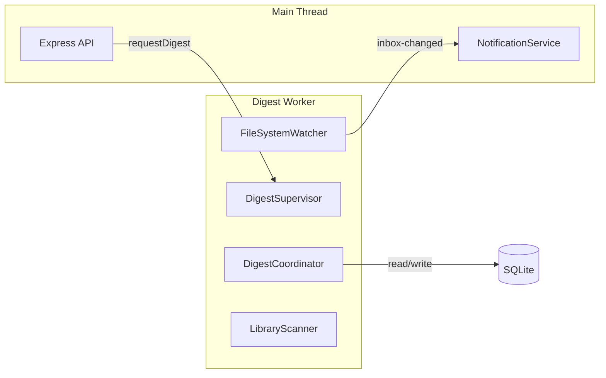
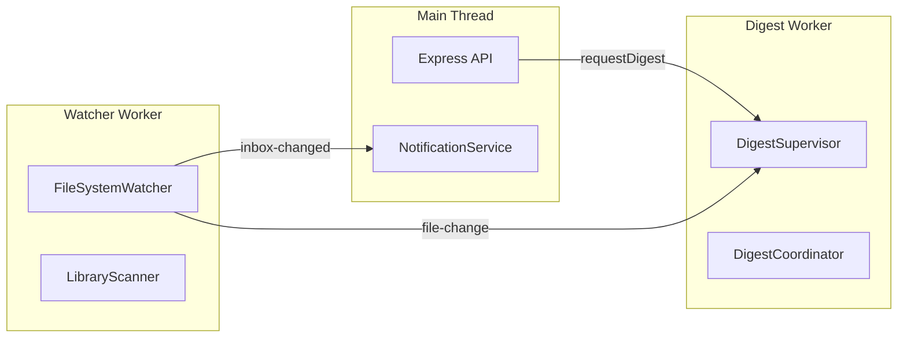
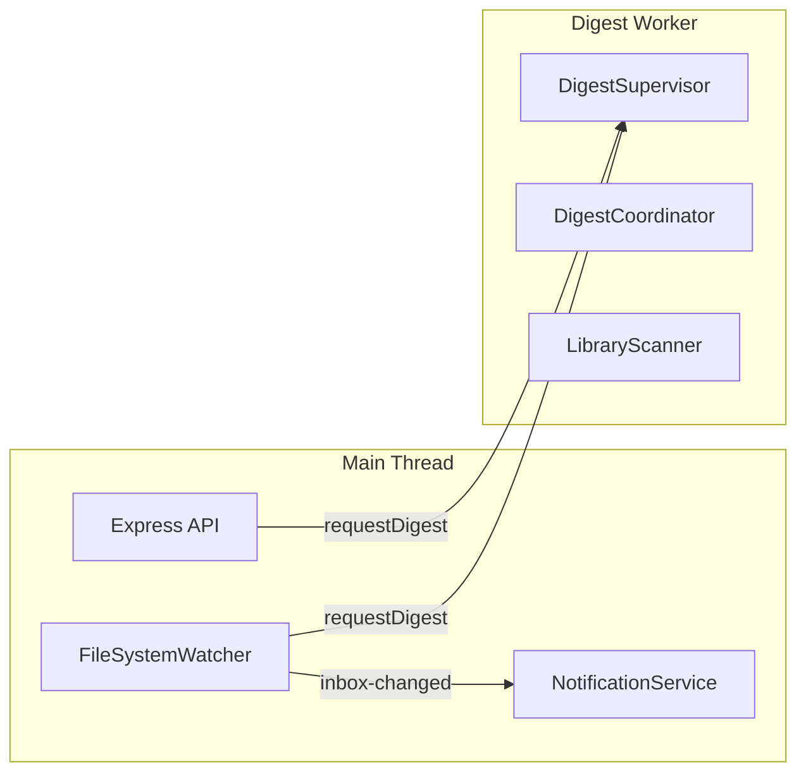

# Worker Thread Design

## Current Non-API Background Tasks

### 1. FileSystemWatcher
**Location:** `app/.server/scanner/fs-watcher.ts`

| Aspect | Details |
|--------|---------|
| Trigger | chokidar file events (realtime) |
| Frequency | Continuous, 500ms stabilization |
| CPU | Low (event-driven) |
| I/O | Filesystem stat, hash (<10MB files) |
| DB | Read/write `files` table |
| External | None |
| Notifications | Emits `inbox-changed` to SSE clients |

**Operations:**
- Detect file add/change/delete
- Hash files <10MB (SHA256)
- Read text preview (first 50 lines)
- Upsert `files` table
- Call `ensureAllDigesters()` for new files
- Call `deleteFile()` for deletions
- Emit `inbox-changed` notifications

---

### 2. DigestSupervisor
**Location:** `app/.server/digest/supervisor.ts`

| Aspect | Details |
|--------|---------|
| Trigger | Polling loop + FS watcher events |
| Frequency | 1s idle sleep, 3s start delay |
| CPU | Varies by digester |
| I/O | Heavy (file reads, external API calls) |
| DB | Read/write `digests`, `files`, `sqlar` |
| External | Meilisearch, Qdrant, OpenAI, Homelab AI |
| Notifications | None directly |

**Operations:**
- Query `digests` table for pending work
- Process files through DigestCoordinator
- Reset stale in-progress digests (every 60s)
- Exponential backoff on failures

---

### 3. DigestCoordinator
**Location:** `app/.server/digest/coordinator.ts`

| Aspect | Details |
|--------|---------|
| Trigger | Called by DigestSupervisor |
| CPU | High (AI inference, image processing) |
| I/O | Heavy (file reads, HTTP to external services) |
| DB | Read/write `digests`, `sqlar`, `processing_locks` |
| External | All vendor APIs |

**Digesters (in order):**
1. `doc-to-screenshot` - Render document to image
2. `doc-to-markdown` - Convert doc to markdown
3. `image-captioning` - AI caption via Homelab
4. `image-objects` - Object detection via Homelab
5. `image-ocr` - OCR text extraction
6. `speech-recognition` - Whisper transcription
7. `speaker-embedding` - Speaker diarization
8. `speech-recognition-cleanup` - Transcript cleanup (OpenAI)
9. `speech-recognition-summary` - Summary (OpenAI)
10. `url-crawler` - Fetch and parse URLs
11. `url-crawl-summary` - Summarize crawled content (OpenAI)
12. `tags` - Generate tags (OpenAI)
13. `search-keyword` - Index to Meilisearch
14. `search-semantic` - Embed to Qdrant

---

### 4. LibraryScanner
**Location:** `app/.server/scanner/library-scanner.ts`

| Aspect | Details |
|--------|---------|
| Trigger | Timer (setInterval) |
| Frequency | 1 hour, 10s initial delay |
| CPU | Low-Medium |
| I/O | Filesystem walk, hash files |
| DB | Read/write `files` table |
| External | None |
| Notifications | None |

**Operations:**
- Full recursive scan of DATA_ROOT
- Hash files <10MB
- Detect orphan files (in DB but not on disk)
- Call `deleteFile()` for orphans

---

### 5. Search Indexing
**Location:** `app/.server/search/meili-tasks.ts`, `app/.server/search/qdrant-tasks.ts`

| Aspect | Details |
|--------|---------|
| Trigger | Called by digesters |
| CPU | Low |
| I/O | HTTP to Meilisearch/Qdrant |
| DB | Read `search_documents` |
| External | Meilisearch, Qdrant |

---

## External Service Dependencies

| Service | Used By | Purpose |
|---------|---------|---------|
| Meilisearch | search-keyword digester | Keyword search indexing |
| Qdrant | search-semantic digester | Vector embeddings |
| OpenAI | tags, url-crawl-summary, speech-* | LLM inference |
| Homelab AI | image-captioning, image-objects | Local AI inference |

---

## Proposed Worker Scope

### Option A: Single Digest Worker

Move all digest-related processing to one worker:

**Interface (Main → Worker):**
- `{ type: 'digest', filePath, reset? }` - Request digest processing
- `{ type: 'shutdown' }` - Graceful shutdown

**Interface (Worker → Main):**
- `{ type: 'ready' }` - Worker initialized
- `{ type: 'inbox-changed', timestamp }` - For SSE broadcast
- `{ type: 'shutdown-complete' }` - Shutdown done

**Pros:**
- Complete isolation of heavy work
- API thread stays responsive
- Simple single-worker model

**Cons:**
- Digest processing still sequential (one file at a time)
- Long-running digests block other files

---

### Option B: Separate FS Watcher + Digest Workers

**Pros:**
- FS events not blocked by digest processing
- Can add more digest workers later

**Cons:**
- More complex IPC
- Two workers to manage

---

### Option C: Main + Digest Worker (FS Watcher stays in main)

**Pros:**
- FS watcher has direct access to NotificationService (no IPC for notifications)
- Simpler notification flow
- Digest work fully isolated

**Cons:**
- FS watcher shares event loop with API (but it's lightweight)

---

## Recommendation

**Option A (Single Digest Worker)** is the simplest and addresses the main problem (API blocking during heavy digest work).

The FileSystemWatcher is lightweight (event-driven, quick DB writes) and its notification needs are simpler if it stays in main thread OR if we add simple IPC for `inbox-changed` events.

Moving everything to one worker keeps the architecture simple while fully isolating CPU/IO-intensive digest processing.
